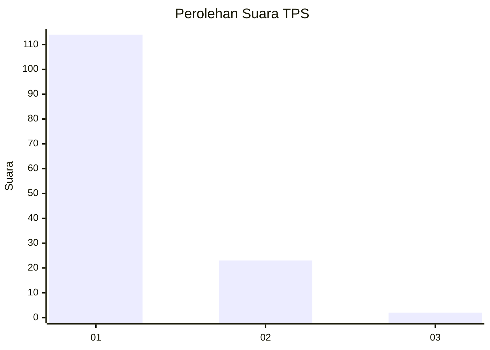
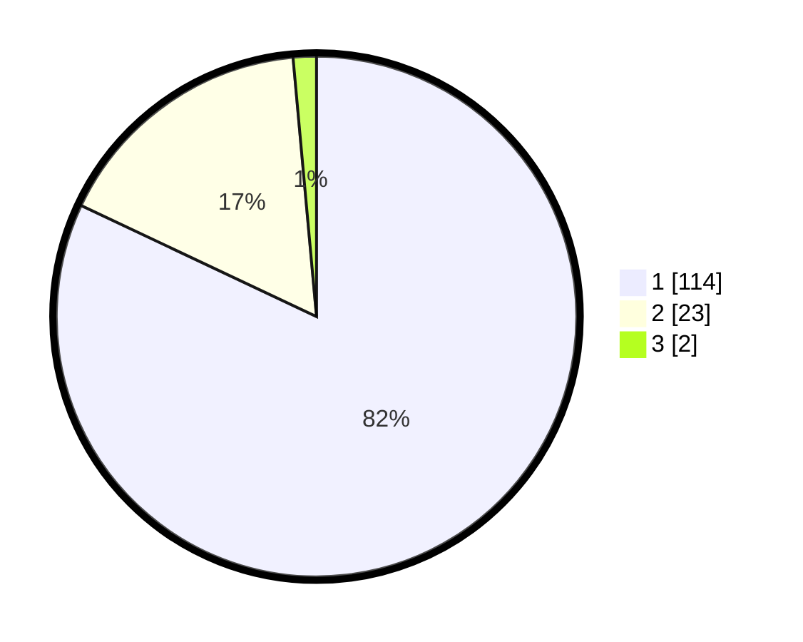

# Hasil

## Grafik

## Tabel

| No. | Nama Paslon    | Suara | Suara (raw) | Persentase |
|:--- |:-------------- | -----:| -----------:| ----------:|
| 1   | ANIES MUHAIMIN | 114   | [114][p-1]  | 82,01      |
| 2   | PRABOWO GIBRAN | 23    | [23][p-2]   | 16,55      |
| 3   | GANJAR MAHFUD  | 2     | [2][p-3]    | 1,44       |

[p-1]: https://github.com/gigit-pemilu/pemilu-2024-13-sumatera-barat/blob/main/pilpres/hitung-suara/sub/13-sumatera-barat/sub/04-tanah-datar/sub/03-rambatan/sub/2003-iii-koto/sub/007-tps/sub/paslon-1.txt
[p-2]: https://github.com/gigit-pemilu/pemilu-2024-13-sumatera-barat/blob/main/pilpres/hitung-suara/sub/13-sumatera-barat/sub/04-tanah-datar/sub/03-rambatan/sub/2003-iii-koto/sub/007-tps/sub/paslon-2.txt
[p-3]: https://github.com/gigit-pemilu/pemilu-2024-13-sumatera-barat/blob/main/pilpres/hitung-suara/sub/13-sumatera-barat/sub/04-tanah-datar/sub/03-rambatan/sub/2003-iii-koto/sub/007-tps/sub/paslon-3.txt

## Foto C Plano

https://sirekap-obj-formc.kpu.go.id/69ba/pemilu/ppwp/13/04/03/20/03/1304032003007-20240214-215847--17e8b38a-26ee-4218-bf38-5168a6aa378e.jpg

https://sirekap-obj-formc.kpu.go.id/69ba/pemilu/ppwp/13/04/03/20/03/1304032003007-20240218-113415--05e0b63f-01d1-4b8c-a84c-805286ea56f2.jpg

https://sirekap-obj-formc.kpu.go.id/69ba/pemilu/ppwp/13/04/03/20/03/1304032003007-20240218-113556--1c7be2e9-f1cf-41a8-8dc7-f042a2d7f185.jpg

## Metadata

| Key        | Value               |
| ---------- | ------------------- |
| Time Stamp | 2024-02-19 06:16:00 |

