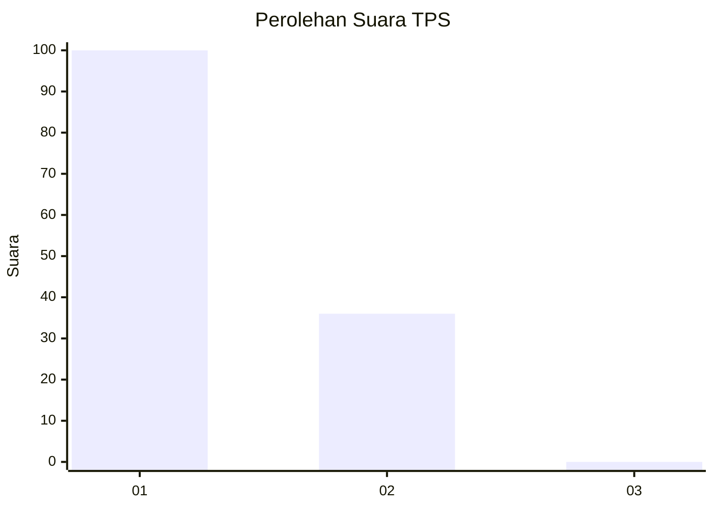
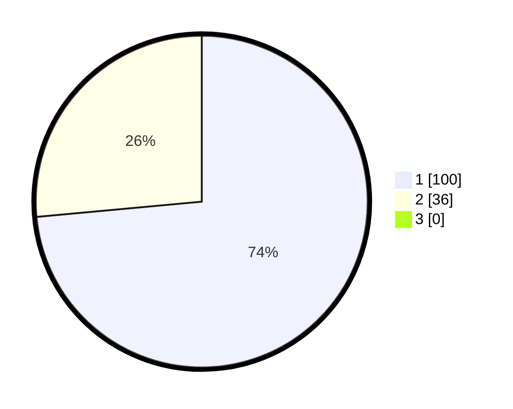

# Hasil

## Grafik

## Tabel

| No. | Nama Paslon    | Suara | Suara (raw) | Persentase |
|:--- |:-------------- | -----:| -----------:| ----------:|
| 1   | ANIES MUHAIMIN | 100   | [100][p-1]  | 73,53      |
| 2   | PRABOWO GIBRAN | 36    | [36][p-2]   | 26,47      |
| 3   | GANJAR MAHFUD  | 0     | [0][p-3]    | 0,00       |

[p-1]: https://github.com/gigit-pemilu/pemilu-2024-13-sumatera-barat/blob/main/pilpres/hitung-suara/sub/13-sumatera-barat/sub/04-tanah-datar/sub/03-rambatan/sub/2004-padang-magek/sub/005-tps/sub/paslon-1.txt
[p-2]: https://github.com/gigit-pemilu/pemilu-2024-13-sumatera-barat/blob/main/pilpres/hitung-suara/sub/13-sumatera-barat/sub/04-tanah-datar/sub/03-rambatan/sub/2004-padang-magek/sub/005-tps/sub/paslon-2.txt
[p-3]: https://github.com/gigit-pemilu/pemilu-2024-13-sumatera-barat/blob/main/pilpres/hitung-suara/sub/13-sumatera-barat/sub/04-tanah-datar/sub/03-rambatan/sub/2004-padang-magek/sub/005-tps/sub/paslon-3.txt

## Foto C Plano

https://sirekap-obj-formc.kpu.go.id/62cd/pemilu/ppwp/13/04/03/20/04/1304032004005-20240217-085918--6febd787-99a1-407d-86de-429e3fe132e5.jpg

https://sirekap-obj-formc.kpu.go.id/62cd/pemilu/ppwp/13/04/03/20/04/1304032004005-20240215-000820--74c1c0cf-155e-42fc-a80b-2a9444a9f29c.jpg

https://sirekap-obj-formc.kpu.go.id/62cd/pemilu/ppwp/13/04/03/20/04/1304032004005-20240215-000924--f16bc3e2-00ec-455c-b187-b17a12010f88.jpg

## Metadata

| Key        | Value               |
| ---------- | ------------------- |
| Time Stamp | 2024-02-24 22:31:28 |

