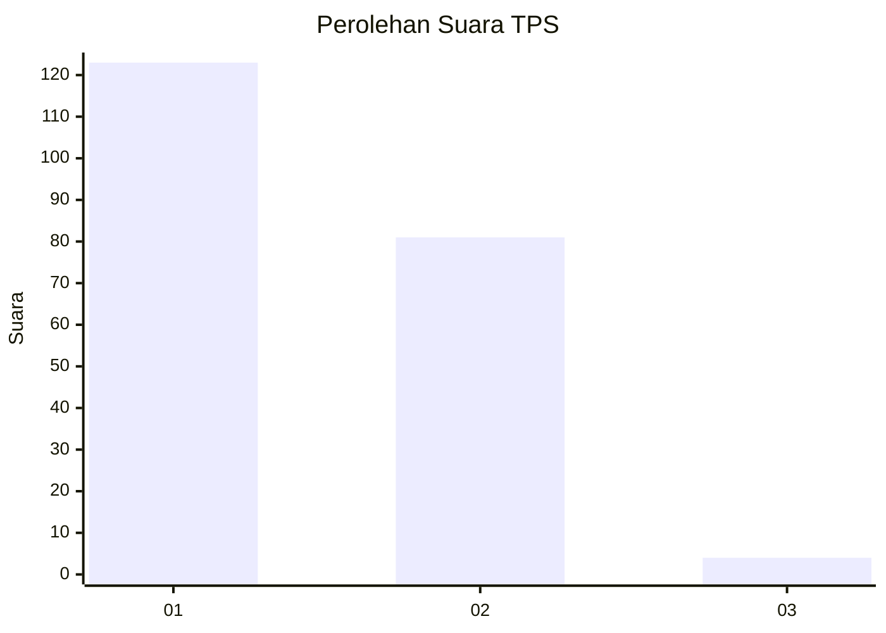
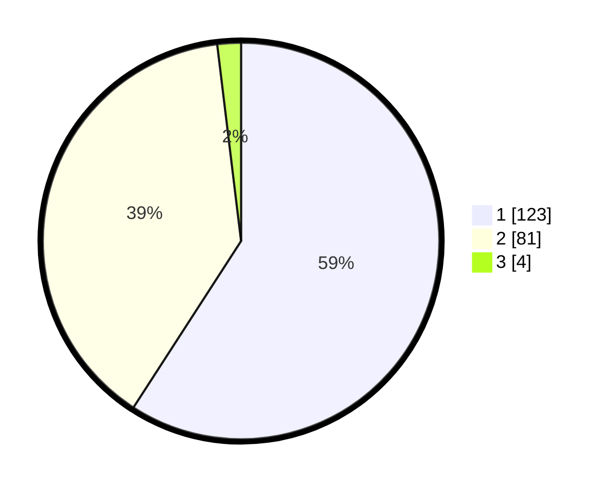

# Hasil

## Grafik

## Tabel

| No. | Nama Paslon    | Suara | Suara (raw) | Persentase |
|:--- |:-------------- | -----:| -----------:| ----------:|
| 1   | ANIES MUHAIMIN | 123   | [123][p-1]  | 59,13      |
| 2   | PRABOWO GIBRAN | 81    | [81][p-2]   | 38,94      |
| 3   | GANJAR MAHFUD  | 4     | [4][p-3]    | 1,92       |

[p-1]: https://github.com/gigit-pemilu/pemilu-2024-13-sumatera-barat/blob/main/pilpres/hitung-suara/sub/13-sumatera-barat/sub/04-tanah-datar/sub/04-lima-kaum/sub/2001-baringin/sub/001-tps/sub/paslon-1.txt
[p-2]: https://github.com/gigit-pemilu/pemilu-2024-13-sumatera-barat/blob/main/pilpres/hitung-suara/sub/13-sumatera-barat/sub/04-tanah-datar/sub/04-lima-kaum/sub/2001-baringin/sub/001-tps/sub/paslon-2.txt
[p-3]: https://github.com/gigit-pemilu/pemilu-2024-13-sumatera-barat/blob/main/pilpres/hitung-suara/sub/13-sumatera-barat/sub/04-tanah-datar/sub/04-lima-kaum/sub/2001-baringin/sub/001-tps/sub/paslon-3.txt

## Foto C Plano

https://sirekap-obj-formc.kpu.go.id/ca2a/pemilu/ppwp/13/04/04/20/01/1304042001001-20240214-155927--0270df41-aeb1-4b4e-96f5-c6b6da7385ae.jpg

https://sirekap-obj-formc.kpu.go.id/ca2a/pemilu/ppwp/13/04/04/20/01/1304042001001-20240214-160058--eb1cfc72-ba5c-46d1-9d2e-4df7e25e5a15.jpg

https://sirekap-obj-formc.kpu.go.id/ca2a/pemilu/ppwp/13/04/04/20/01/1304042001001-20240214-160059--2263824c-6685-4e42-9c44-f65db382acb8.jpg

## Metadata

| Key        | Value               |
| ---------- | ------------------- |
| Time Stamp | 2024-02-25 11:00:00 |

