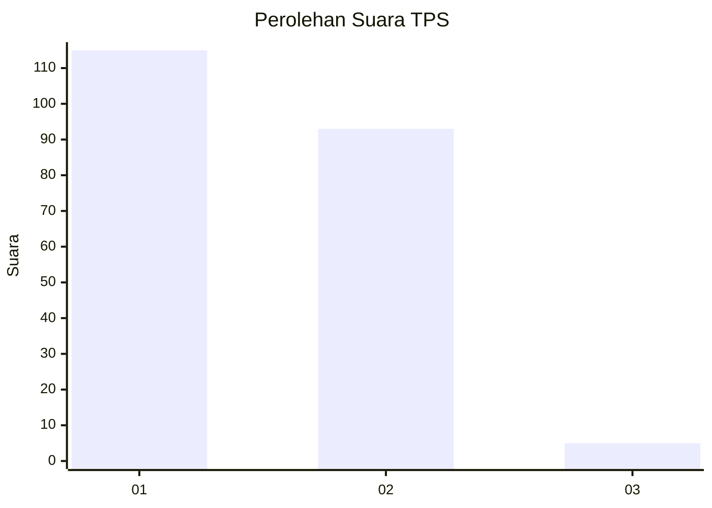
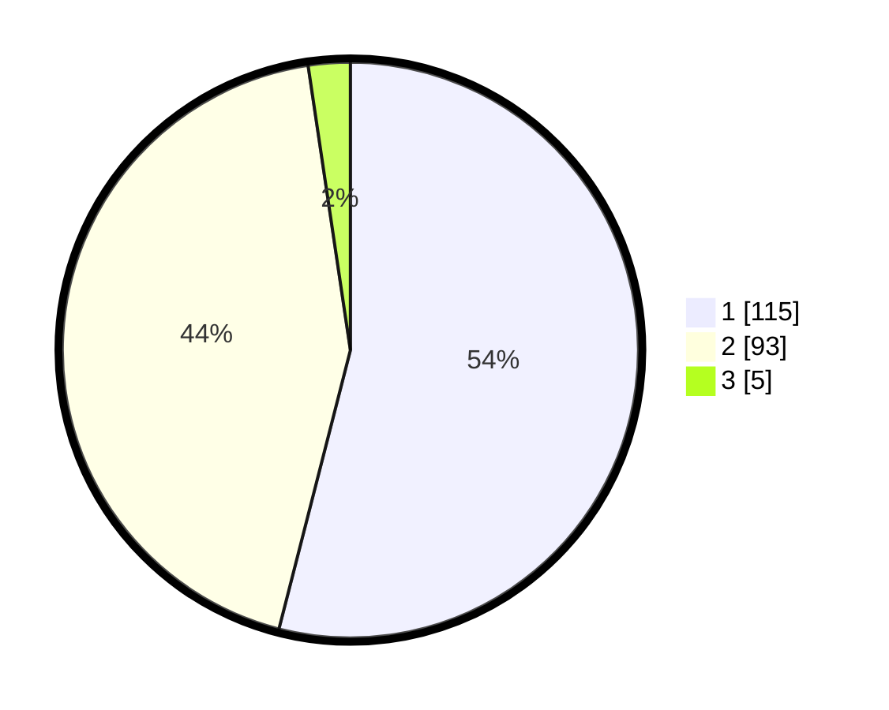

# Hasil

## Grafik

## Tabel

| No. | Nama Paslon    | Suara | Suara (raw) | Persentase |
|:--- |:-------------- | -----:| -----------:| ----------:|
| 1   | ANIES MUHAIMIN | 115   | [115][p-1]  | 53,99      |
| 2   | PRABOWO GIBRAN | 93    | [93][p-2]   | 43,66      |
| 3   | GANJAR MAHFUD  | 5     | [5][p-3]    | 2,35       |

[p-1]: https://github.com/gigit-pemilu/pemilu-2024-13-sumatera-barat/blob/main/pilpres/hitung-suara/sub/13-sumatera-barat/sub/04-tanah-datar/sub/04-lima-kaum/sub/2001-baringin/sub/002-tps/sub/paslon-1.txt
[p-2]: https://github.com/gigit-pemilu/pemilu-2024-13-sumatera-barat/blob/main/pilpres/hitung-suara/sub/13-sumatera-barat/sub/04-tanah-datar/sub/04-lima-kaum/sub/2001-baringin/sub/002-tps/sub/paslon-2.txt
[p-3]: https://github.com/gigit-pemilu/pemilu-2024-13-sumatera-barat/blob/main/pilpres/hitung-suara/sub/13-sumatera-barat/sub/04-tanah-datar/sub/04-lima-kaum/sub/2001-baringin/sub/002-tps/sub/paslon-3.txt

## Foto C Plano

https://sirekap-obj-formc.kpu.go.id/02cb/pemilu/ppwp/13/04/04/20/01/1304042001002-20240215-024938--41d1900a-f3c6-4ec4-89d2-67cf0000229d.jpg

https://sirekap-obj-formc.kpu.go.id/02cb/pemilu/ppwp/13/04/04/20/01/1304042001002-20240215-030415--c629e450-a25c-4c92-bf61-ef62af57f4f1.jpg

https://sirekap-obj-formc.kpu.go.id/02cb/pemilu/ppwp/13/04/04/20/01/1304042001002-20240215-030431--9aeb3134-aa28-4587-9f7a-46bc4b191e3b.jpg

## Metadata

| Key        | Value               |
| ---------- | ------------------- |
| Time Stamp | 2024-02-24 22:31:28 |

