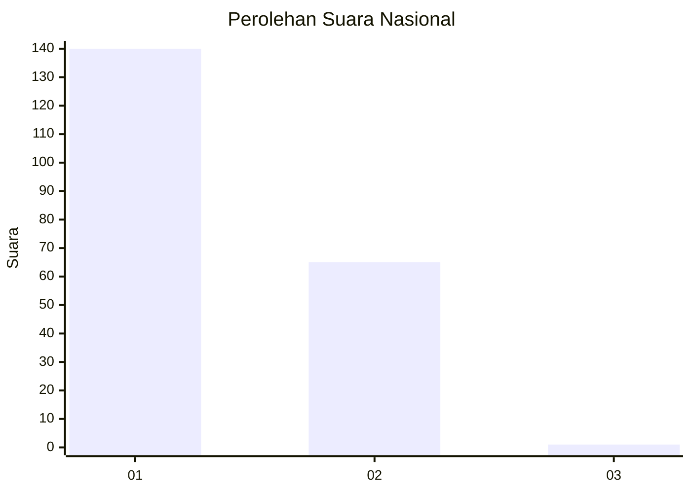
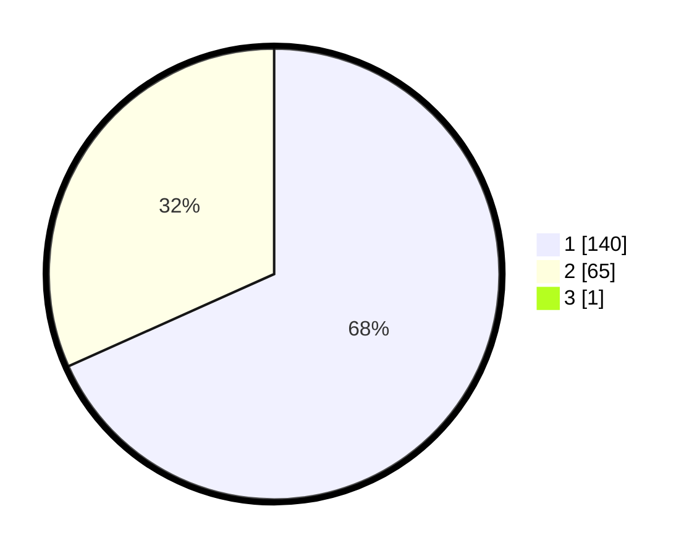

# Hasil

## Grafik

## Tabel

| No. | Nama Paslon    | Suara | Suara (raw) | Persentase |
|:--- |:-------------- | -----:| -----------:| ----------:|
| 1   | ANIES MUHAIMIN | 140   | [140][p-1]  | 67,96      |
| 2   | PRABOWO GIBRAN | 65    | [65][p-2]   | 31,55      |
| 3   | GANJAR MAHFUD  | 1     | [1][p-3]    | 0,49       |

[p-1]: https://github.com/gigit-pemilu/pemilu-2024/blob/main/pilpres/hitung-suara/sub/13-sumatera-barat/sub/04-tanah-datar/sub/04-lima-kaum/sub/2001-baringin/sub/004-tps/sub/paslon-1.txt
[p-2]: https://github.com/gigit-pemilu/pemilu-2024/blob/main/pilpres/hitung-suara/sub/13-sumatera-barat/sub/04-tanah-datar/sub/04-lima-kaum/sub/2001-baringin/sub/004-tps/sub/paslon-2.txt
[p-3]: https://github.com/gigit-pemilu/pemilu-2024/blob/main/pilpres/hitung-suara/sub/13-sumatera-barat/sub/04-tanah-datar/sub/04-lima-kaum/sub/2001-baringin/sub/004-tps/sub/paslon-3.txt

## Foto C Plano

https://sirekap-obj-formc.kpu.go.id/b228/pemilu/ppwp/13/04/04/20/01/1304042001004-20240214-224350--ff184964-5017-4bb4-9233-d052ae08e883.jpg

https://sirekap-obj-formc.kpu.go.id/b228/pemilu/ppwp/13/04/04/20/01/1304042001004-20240214-224408--18146fef-bbc2-4b2c-98e7-3d2939443eb9.jpg

https://sirekap-obj-formc.kpu.go.id/b228/pemilu/ppwp/13/04/04/20/01/1304042001004-20240220-171019--89093b63-e762-4dcf-a5fd-869ff1e8efaf.jpg

## Metadata

| Key        | Value               |
| ---------- | ------------------- |
| Time Stamp | 2024-02-20 18:00:00 |

