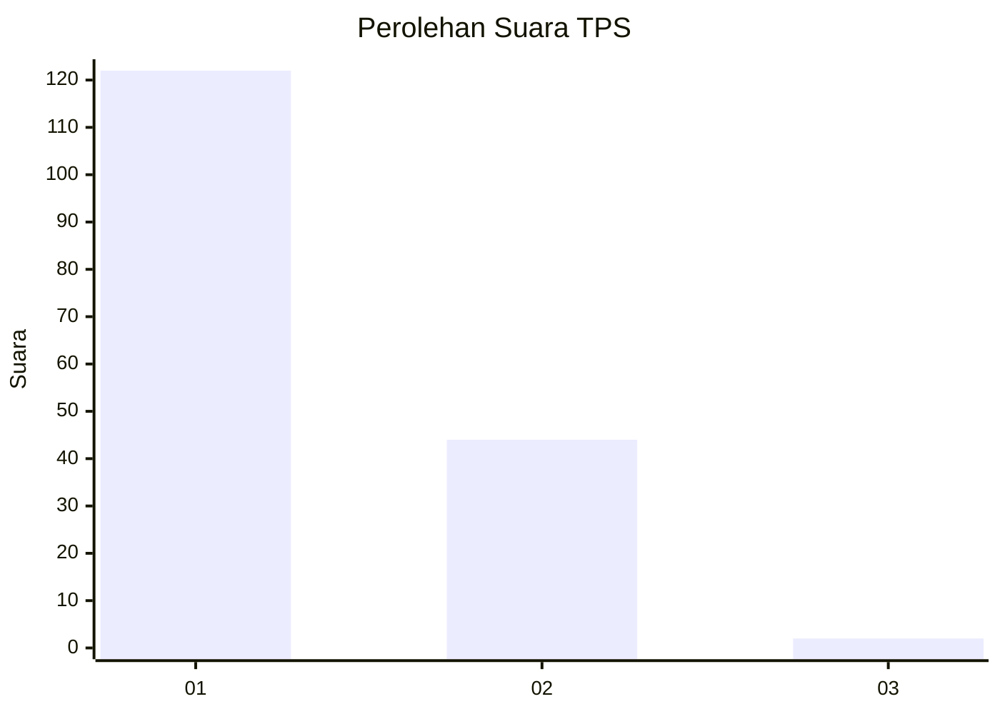
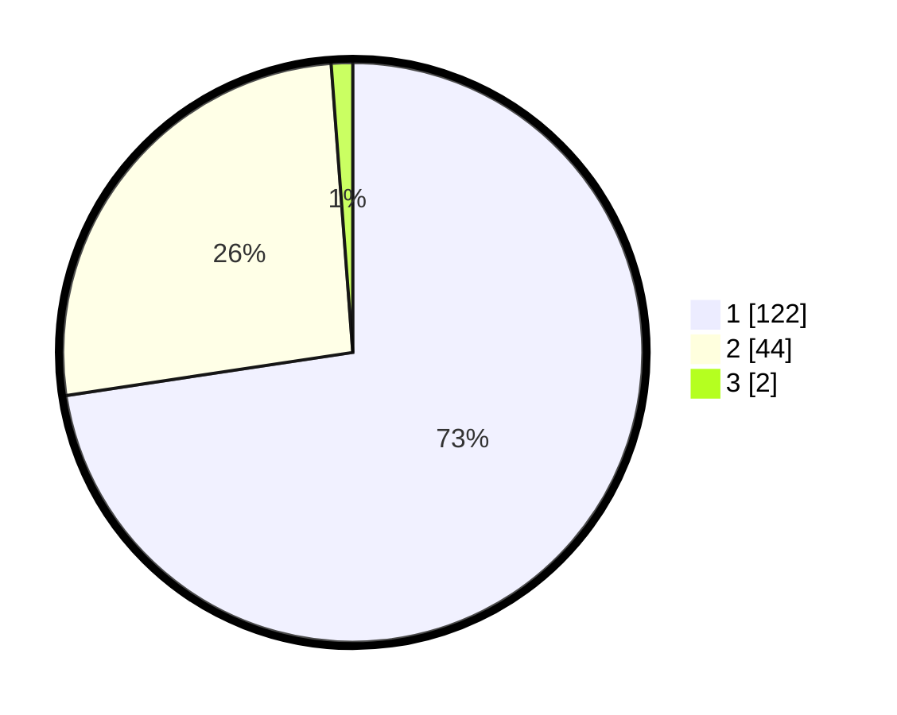

# Hasil

## Grafik

## Tabel

| No. | Nama Paslon    | Suara | Suara (raw) | Persentase |
|:--- |:-------------- | -----:| -----------:| ----------:|
| 1   | ANIES MUHAIMIN | 122   | [122][p-1]  | 72,62      |
| 2   | PRABOWO GIBRAN | 44    | [44][p-2]   | 26,19      |
| 3   | GANJAR MAHFUD  | 2     | [2][p-3]    | 1,19       |

[p-1]: https://github.com/gigit-pemilu/pemilu-2024-13-sumatera-barat/blob/main/pilpres/hitung-suara/sub/13-sumatera-barat/sub/04-tanah-datar/sub/05-tanjung-emas/sub/2004-pagaruyung/sub/002-tps/sub/paslon-1.txt
[p-2]: https://github.com/gigit-pemilu/pemilu-2024-13-sumatera-barat/blob/main/pilpres/hitung-suara/sub/13-sumatera-barat/sub/04-tanah-datar/sub/05-tanjung-emas/sub/2004-pagaruyung/sub/002-tps/sub/paslon-2.txt
[p-3]: https://github.com/gigit-pemilu/pemilu-2024-13-sumatera-barat/blob/main/pilpres/hitung-suara/sub/13-sumatera-barat/sub/04-tanah-datar/sub/05-tanjung-emas/sub/2004-pagaruyung/sub/002-tps/sub/paslon-3.txt

## Foto C Plano

https://sirekap-obj-formc.kpu.go.id/df08/pemilu/ppwp/13/04/05/20/04/1304052004002-20240218-094511--6545f126-4c83-4fee-9849-4ad1bb479d92.jpg

https://sirekap-obj-formc.kpu.go.id/df08/pemilu/ppwp/13/04/05/20/04/1304052004002-20240218-095011--1e1aae6d-0529-4157-9167-d56414155629.jpg

https://sirekap-obj-formc.kpu.go.id/df08/pemilu/ppwp/13/04/05/20/04/1304052004002-20240218-094743--97b16fcd-f2c1-42bd-9a46-62c13581035b.jpg

## Metadata

| Key        | Value               |
| ---------- | ------------------- |
| Time Stamp | 2024-02-24 22:31:28 |

