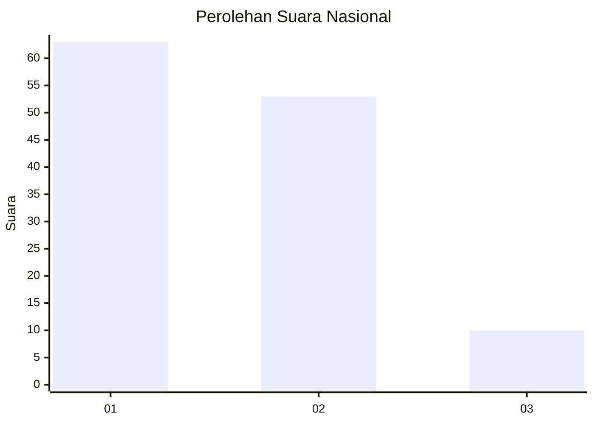
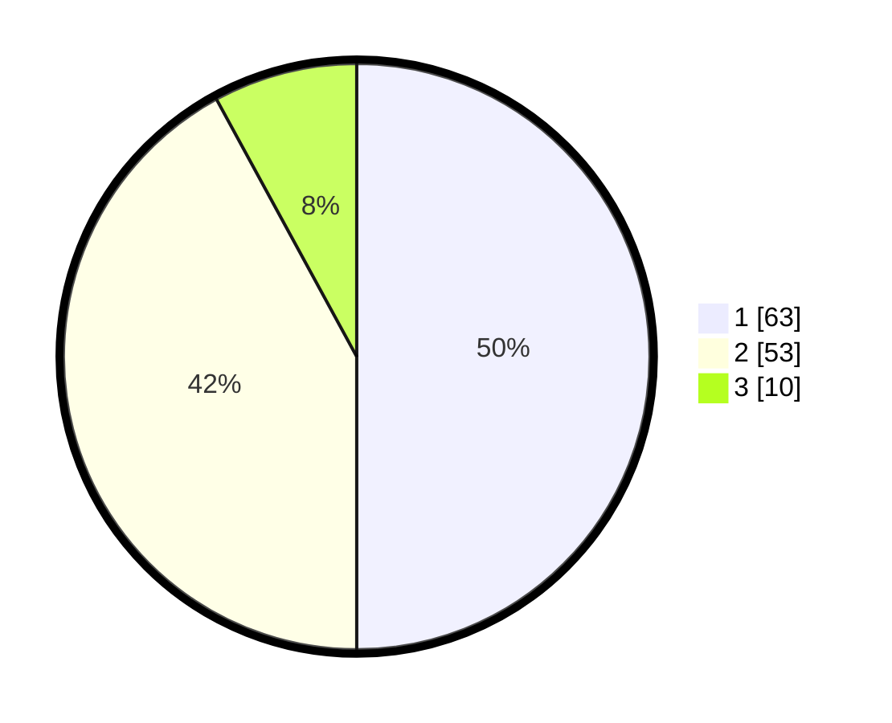

# Hasil

## Grafik

## Tabel

| No. | Nama Paslon    | Suara | Suara (raw) | Persentase |
|:--- |:-------------- | -----:| -----------:| ----------:|
| 1   | ANIES MUHAIMIN | 63    | [63][p-1]   | 50,00      |
| 2   | PRABOWO GIBRAN | 53    | [53][p-2]   | 42,06      |
| 3   | GANJAR MAHFUD  | 10    | [10][p-3]   | 7,94       |

[p-1]: https://github.com/gigit-pemilu/pemilu-2024/blob/main/pilpres/hitung-suara/sub/13-sumatera-barat/sub/04-tanah-datar/sub/06-lintau-buo/sub/2001-taluk/sub/002-tps/sub/paslon-1.txt
[p-2]: https://github.com/gigit-pemilu/pemilu-2024/blob/main/pilpres/hitung-suara/sub/13-sumatera-barat/sub/04-tanah-datar/sub/06-lintau-buo/sub/2001-taluk/sub/002-tps/sub/paslon-2.txt
[p-3]: https://github.com/gigit-pemilu/pemilu-2024/blob/main/pilpres/hitung-suara/sub/13-sumatera-barat/sub/04-tanah-datar/sub/06-lintau-buo/sub/2001-taluk/sub/002-tps/sub/paslon-3.txt

## Foto C Plano

https://sirekap-obj-formc.kpu.go.id/30ab/pemilu/ppwp/13/04/06/20/01/1304062001002-20240220-110151--493f33df-a258-4da9-a2ad-95eeb8b0ab3a.jpg

https://sirekap-obj-formc.kpu.go.id/30ab/pemilu/ppwp/13/04/06/20/01/1304062001002-20240214-234334--c5b45855-216b-463b-9246-56ba78233e9d.jpg

https://sirekap-obj-formc.kpu.go.id/30ab/pemilu/ppwp/13/04/06/20/01/1304062001002-20240214-234438--49b996af-5f98-418c-a325-f7dad0cb5cca.jpg

## Metadata

| Key        | Value               |
| ---------- | ------------------- |
| Time Stamp | 2024-02-24 22:31:28 |

