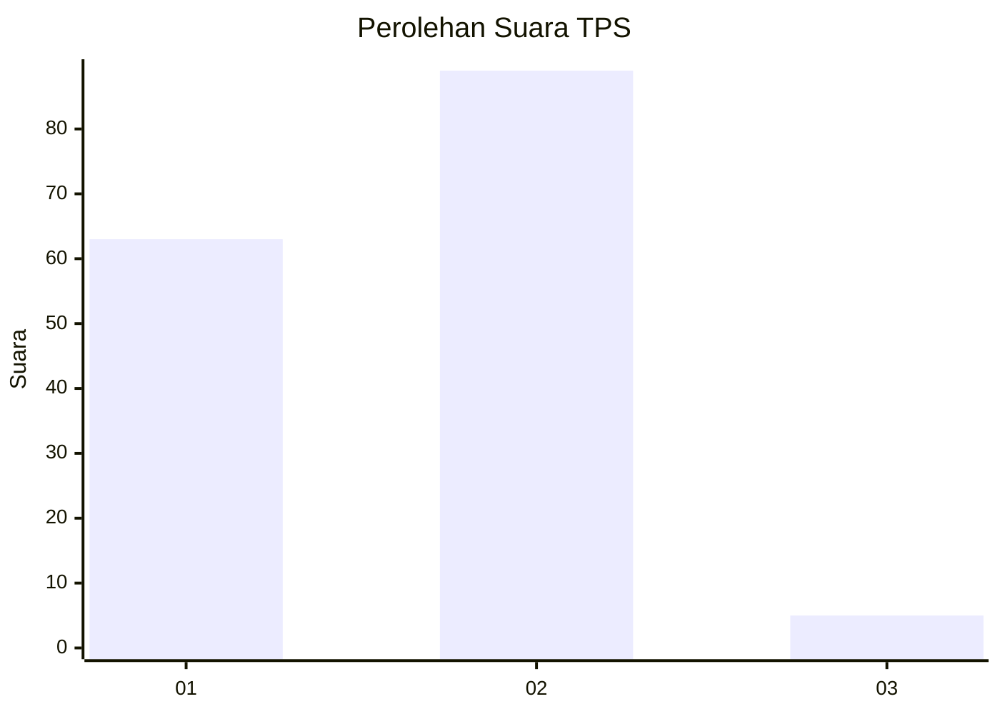
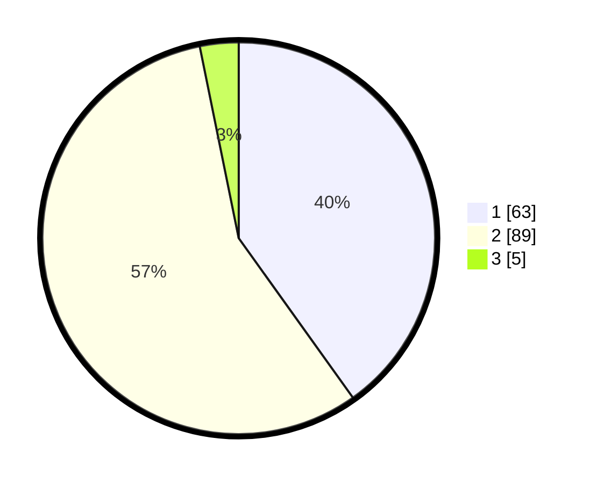

# Hasil

## Grafik

## Tabel

| No. | Nama Paslon    | Suara | Suara (raw) | Persentase |
|:--- |:-------------- | -----:| -----------:| ----------:|
| 1   | ANIES MUHAIMIN | 63    | [63][p-1]   | 40,13      |
| 2   | PRABOWO GIBRAN | 89    | [89][p-2]   | 56,69      |
| 3   | GANJAR MAHFUD  | 5     | [5][p-3]    | 3,18       |

[p-1]: https://github.com/gigit-pemilu/pemilu-2024-13-sumatera-barat/blob/main/pilpres/hitung-suara/sub/13-sumatera-barat/sub/04-tanah-datar/sub/06-lintau-buo/sub/2001-taluk/sub/005-tps/sub/paslon-1.txt
[p-2]: https://github.com/gigit-pemilu/pemilu-2024-13-sumatera-barat/blob/main/pilpres/hitung-suara/sub/13-sumatera-barat/sub/04-tanah-datar/sub/06-lintau-buo/sub/2001-taluk/sub/005-tps/sub/paslon-2.txt
[p-3]: https://github.com/gigit-pemilu/pemilu-2024-13-sumatera-barat/blob/main/pilpres/hitung-suara/sub/13-sumatera-barat/sub/04-tanah-datar/sub/06-lintau-buo/sub/2001-taluk/sub/005-tps/sub/paslon-3.txt

## Foto C Plano

https://sirekap-obj-formc.kpu.go.id/4455/pemilu/ppwp/13/04/06/20/01/1304062001005-20240215-010738--f1500f7f-44ec-474d-86f7-8b7cfda57350.jpg

https://sirekap-obj-formc.kpu.go.id/4455/pemilu/ppwp/13/04/06/20/01/1304062001005-20240214-212128--8ae816c6-0889-41f6-a548-48973a369ade.jpg

https://sirekap-obj-formc.kpu.go.id/4455/pemilu/ppwp/13/04/06/20/01/1304062001005-20240214-212254--7da0e91f-cd17-4e5f-a09d-9c4bd440a474.jpg

## Metadata

| Key        | Value               |
| ---------- | ------------------- |
| Time Stamp | 2024-02-24 22:31:28 |

