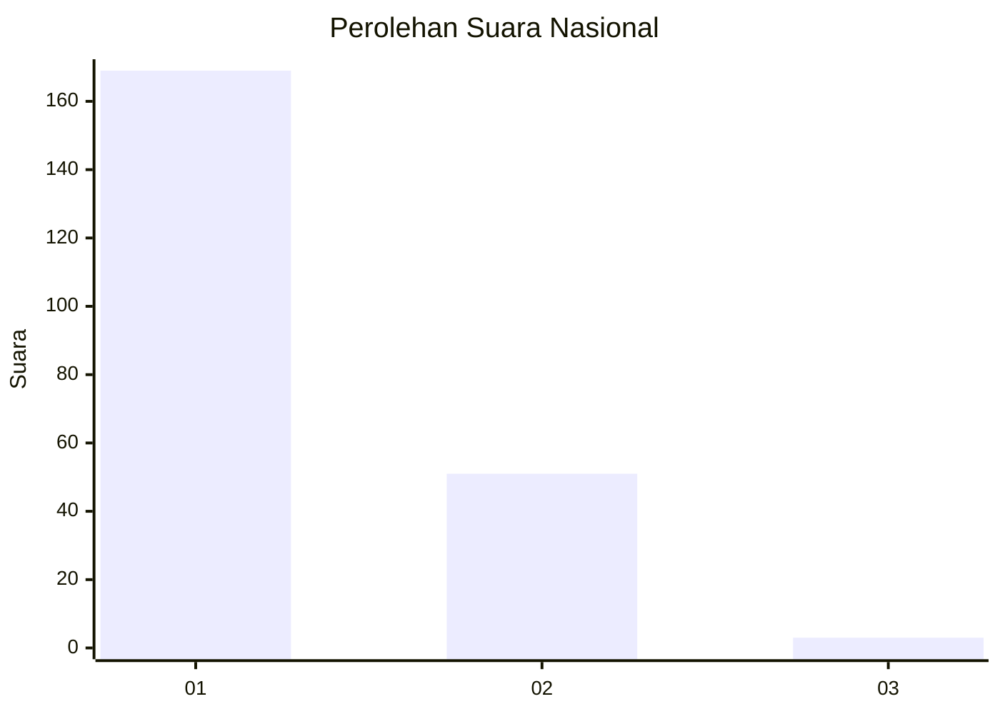
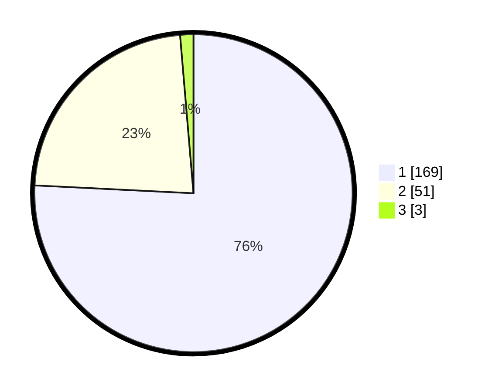

# Hasil

## Grafik

## Tabel

| No. | Nama Paslon    | Suara | Suara (raw) | Persentase |
|:--- |:-------------- | -----:| -----------:| ----------:|
| 1   | ANIES MUHAIMIN | 169   | [169][p-1]  | 75,78      |
| 2   | PRABOWO GIBRAN | 51    | [51][p-2]   | 22,87      |
| 3   | GANJAR MAHFUD  | 3     | [3][p-3]    | 1,35       |

[p-1]: https://github.com/gigit-pemilu/pemilu-2024/blob/main/pilpres/hitung-suara/sub/13-sumatera-barat/sub/04-tanah-datar/sub/06-lintau-buo/sub/2004-pangian/sub/004-tps/sub/paslon-1.txt
[p-2]: https://github.com/gigit-pemilu/pemilu-2024/blob/main/pilpres/hitung-suara/sub/13-sumatera-barat/sub/04-tanah-datar/sub/06-lintau-buo/sub/2004-pangian/sub/004-tps/sub/paslon-2.txt
[p-3]: https://github.com/gigit-pemilu/pemilu-2024/blob/main/pilpres/hitung-suara/sub/13-sumatera-barat/sub/04-tanah-datar/sub/06-lintau-buo/sub/2004-pangian/sub/004-tps/sub/paslon-3.txt

## Foto C Plano

https://sirekap-obj-formc.kpu.go.id/d629/pemilu/ppwp/13/04/06/20/04/1304062004004-20240218-121504--71c379c7-ae8e-4552-8aa5-ceef7267aeb4.jpg

https://sirekap-obj-formc.kpu.go.id/d629/pemilu/ppwp/13/04/06/20/04/1304062004004-20240218-122409--dbb5391c-d50e-4afd-b99f-6cf288c2ba24.jpg

https://sirekap-obj-formc.kpu.go.id/d629/pemilu/ppwp/13/04/06/20/04/1304062004004-20240218-121910--5b701a3b-a983-46bc-812f-fc594553d317.jpg

## Metadata

| Key        | Value               |
| ---------- | ------------------- |
| Time Stamp | 2024-02-19 06:16:00 |

