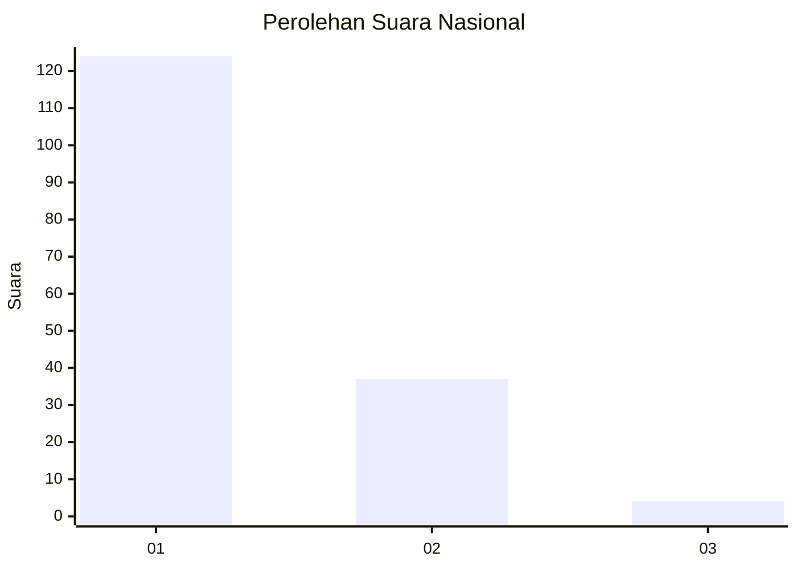
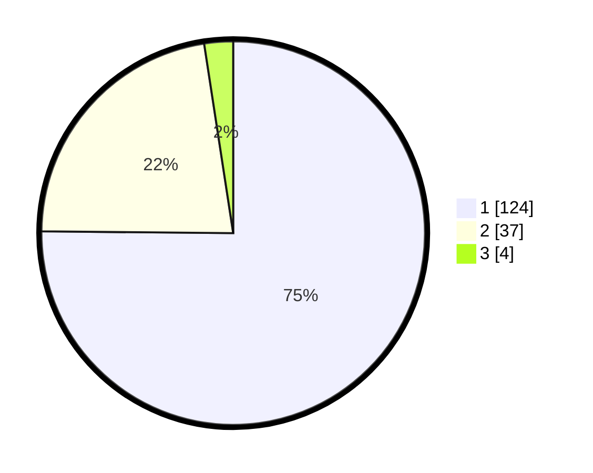

# Hasil

## Grafik

## Tabel

| No. | Nama Paslon    | Suara | Suara (raw) | Persentase |
|:--- |:-------------- | -----:| -----------:| ----------:|
| 1   | ANIES MUHAIMIN | 124   | [124][p-1]  | 75,15      |
| 2   | PRABOWO GIBRAN | 37    | [37][p-2]   | 22,42      |
| 3   | GANJAR MAHFUD  | 4     | [4][p-3]    | 2,42       |

[p-1]: https://github.com/gigit-pemilu/pemilu-2024/blob/main/pilpres/hitung-suara/sub/13-sumatera-barat/sub/04-tanah-datar/sub/06-lintau-buo/sub/2004-pangian/sub/007-tps/sub/paslon-1.txt
[p-2]: https://github.com/gigit-pemilu/pemilu-2024/blob/main/pilpres/hitung-suara/sub/13-sumatera-barat/sub/04-tanah-datar/sub/06-lintau-buo/sub/2004-pangian/sub/007-tps/sub/paslon-2.txt
[p-3]: https://github.com/gigit-pemilu/pemilu-2024/blob/main/pilpres/hitung-suara/sub/13-sumatera-barat/sub/04-tanah-datar/sub/06-lintau-buo/sub/2004-pangian/sub/007-tps/sub/paslon-3.txt

## Foto C Plano

https://sirekap-obj-formc.kpu.go.id/b1de/pemilu/ppwp/13/04/06/20/04/1304062004007-20240215-014211--939153d4-2bf7-4050-9ca8-11dbe39067aa.jpg

https://sirekap-obj-formc.kpu.go.id/b1de/pemilu/ppwp/13/04/06/20/04/1304062004007-20240215-015311--41393ff1-11a1-4016-bc35-90c3ea86904c.jpg

https://sirekap-obj-formc.kpu.go.id/b1de/pemilu/ppwp/13/04/06/20/04/1304062004007-20240215-015429--87677cf5-9a55-49d7-8c86-d28ccdb4afb9.jpg

## Metadata

| Key        | Value               |
| ---------- | ------------------- |
| Time Stamp | 2024-02-24 22:31:28 |

