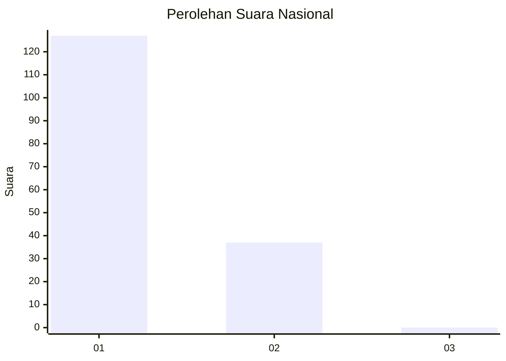
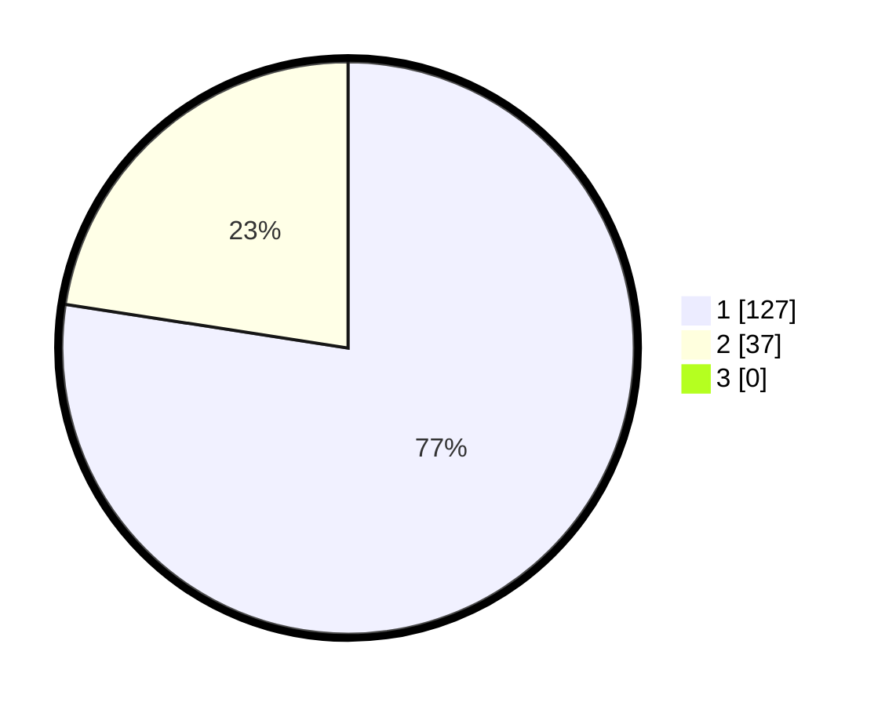

# Hasil

## Grafik

## Tabel

| No. | Nama Paslon    | Suara | Suara (raw) | Persentase |
|:--- |:-------------- | -----:| -----------:| ----------:|
| 1   | ANIES MUHAIMIN | 127   | [127][p-1]  | 77,44      |
| 2   | PRABOWO GIBRAN | 37    | [37][p-2]   | 22,56      |
| 3   | GANJAR MAHFUD  | 0     | [0][p-3]    | 0,00       |

[p-1]: https://github.com/gigit-pemilu/pemilu-2024/blob/main/pilpres/hitung-suara/sub/13-sumatera-barat/sub/04-tanah-datar/sub/06-lintau-buo/sub/2004-pangian/sub/008-tps/sub/paslon-1.txt
[p-2]: https://github.com/gigit-pemilu/pemilu-2024/blob/main/pilpres/hitung-suara/sub/13-sumatera-barat/sub/04-tanah-datar/sub/06-lintau-buo/sub/2004-pangian/sub/008-tps/sub/paslon-2.txt
[p-3]: https://github.com/gigit-pemilu/pemilu-2024/blob/main/pilpres/hitung-suara/sub/13-sumatera-barat/sub/04-tanah-datar/sub/06-lintau-buo/sub/2004-pangian/sub/008-tps/sub/paslon-3.txt

## Foto C Plano

https://sirekap-obj-formc.kpu.go.id/d7af/pemilu/ppwp/13/04/06/20/04/1304062004008-20240218-175105--4e2702d0-679e-4063-aa28-dab27c19918a.jpg

https://sirekap-obj-formc.kpu.go.id/d7af/pemilu/ppwp/13/04/06/20/04/1304062004008-20240218-175547--2994dd20-05a6-405c-82c8-573197407762.jpg

https://sirekap-obj-formc.kpu.go.id/d7af/pemilu/ppwp/13/04/06/20/04/1304062004008-20240218-175656--c704760f-0b2e-4f00-b33e-aca59238e6e5.jpg

## Metadata

| Key        | Value               |
| ---------- | ------------------- |
| Time Stamp | 2024-02-19 06:16:00 |

## DATA PEMILIH TETAP

Jumlah pemilih dalam DPT: **252**.
 * L: **212**.
 * P: **98**.

## DATA PENGGUNA HAK PILIH

Jumlah pengguna hak pilih dalam DPT: **655**.
 * L: **666**.
 * P: **622**.

Jumlah pengguna hak pilih dalam DPTb: **555**.
 * L: **665**.
 * P: **655**.

Jumlah pengguna hak pilih dalam DPK: **577**.
 * L: **555**.
 * P: **555**.

Jumlah pengguna hak pilih: **0**.
 * L: **520**.
 * P: **200**.

## JUMLAH SUARA SAH DAN TIDAK SAH

JUMLAH SELURUH SUARA SAH: **164**.

JUMLAH SUARA TIDAK SAH: **1**.

JUMLAH SELURUH SUARA SAH DAN SUARA TIDAK SAH: **165**.

