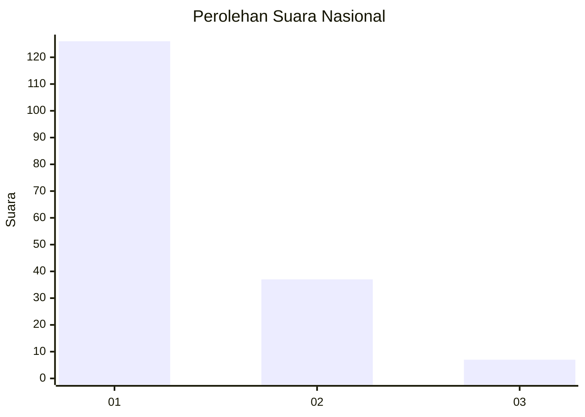
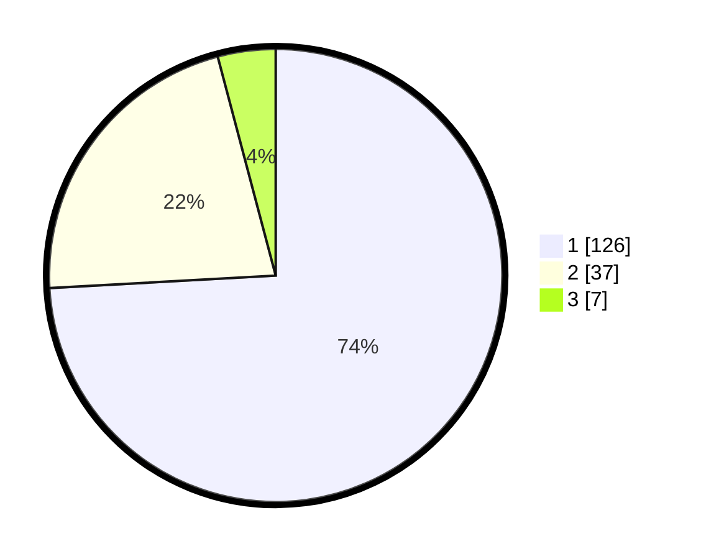

# Hasil

## Grafik

## Tabel

| No. | Nama Paslon    | Suara | Suara (raw) | Persentase |
|:--- |:-------------- | -----:| -----------:| ----------:|
| 1   | ANIES MUHAIMIN | 126   | [126][p-1]  | 74,12      |
| 2   | PRABOWO GIBRAN | 37    | [37][p-2]   | 21,76      |
| 3   | GANJAR MAHFUD  | 7     | [7][p-3]    | 4,12       |

[p-1]: https://github.com/gigit-pemilu/pemilu-2024/blob/main/pilpres/hitung-suara/sub/13-sumatera-barat/sub/04-tanah-datar/sub/08-sungai-tarab/sub/2002-sungai-tarab/sub/008-tps/sub/paslon-1.txt
[p-2]: https://github.com/gigit-pemilu/pemilu-2024/blob/main/pilpres/hitung-suara/sub/13-sumatera-barat/sub/04-tanah-datar/sub/08-sungai-tarab/sub/2002-sungai-tarab/sub/008-tps/sub/paslon-2.txt
[p-3]: https://github.com/gigit-pemilu/pemilu-2024/blob/main/pilpres/hitung-suara/sub/13-sumatera-barat/sub/04-tanah-datar/sub/08-sungai-tarab/sub/2002-sungai-tarab/sub/008-tps/sub/paslon-3.txt

## Foto C Plano

https://sirekap-obj-formc.kpu.go.id/4b99/pemilu/ppwp/13/04/08/20/02/1304082002008-20240215-181931--7dd98b85-c62d-47c5-839d-2bd63894e02b.jpg

https://sirekap-obj-formc.kpu.go.id/4b99/pemilu/ppwp/13/04/08/20/02/1304082002008-20240215-182101--c4a2b005-187b-424b-80f4-1f1cfc5eabcc.jpg

https://sirekap-obj-formc.kpu.go.id/4b99/pemilu/ppwp/13/04/08/20/02/1304082002008-20240215-194504--9d86e527-7230-4605-8a9c-81b292cc33da.jpg

## Metadata

| Key        | Value               |
| ---------- | ------------------- |
| Time Stamp | 2024-02-24 22:31:28 |

