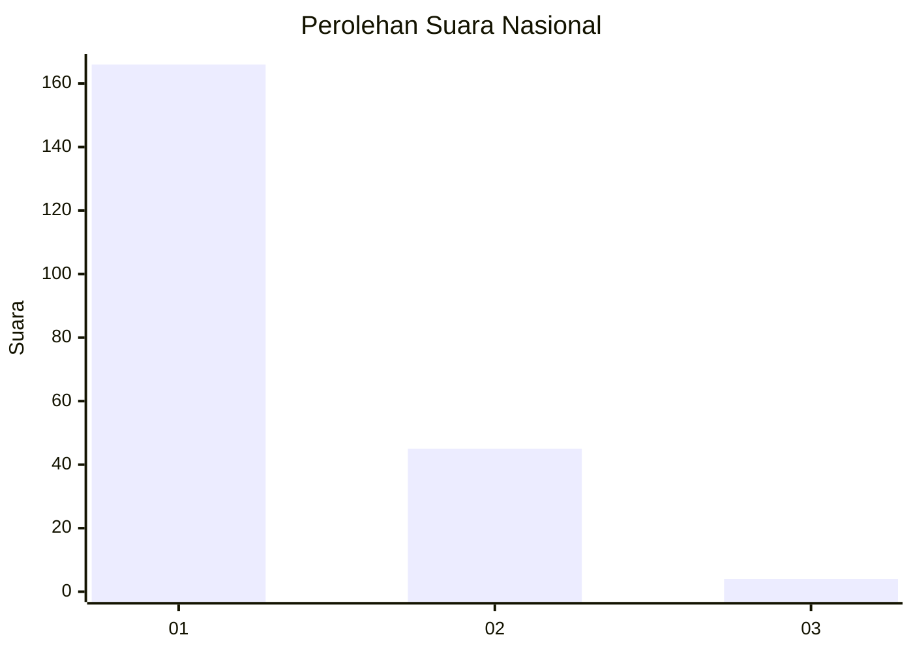
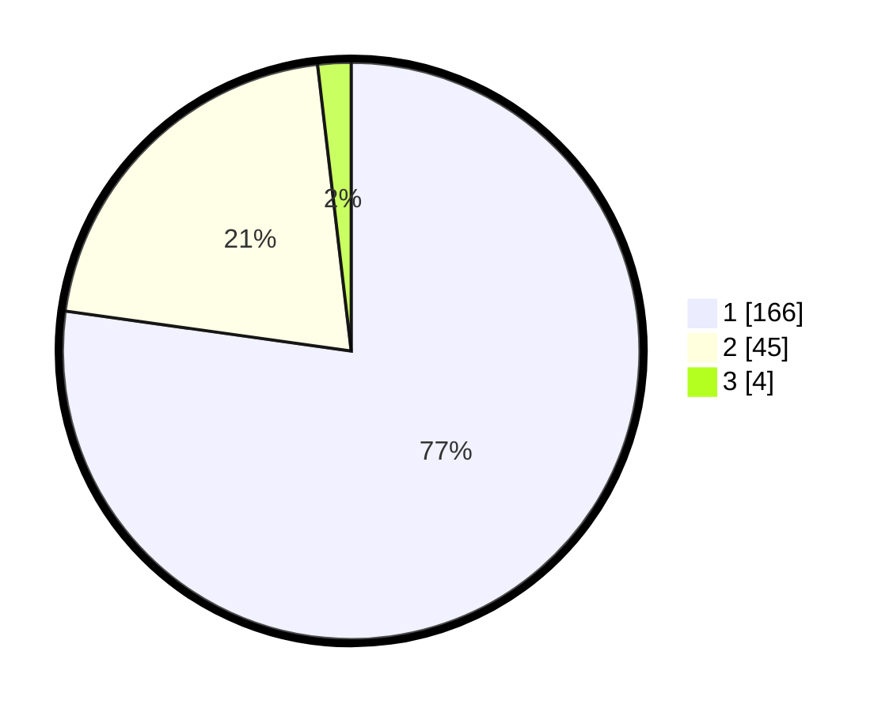

# Hasil

## Grafik

## Tabel

| No. | Nama Paslon    | Suara | Suara (raw) | Persentase |
|:--- |:-------------- | -----:| -----------:| ----------:|
| 1   | ANIES MUHAIMIN | 166   | [166][p-1]  | 77,21      |
| 2   | PRABOWO GIBRAN | 45    | [45][p-2]   | 20,93      |
| 3   | GANJAR MAHFUD  | 4     | [4][p-3]    | 1,86       |

[p-1]: https://github.com/gigit-pemilu/pemilu-2024/blob/main/pilpres/hitung-suara/sub/13-sumatera-barat/sub/04-tanah-datar/sub/12-tanjuang-baru/sub/2002-barulak/sub/013-tps/sub/paslon-1.txt
[p-2]: https://github.com/gigit-pemilu/pemilu-2024/blob/main/pilpres/hitung-suara/sub/13-sumatera-barat/sub/04-tanah-datar/sub/12-tanjuang-baru/sub/2002-barulak/sub/013-tps/sub/paslon-2.txt
[p-3]: https://github.com/gigit-pemilu/pemilu-2024/blob/main/pilpres/hitung-suara/sub/13-sumatera-barat/sub/04-tanah-datar/sub/12-tanjuang-baru/sub/2002-barulak/sub/013-tps/sub/paslon-3.txt

## Foto C Plano

https://sirekap-obj-formc.kpu.go.id/d353/pemilu/ppwp/13/04/12/20/02/1304122002013-20240215-021558--7cc3a238-f9b9-495b-9334-3c5551a2f285.jpg

https://sirekap-obj-formc.kpu.go.id/d353/pemilu/ppwp/13/04/12/20/02/1304122002013-20240215-013941--78f25950-3e6e-47ec-9545-9cee76d763f3.jpg

https://sirekap-obj-formc.kpu.go.id/d353/pemilu/ppwp/13/04/12/20/02/1304122002013-20240215-014636--01acfb9f-9e1e-4c07-b98e-2c58a0918cb7.jpg

## Metadata

| Key        | Value               |
| ---------- | ------------------- |
| Time Stamp | 2024-02-15 19:30:26 |

