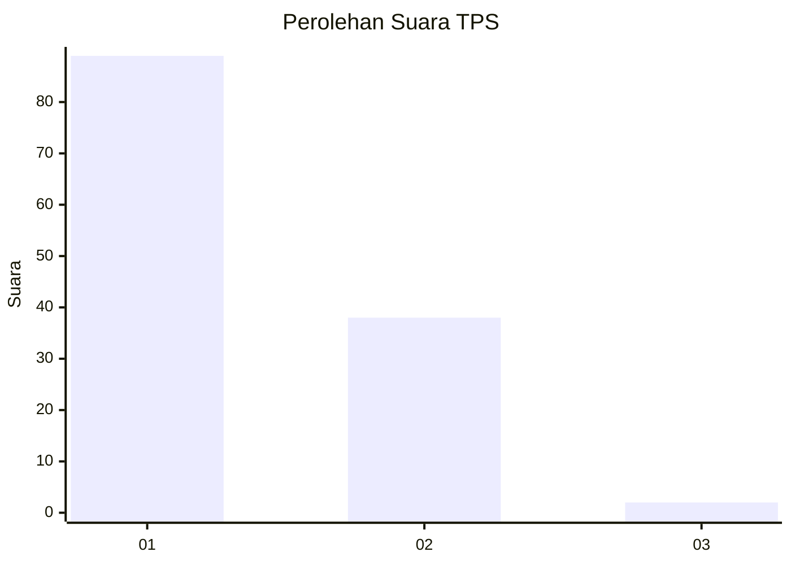
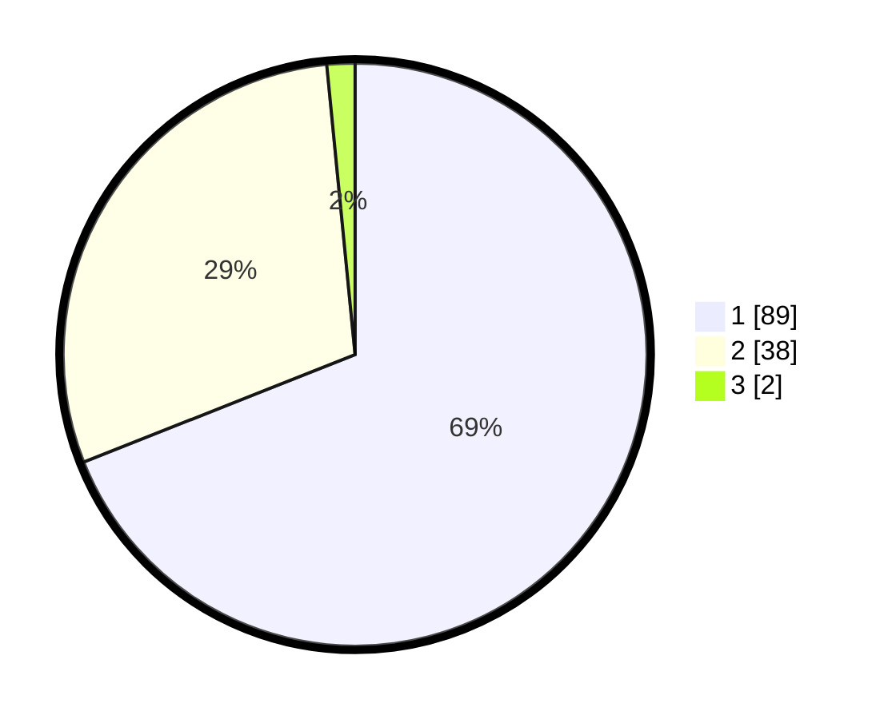

# Hasil

## Grafik

## Tabel

| No. | Nama Paslon    | Suara | Suara (raw) | Persentase |
|:--- |:-------------- | -----:| -----------:| ----------:|
| 1   | ANIES MUHAIMIN | 89    | [89][p-1]   | 68,99      |
| 2   | PRABOWO GIBRAN | 38    | [38][p-2]   | 29,46      |
| 3   | GANJAR MAHFUD  | 2     | [2][p-3]    | 1,55       |

[p-1]: https://github.com/gigit-pemilu/pemilu-2024-13-sumatera-barat/blob/main/pilpres/hitung-suara/sub/13-sumatera-barat/sub/04-tanah-datar/sub/13-lintau-buo-utara/sub/2001-batu-bulek/sub/002-tps/sub/paslon-1.txt
[p-2]: https://github.com/gigit-pemilu/pemilu-2024-13-sumatera-barat/blob/main/pilpres/hitung-suara/sub/13-sumatera-barat/sub/04-tanah-datar/sub/13-lintau-buo-utara/sub/2001-batu-bulek/sub/002-tps/sub/paslon-2.txt
[p-3]: https://github.com/gigit-pemilu/pemilu-2024-13-sumatera-barat/blob/main/pilpres/hitung-suara/sub/13-sumatera-barat/sub/04-tanah-datar/sub/13-lintau-buo-utara/sub/2001-batu-bulek/sub/002-tps/sub/paslon-3.txt

## Foto C Plano

https://sirekap-obj-formc.kpu.go.id/de2b/pemilu/ppwp/13/04/13/20/01/1304132001002-20240216-153710--558658f0-7081-45f7-aa3b-4064f2157e8c.jpg

https://sirekap-obj-formc.kpu.go.id/de2b/pemilu/ppwp/13/04/13/20/01/1304132001002-20240216-153716--0f891785-e26f-48b8-8ddd-8a1023b32853.jpg

https://sirekap-obj-formc.kpu.go.id/de2b/pemilu/ppwp/13/04/13/20/01/1304132001002-20240216-153721--c73c2e2a-1560-41f2-ae8f-ddf23dfdaabf.jpg

## Metadata

| Key        | Value               |
| ---------- | ------------------- |
| Time Stamp | 2024-02-17 14:45:18 |

