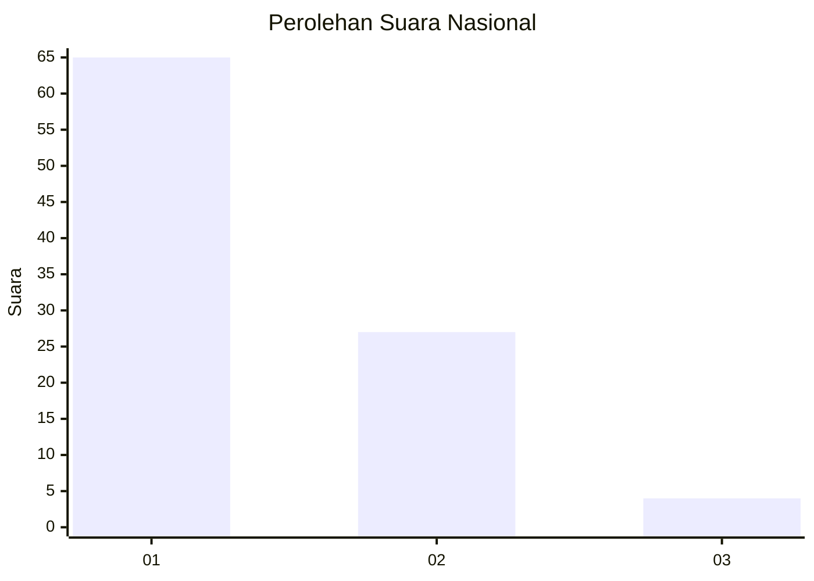
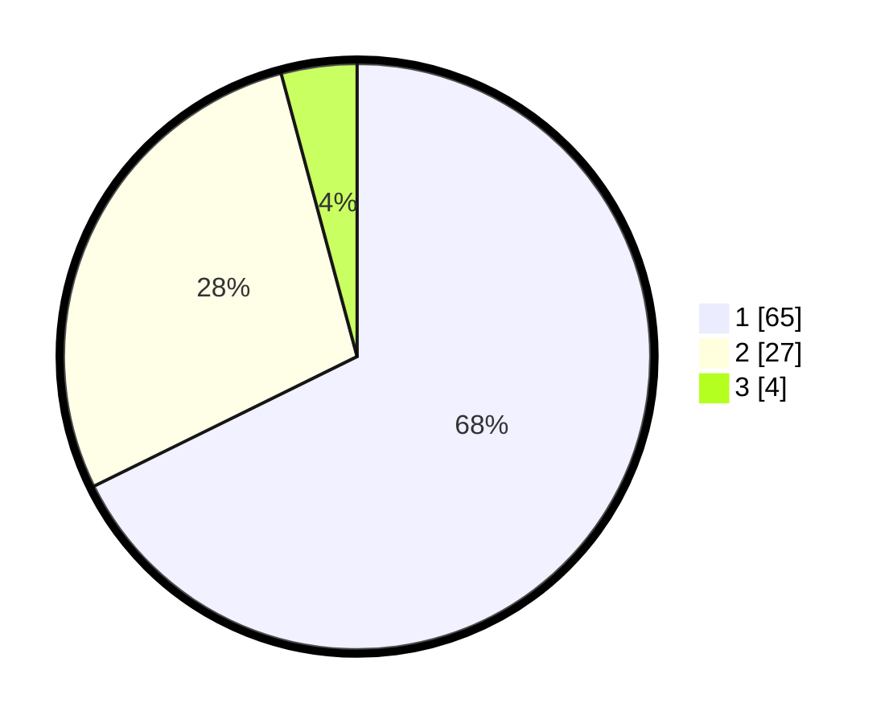

# Hasil

## Grafik

## Tabel

| No. | Nama Paslon    | Suara | Suara (raw) | Persentase |
|:--- |:-------------- | -----:| -----------:| ----------:|
| 1   | ANIES MUHAIMIN | 65    | [65][p-1]   | 67,71      |
| 2   | PRABOWO GIBRAN | 27    | [27][p-2]   | 28,13      |
| 3   | GANJAR MAHFUD  | 4     | [4][p-3]    | 4,17       |

[p-1]: https://github.com/gigit-pemilu/pemilu-2024/blob/main/pilpres/hitung-suara/sub/13-sumatera-barat/sub/04-tanah-datar/sub/13-lintau-buo-utara/sub/2002-balai-tangah/sub/003-tps/sub/paslon-1.txt
[p-2]: https://github.com/gigit-pemilu/pemilu-2024/blob/main/pilpres/hitung-suara/sub/13-sumatera-barat/sub/04-tanah-datar/sub/13-lintau-buo-utara/sub/2002-balai-tangah/sub/003-tps/sub/paslon-2.txt
[p-3]: https://github.com/gigit-pemilu/pemilu-2024/blob/main/pilpres/hitung-suara/sub/13-sumatera-barat/sub/04-tanah-datar/sub/13-lintau-buo-utara/sub/2002-balai-tangah/sub/003-tps/sub/paslon-3.txt

## Foto C Plano

https://sirekap-obj-formc.kpu.go.id/9cc3/pemilu/ppwp/13/04/13/20/02/1304132002003-20240215-053959--4accfee8-51e2-4cec-9efe-cf1ceda11c8b.jpg

https://sirekap-obj-formc.kpu.go.id/9cc3/pemilu/ppwp/13/04/13/20/02/1304132002003-20240215-054029--c87da091-6119-4ce2-9562-28a3f41fd48a.jpg

https://sirekap-obj-formc.kpu.go.id/9cc3/pemilu/ppwp/13/04/13/20/02/1304132002003-20240215-054047--4d843bd4-e9ed-4ecb-af51-a9f93d14b822.jpg

## Metadata

| Key        | Value               |
| ---------- | ------------------- |
| Time Stamp | 2024-02-15 15:00:29 |

