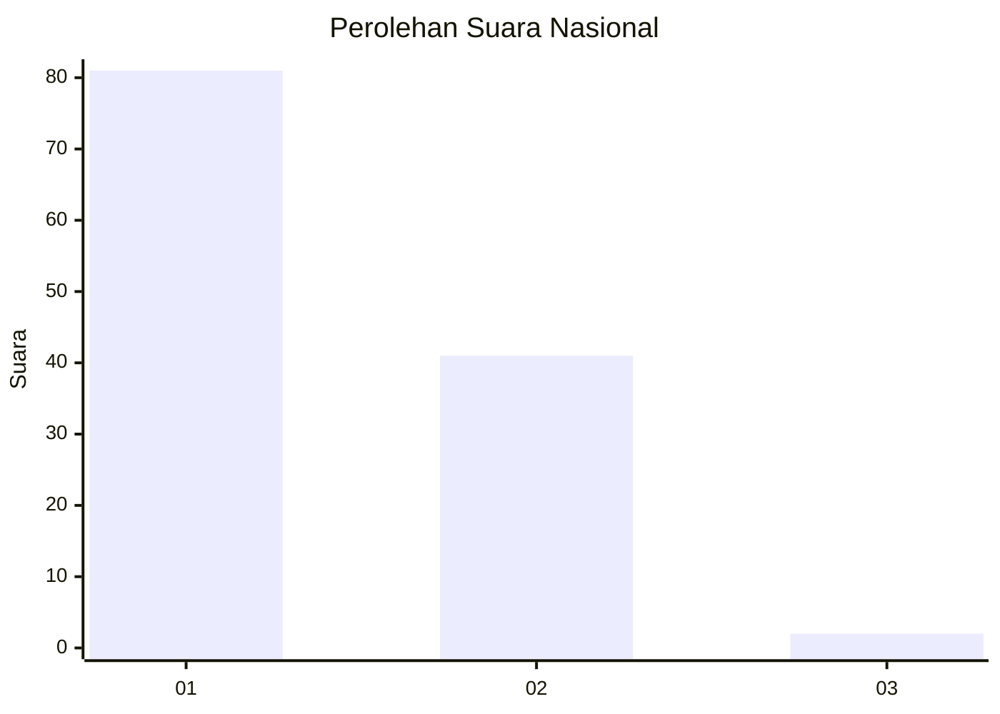
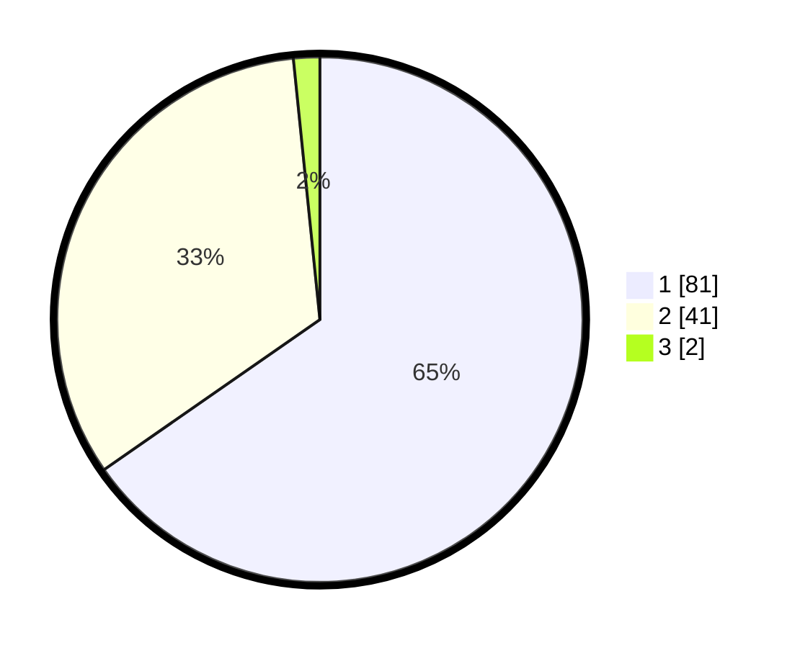

# Hasil

## Grafik

## Tabel

| No. | Nama Paslon    | Suara | Suara (raw) | Persentase |
|:--- |:-------------- | -----:| -----------:| ----------:|
| 1   | ANIES MUHAIMIN | 81    | [81][p-1]   | 65,32      |
| 2   | PRABOWO GIBRAN | 41    | [41][p-2]   | 33,06      |
| 3   | GANJAR MAHFUD  | 2     | [2][p-3]    | 1,61       |

[p-1]: https://github.com/gigit-pemilu/pemilu-2024/blob/main/pilpres/hitung-suara/sub/13-sumatera-barat/sub/04-tanah-datar/sub/13-lintau-buo-utara/sub/2003-tanjuang-bonai/sub/005-tps/sub/paslon-1.txt
[p-2]: https://github.com/gigit-pemilu/pemilu-2024/blob/main/pilpres/hitung-suara/sub/13-sumatera-barat/sub/04-tanah-datar/sub/13-lintau-buo-utara/sub/2003-tanjuang-bonai/sub/005-tps/sub/paslon-2.txt
[p-3]: https://github.com/gigit-pemilu/pemilu-2024/blob/main/pilpres/hitung-suara/sub/13-sumatera-barat/sub/04-tanah-datar/sub/13-lintau-buo-utara/sub/2003-tanjuang-bonai/sub/005-tps/sub/paslon-3.txt

## Foto C Plano

https://sirekap-obj-formc.kpu.go.id/f0a4/pemilu/ppwp/13/04/13/20/03/1304132003005-20240214-215002--9d996e32-0703-4849-bfd8-2e3371de1e71.jpg

https://sirekap-obj-formc.kpu.go.id/f0a4/pemilu/ppwp/13/04/13/20/03/1304132003005-20240214-214755--89ffe853-4105-4edd-bdd8-f0ba77862d91.jpg

https://sirekap-obj-formc.kpu.go.id/f0a4/pemilu/ppwp/13/04/13/20/03/1304132003005-20240214-214910--618f4e09-69e8-47eb-b19b-5ac710aa193b.jpg

## Metadata

| Key        | Value               |
| ---------- | ------------------- |
| Time Stamp | 2024-02-15 15:00:29 |

