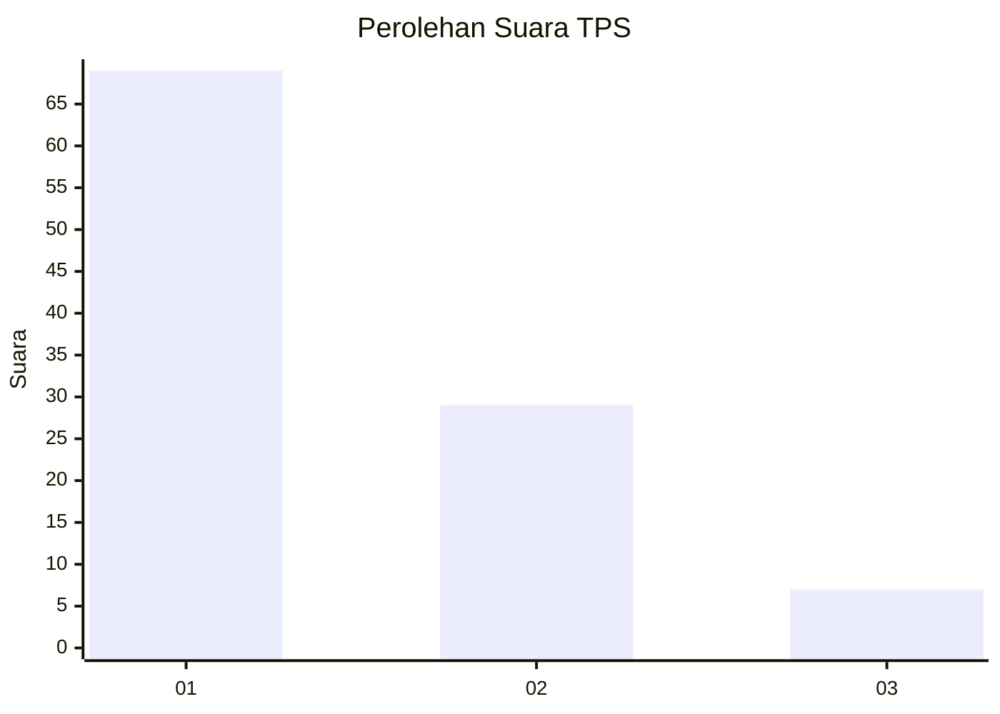
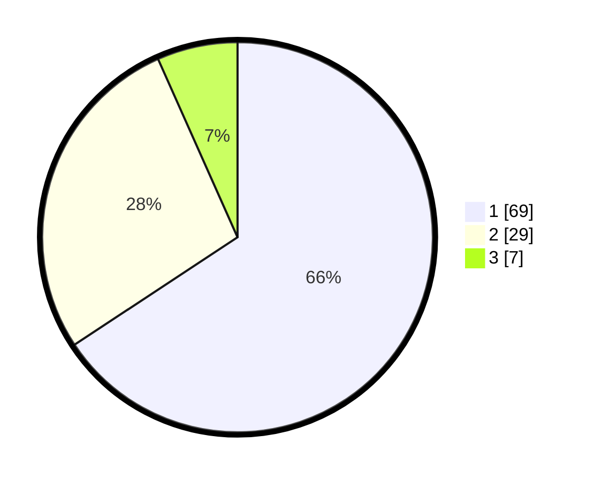

# Hasil

## Grafik

## Tabel

| No. | Nama Paslon    | Suara | Suara (raw) | Persentase |
|:--- |:-------------- | -----:| -----------:| ----------:|
| 1   | ANIES MUHAIMIN | 69    | [69][p-1]   | 65,71      |
| 2   | PRABOWO GIBRAN | 29    | [29][p-2]   | 27,62      |
| 3   | GANJAR MAHFUD  | 7     | [7][p-3]    | 6,67       |

[p-1]: https://github.com/gigit-pemilu/pemilu-2024-13-sumatera-barat/blob/main/pilpres/hitung-suara/sub/13-sumatera-barat/sub/04-tanah-datar/sub/13-lintau-buo-utara/sub/2003-tanjuang-bonai/sub/026-tps/sub/paslon-1.txt
[p-2]: https://github.com/gigit-pemilu/pemilu-2024-13-sumatera-barat/blob/main/pilpres/hitung-suara/sub/13-sumatera-barat/sub/04-tanah-datar/sub/13-lintau-buo-utara/sub/2003-tanjuang-bonai/sub/026-tps/sub/paslon-2.txt
[p-3]: https://github.com/gigit-pemilu/pemilu-2024-13-sumatera-barat/blob/main/pilpres/hitung-suara/sub/13-sumatera-barat/sub/04-tanah-datar/sub/13-lintau-buo-utara/sub/2003-tanjuang-bonai/sub/026-tps/sub/paslon-3.txt

## Foto C Plano

https://sirekap-obj-formc.kpu.go.id/5423/pemilu/ppwp/13/04/13/20/03/1304132003026-20240215-015058--053d4cad-e468-40b8-b274-c745791a764a.jpg

https://sirekap-obj-formc.kpu.go.id/5423/pemilu/ppwp/13/04/13/20/03/1304132003026-20240220-143716--7e8b459e-aca8-44c4-9d7c-bfd3fd22b3fd.jpg

https://sirekap-obj-formc.kpu.go.id/5423/pemilu/ppwp/13/04/13/20/03/1304132003026-20240220-143250--4f13a42a-a74b-46d0-a4ed-7ea1f6f1f0c5.jpg

## Metadata

| Key        | Value               |
| ---------- | ------------------- |
| Time Stamp | 2024-02-21 09:00:00 |

