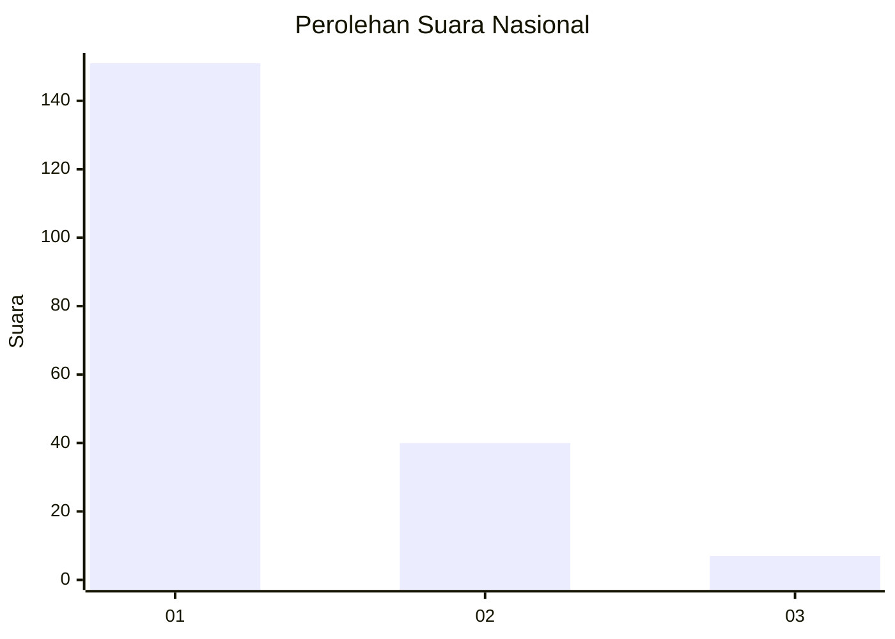
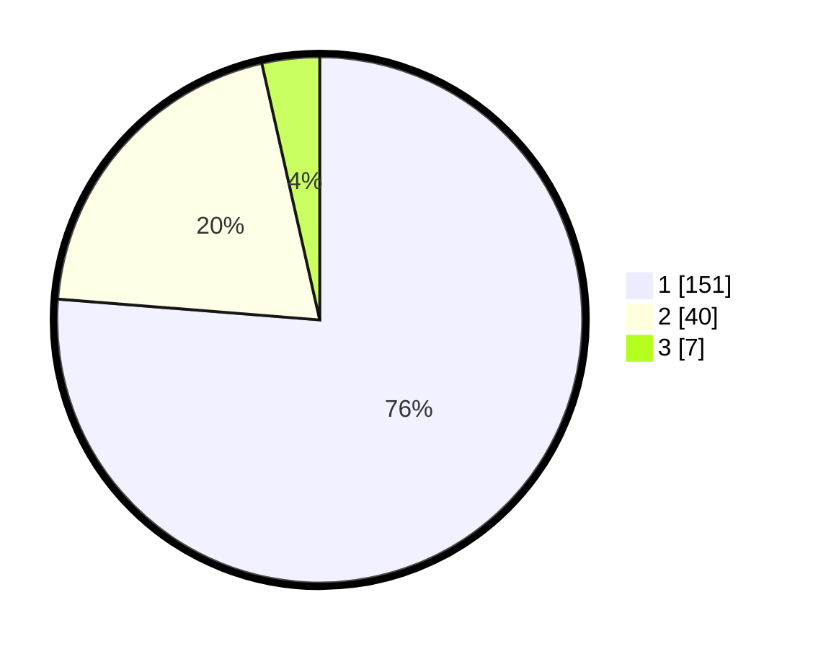

# Hasil

## Grafik

## Tabel

| No. | Nama Paslon    | Suara | Suara (raw) | Persentase |
|:--- |:-------------- | -----:| -----------:| ----------:|
| 1   | ANIES MUHAIMIN | 151   | [151][p-1]  | 76,26      |
| 2   | PRABOWO GIBRAN | 40    | [40][p-2]   | 20,20      |
| 3   | GANJAR MAHFUD  | 7     | [7][p-3]    | 3,54       |

[p-1]: https://github.com/gigit-pemilu/pemilu-2024/blob/main/pilpres/hitung-suara/sub/13-sumatera-barat/sub/04-tanah-datar/sub/13-lintau-buo-utara/sub/2004-lubuak-jantan/sub/018-tps/sub/paslon-1.txt
[p-2]: https://github.com/gigit-pemilu/pemilu-2024/blob/main/pilpres/hitung-suara/sub/13-sumatera-barat/sub/04-tanah-datar/sub/13-lintau-buo-utara/sub/2004-lubuak-jantan/sub/018-tps/sub/paslon-2.txt
[p-3]: https://github.com/gigit-pemilu/pemilu-2024/blob/main/pilpres/hitung-suara/sub/13-sumatera-barat/sub/04-tanah-datar/sub/13-lintau-buo-utara/sub/2004-lubuak-jantan/sub/018-tps/sub/paslon-3.txt

## Foto C Plano

https://sirekap-obj-formc.kpu.go.id/a502/pemilu/ppwp/13/04/13/20/04/1304132004018-20240214-234038--2a11468e-f593-47b7-a41f-bc3e7ab32133.jpg

https://sirekap-obj-formc.kpu.go.id/a502/pemilu/ppwp/13/04/13/20/04/1304132004018-20240214-221945--d1d8eb2e-221f-4ad8-8d58-0d37d8a269cb.jpg

https://sirekap-obj-formc.kpu.go.id/a502/pemilu/ppwp/13/04/13/20/04/1304132004018-20240214-222045--4853c5d9-ce3e-4732-82fb-07e6ea497dc2.jpg

## Metadata

| Key        | Value               |
| ---------- | ------------------- |
| Time Stamp | 2024-02-17 16:00:02 |

