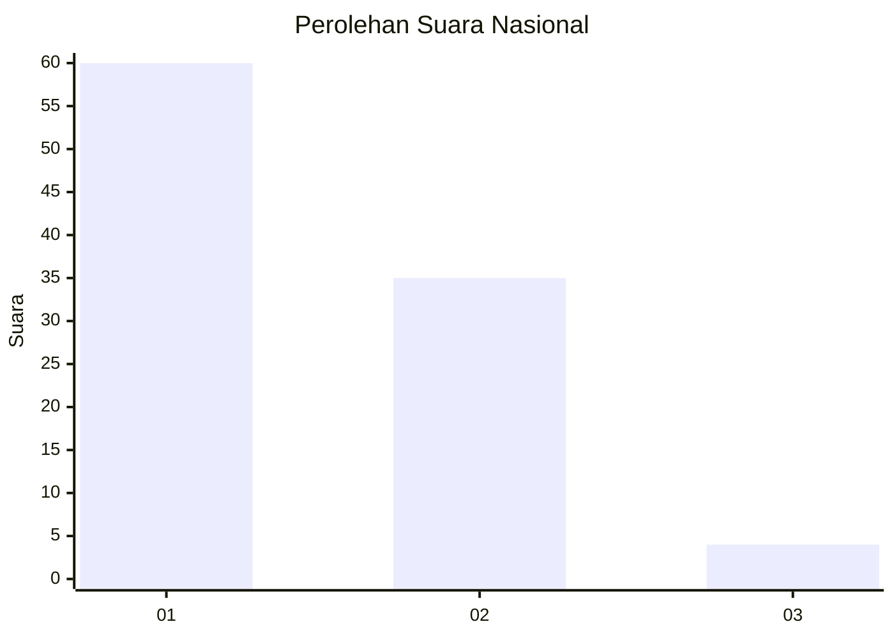
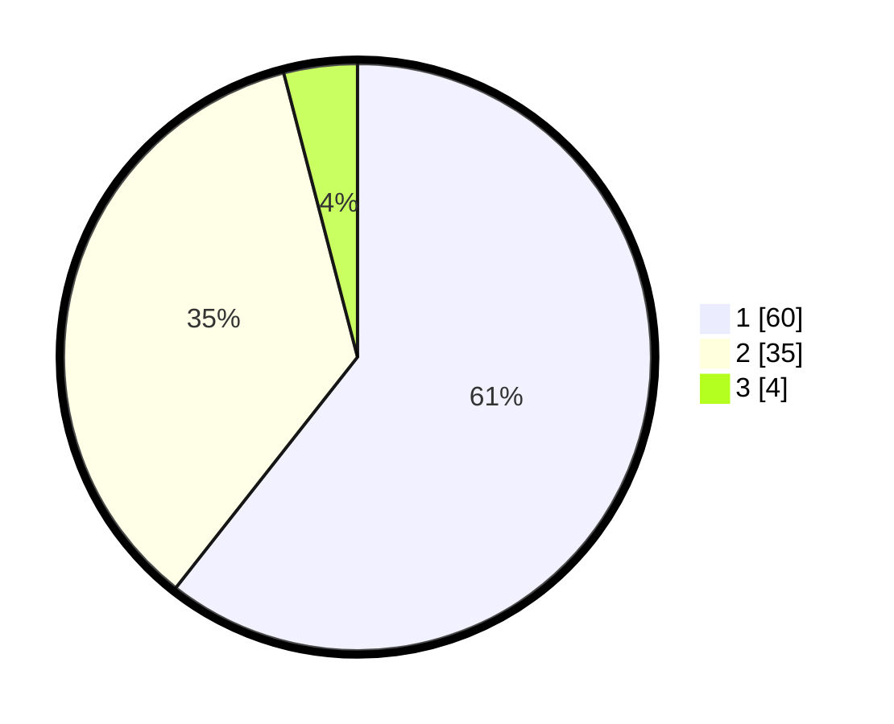

# Hasil

## Grafik

## Tabel

| No. | Nama Paslon    | Suara | Suara (raw) | Persentase |
|:--- |:-------------- | -----:| -----------:| ----------:|
| 1   | ANIES MUHAIMIN | 60    | [60][p-1]   | 60,61      |
| 2   | PRABOWO GIBRAN | 35    | [35][p-2]   | 35,35      |
| 3   | GANJAR MAHFUD  | 4     | [4][p-3]    | 4,04       |

[p-1]: https://github.com/gigit-pemilu/pemilu-2024/blob/main/pilpres/hitung-suara/sub/13-sumatera-barat/sub/04-tanah-datar/sub/13-lintau-buo-utara/sub/2004-lubuak-jantan/sub/019-tps/sub/paslon-1.txt
[p-2]: https://github.com/gigit-pemilu/pemilu-2024/blob/main/pilpres/hitung-suara/sub/13-sumatera-barat/sub/04-tanah-datar/sub/13-lintau-buo-utara/sub/2004-lubuak-jantan/sub/019-tps/sub/paslon-2.txt
[p-3]: https://github.com/gigit-pemilu/pemilu-2024/blob/main/pilpres/hitung-suara/sub/13-sumatera-barat/sub/04-tanah-datar/sub/13-lintau-buo-utara/sub/2004-lubuak-jantan/sub/019-tps/sub/paslon-3.txt

## Foto C Plano

https://sirekap-obj-formc.kpu.go.id/6691/pemilu/ppwp/13/04/13/20/04/1304132004019-20240214-214457--843d2b44-b1dc-4c85-b233-86f33289f5b7.jpg

https://sirekap-obj-formc.kpu.go.id/6691/pemilu/ppwp/13/04/13/20/04/1304132004019-20240214-214641--ce6f413d-02e2-4e24-91cc-3dbe3c36a553.jpg

https://sirekap-obj-formc.kpu.go.id/6691/pemilu/ppwp/13/04/13/20/04/1304132004019-20240214-214735--f2642fb5-e276-4d6d-8d5a-2a75e507ddfe.jpg

## Metadata

| Key        | Value               |
| ---------- | ------------------- |
| Time Stamp | 2024-02-15 15:30:25 |

