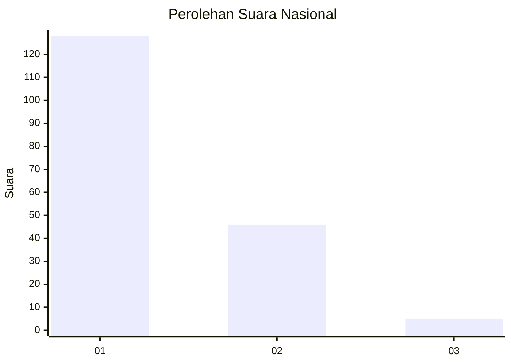
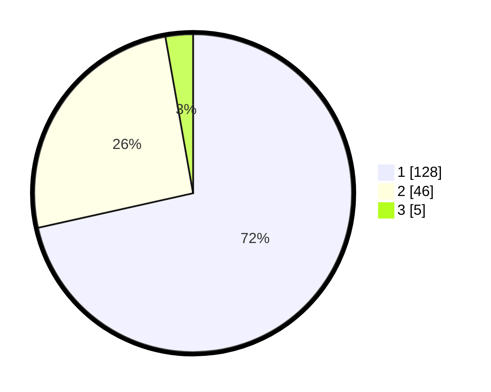

# Hasil

## Grafik

## Tabel

| No. | Nama Paslon    | Suara | Suara (raw) | Persentase |
|:--- |:-------------- | -----:| -----------:| ----------:|
| 1   | ANIES MUHAIMIN | 128   | [128][p-1]  | 71,51      |
| 2   | PRABOWO GIBRAN | 46    | [46][p-2]   | 25,70      |
| 3   | GANJAR MAHFUD  | 5     | [5][p-3]    | 2,79       |

[p-1]: https://github.com/gigit-pemilu/pemilu-2024/blob/main/pilpres/hitung-suara/sub/13-sumatera-barat/sub/04-tanah-datar/sub/13-lintau-buo-utara/sub/2005-tapi-selo/sub/002-tps/sub/paslon-1.txt
[p-2]: https://github.com/gigit-pemilu/pemilu-2024/blob/main/pilpres/hitung-suara/sub/13-sumatera-barat/sub/04-tanah-datar/sub/13-lintau-buo-utara/sub/2005-tapi-selo/sub/002-tps/sub/paslon-2.txt
[p-3]: https://github.com/gigit-pemilu/pemilu-2024/blob/main/pilpres/hitung-suara/sub/13-sumatera-barat/sub/04-tanah-datar/sub/13-lintau-buo-utara/sub/2005-tapi-selo/sub/002-tps/sub/paslon-3.txt

## Foto C Plano

https://sirekap-obj-formc.kpu.go.id/cf47/pemilu/ppwp/13/04/13/20/05/1304132005002-20240215-031217--1efa7d3d-a3ae-49fe-8c5f-ec1420b591a8.jpg

https://sirekap-obj-formc.kpu.go.id/cf47/pemilu/ppwp/13/04/13/20/05/1304132005002-20240215-031418--738ecb7b-5fd4-40e9-b1a5-37a0a2252577.jpg

https://sirekap-obj-formc.kpu.go.id/cf47/pemilu/ppwp/13/04/13/20/05/1304132005002-20240215-031542--4b438957-c3db-44f3-b0fe-2443a6e90743.jpg

## Metadata

| Key        | Value               |
| ---------- | ------------------- |
| Time Stamp | 2024-02-15 09:00:24 |

