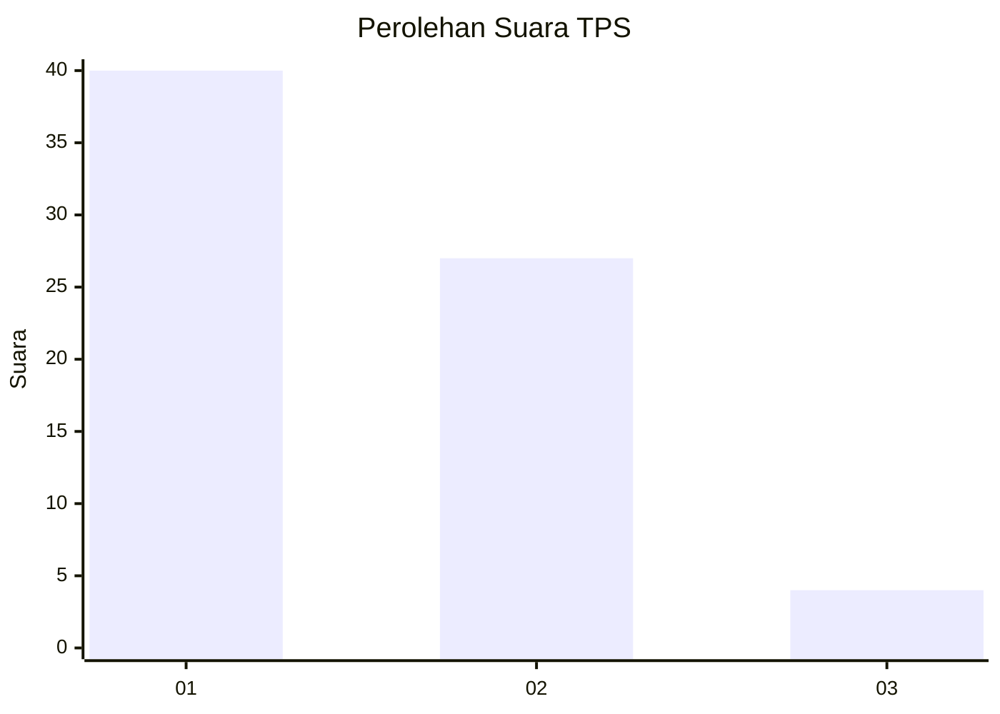
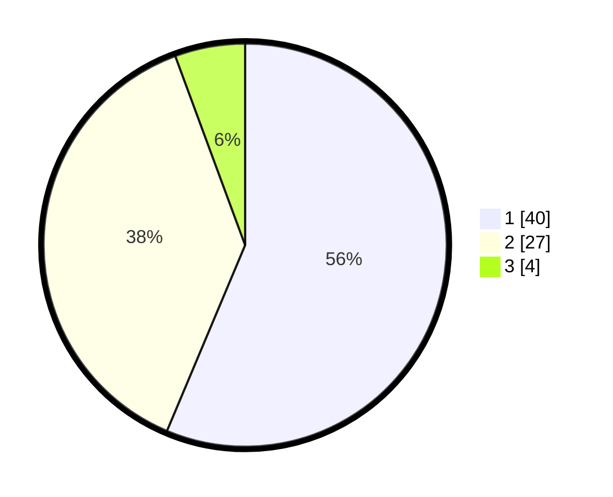

# Hasil

## Grafik

## Tabel

| No. | Nama Paslon    | Suara | Suara (raw) | Persentase |
|:--- |:-------------- | -----:| -----------:| ----------:|
| 1   | ANIES MUHAIMIN | 40    | [40][p-1]   | 56,34      |
| 2   | PRABOWO GIBRAN | 27    | [27][p-2]   | 38,03      |
| 3   | GANJAR MAHFUD  | 4     | [4][p-3]    | 5,63       |

[p-1]: https://github.com/gigit-pemilu/pemilu-2024-13-sumatera-barat/blob/main/pilpres/hitung-suara/sub/13-sumatera-barat/sub/04-tanah-datar/sub/14-batipuah-selatan/sub/2004-guguak-malalo/sub/012-tps/sub/paslon-1.txt
[p-2]: https://github.com/gigit-pemilu/pemilu-2024-13-sumatera-barat/blob/main/pilpres/hitung-suara/sub/13-sumatera-barat/sub/04-tanah-datar/sub/14-batipuah-selatan/sub/2004-guguak-malalo/sub/012-tps/sub/paslon-2.txt
[p-3]: https://github.com/gigit-pemilu/pemilu-2024-13-sumatera-barat/blob/main/pilpres/hitung-suara/sub/13-sumatera-barat/sub/04-tanah-datar/sub/14-batipuah-selatan/sub/2004-guguak-malalo/sub/012-tps/sub/paslon-3.txt

## Foto C Plano

https://sirekap-obj-formc.kpu.go.id/8dae/pemilu/ppwp/13/04/14/20/04/1304142004012-20240218-161107--27f88f6e-a447-4097-ac4d-d2bbc5fe3287.jpg

https://sirekap-obj-formc.kpu.go.id/8dae/pemilu/ppwp/13/04/14/20/04/1304142004012-20240217-185145--d387ca5c-ae48-471d-bda9-af3f277751db.jpg

https://sirekap-obj-formc.kpu.go.id/8dae/pemilu/ppwp/13/04/14/20/04/1304142004012-20240218-161412--ae4651c3-94af-46e7-ae77-d946ef61645c.jpg

## Metadata

| Key        | Value               |
| ---------- | ------------------- |
| Time Stamp | 2024-02-19 06:16:00 |

