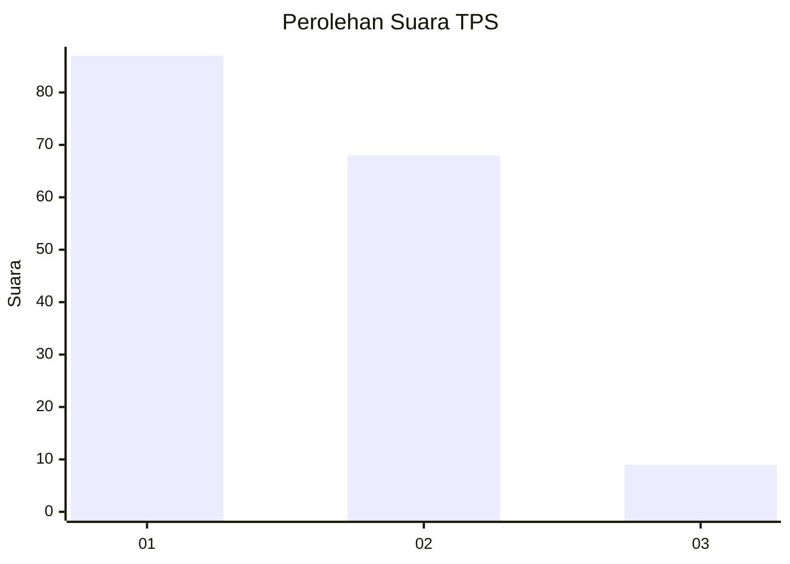
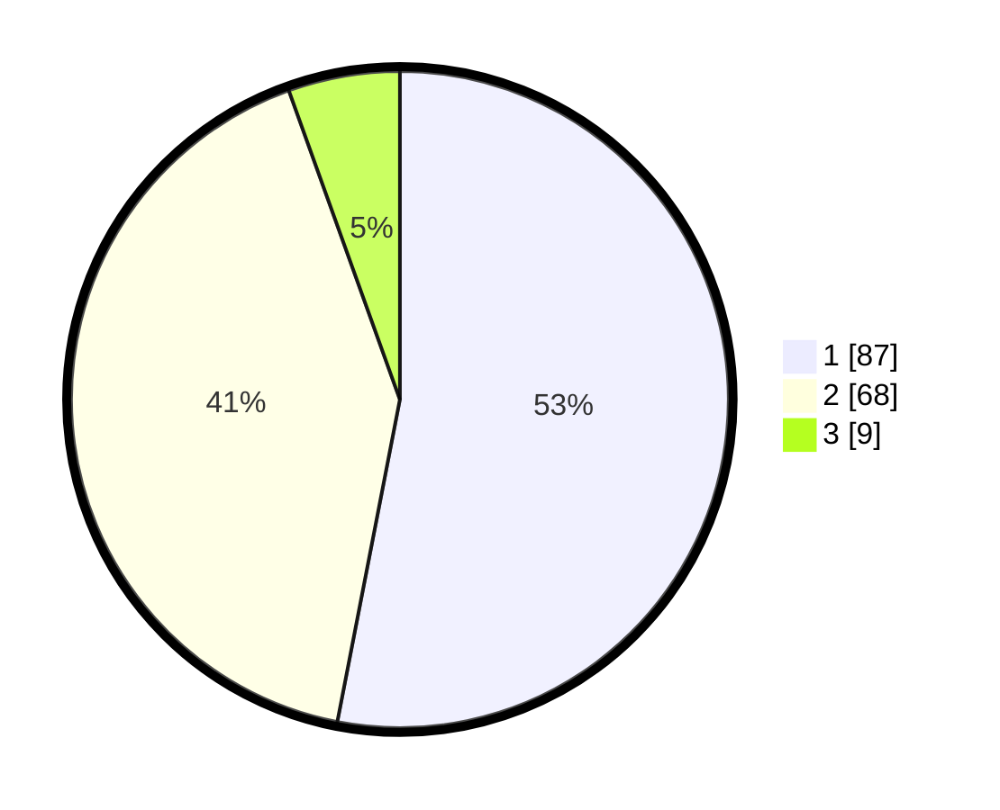

# Hasil

## Grafik

## Tabel

| No. | Nama Paslon    | Suara | Suara (raw) | Persentase |
|:--- |:-------------- | -----:| -----------:| ----------:|
| 1   | ANIES MUHAIMIN | 87    | [87][p-1]   | 53,05      |
| 2   | PRABOWO GIBRAN | 68    | [68][p-2]   | 41,46      |
| 3   | GANJAR MAHFUD  | 9     | [9][p-3]    | 5,49       |

[p-1]: https://github.com/gigit-pemilu/pemilu-2024-13-sumatera-barat/blob/main/pilpres/hitung-suara/sub/13-sumatera-barat/sub/05-padang-pariaman/sub/01-lubuk-alung/sub/2001-lubuk-alung/sub/006-tps/sub/paslon-1.txt
[p-2]: https://github.com/gigit-pemilu/pemilu-2024-13-sumatera-barat/blob/main/pilpres/hitung-suara/sub/13-sumatera-barat/sub/05-padang-pariaman/sub/01-lubuk-alung/sub/2001-lubuk-alung/sub/006-tps/sub/paslon-2.txt
[p-3]: https://github.com/gigit-pemilu/pemilu-2024-13-sumatera-barat/blob/main/pilpres/hitung-suara/sub/13-sumatera-barat/sub/05-padang-pariaman/sub/01-lubuk-alung/sub/2001-lubuk-alung/sub/006-tps/sub/paslon-3.txt

## Foto C Plano

https://sirekap-obj-formc.kpu.go.id/93bb/pemilu/ppwp/13/05/01/20/01/1305012001006-20240215-022309--3ebd2ac8-2e3e-4521-8a2f-62bd49e0c259.jpg

https://sirekap-obj-formc.kpu.go.id/93bb/pemilu/ppwp/13/05/01/20/01/1305012001006-20240215-022435--f525fff2-a4dc-4b29-8c27-8c011f6f589a.jpg

https://sirekap-obj-formc.kpu.go.id/93bb/pemilu/ppwp/13/05/01/20/01/1305012001006-20240215-022559--19e8e9f0-7cc6-4003-a968-4416a3852f1c.jpg

## Metadata

| Key        | Value               |
| ---------- | ------------------- |
| Time Stamp | 2024-02-15 20:00:44 |

