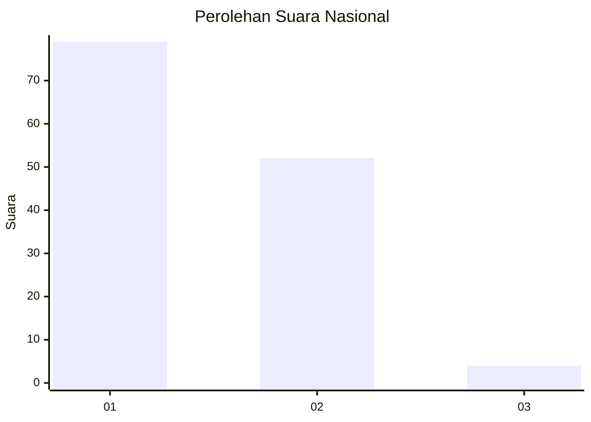
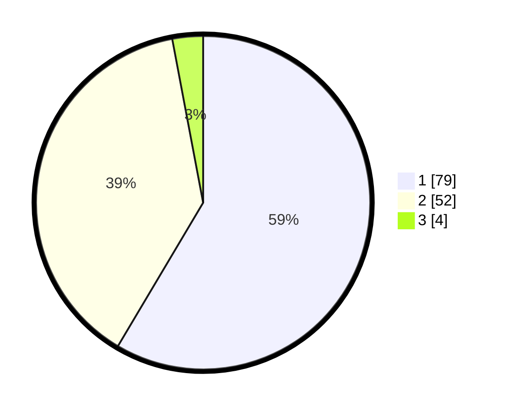

# Hasil

## Grafik

## Tabel

| No. | Nama Paslon    | Suara | Suara (raw) | Persentase |
|:--- |:-------------- | -----:| -----------:| ----------:|
| 1   | ANIES MUHAIMIN | 79    | [79][p-1]   | 58,52      |
| 2   | PRABOWO GIBRAN | 52    | [52][p-2]   | 38,52      |
| 3   | GANJAR MAHFUD  | 4     | [4][p-3]    | 2,96       |

[p-1]: https://github.com/gigit-pemilu/pemilu-2024/blob/main/pilpres/hitung-suara/sub/13-sumatera-barat/sub/05-padang-pariaman/sub/01-lubuk-alung/sub/2002-pungguang-kasiak-lubuk-alung/sub/004-tps/sub/paslon-1.txt
[p-2]: https://github.com/gigit-pemilu/pemilu-2024/blob/main/pilpres/hitung-suara/sub/13-sumatera-barat/sub/05-padang-pariaman/sub/01-lubuk-alung/sub/2002-pungguang-kasiak-lubuk-alung/sub/004-tps/sub/paslon-2.txt
[p-3]: https://github.com/gigit-pemilu/pemilu-2024/blob/main/pilpres/hitung-suara/sub/13-sumatera-barat/sub/05-padang-pariaman/sub/01-lubuk-alung/sub/2002-pungguang-kasiak-lubuk-alung/sub/004-tps/sub/paslon-3.txt

## Foto C Plano

https://sirekap-obj-formc.kpu.go.id/ee3d/pemilu/ppwp/13/05/01/20/02/1305012002004-20240219-233756--6ff85cec-45e3-4f68-b82b-f4ba6c13c014.jpg

https://sirekap-obj-formc.kpu.go.id/ee3d/pemilu/ppwp/13/05/01/20/02/1305012002004-20240220-002254--389138a6-13ab-4830-a322-18f8938f325d.jpg

https://sirekap-obj-formc.kpu.go.id/ee3d/pemilu/ppwp/13/05/01/20/02/1305012002004-20240221-010731--292abbfa-21fd-44ba-aa8d-f6da1671fd34.jpg

## Metadata

| Key        | Value               |
| ---------- | ------------------- |
| Time Stamp | 2024-02-21 02:00:00 |

