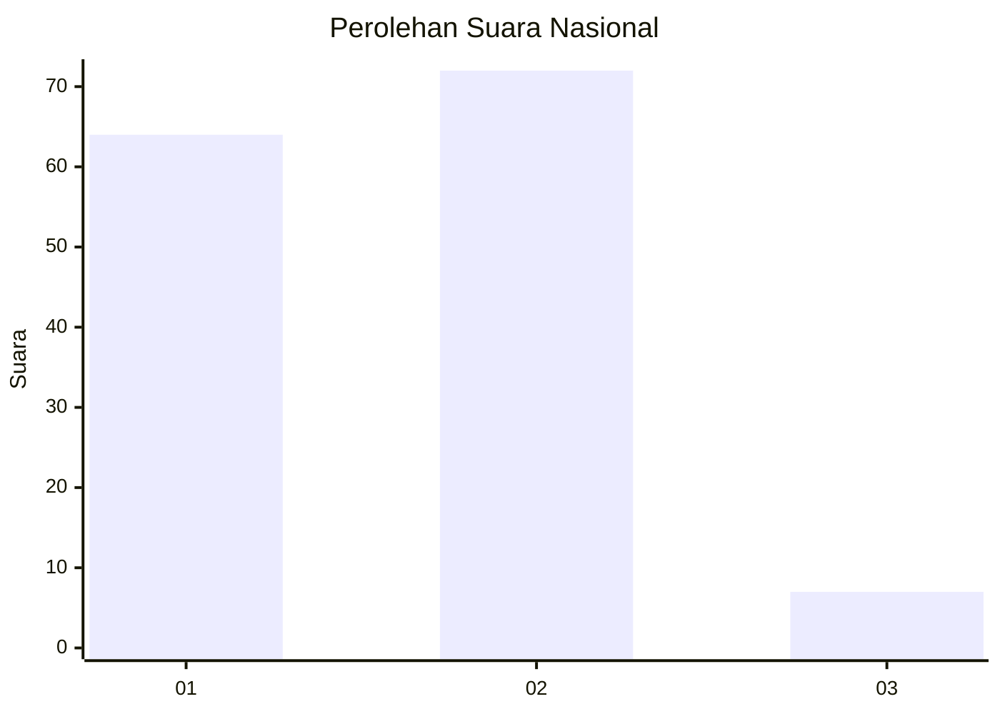
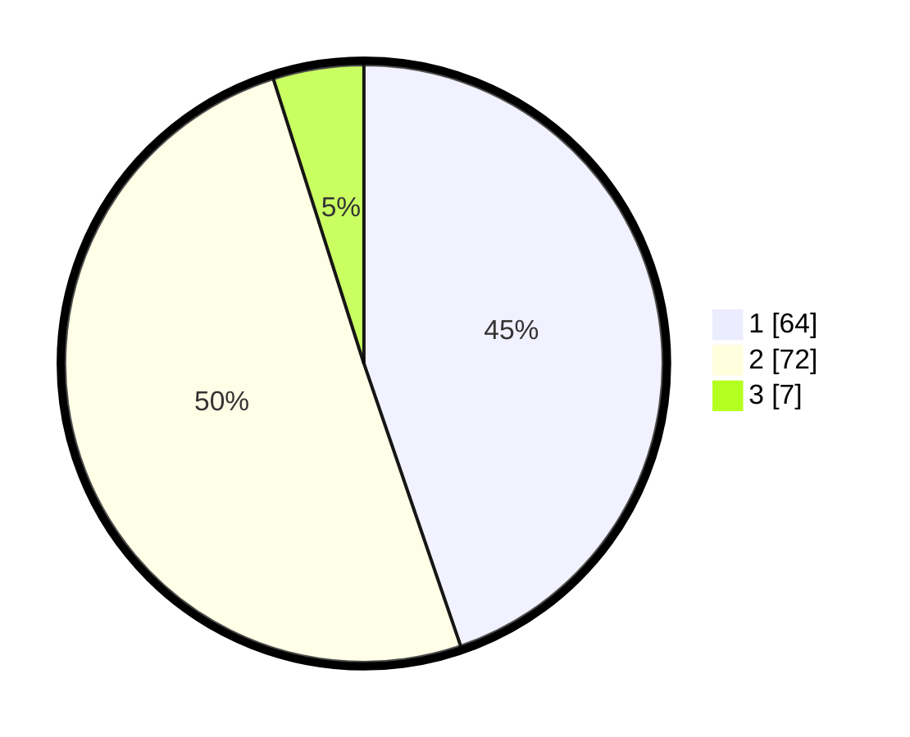

# Hasil

## Grafik

## Tabel

| No. | Nama Paslon    | Suara | Suara (raw) | Persentase |
|:--- |:-------------- | -----:| -----------:| ----------:|
| 1   | ANIES MUHAIMIN | 64    | [64][p-1]   | 44,76      |
| 2   | PRABOWO GIBRAN | 72    | [72][p-2]   | 50,35      |
| 3   | GANJAR MAHFUD  | 7     | [7][p-3]    | 4,90       |

[p-1]: https://github.com/gigit-pemilu/pemilu-2024/blob/main/pilpres/hitung-suara/sub/13-sumatera-barat/sub/05-padang-pariaman/sub/01-lubuk-alung/sub/2003-pasie-laweh-lubuk-alung/sub/004-tps/sub/paslon-1.txt
[p-2]: https://github.com/gigit-pemilu/pemilu-2024/blob/main/pilpres/hitung-suara/sub/13-sumatera-barat/sub/05-padang-pariaman/sub/01-lubuk-alung/sub/2003-pasie-laweh-lubuk-alung/sub/004-tps/sub/paslon-2.txt
[p-3]: https://github.com/gigit-pemilu/pemilu-2024/blob/main/pilpres/hitung-suara/sub/13-sumatera-barat/sub/05-padang-pariaman/sub/01-lubuk-alung/sub/2003-pasie-laweh-lubuk-alung/sub/004-tps/sub/paslon-3.txt

## Foto C Plano

https://sirekap-obj-formc.kpu.go.id/5a9f/pemilu/ppwp/13/05/01/20/03/1305012003004-20240214-223412--14a8da36-ea45-41cc-8ae6-6860a5ad9bd4.jpg

https://sirekap-obj-formc.kpu.go.id/5a9f/pemilu/ppwp/13/05/01/20/03/1305012003004-20240214-230819--5b06a611-5ce3-4e04-a95f-8a47d37c4cc3.jpg

https://sirekap-obj-formc.kpu.go.id/5a9f/pemilu/ppwp/13/05/01/20/03/1305012003004-20240214-231051--aa4a8796-d0ac-4da5-b690-50786c3e3bd5.jpg

## Metadata

| Key        | Value               |
| ---------- | ------------------- |
| Time Stamp | 2024-02-15 20:00:44 |

