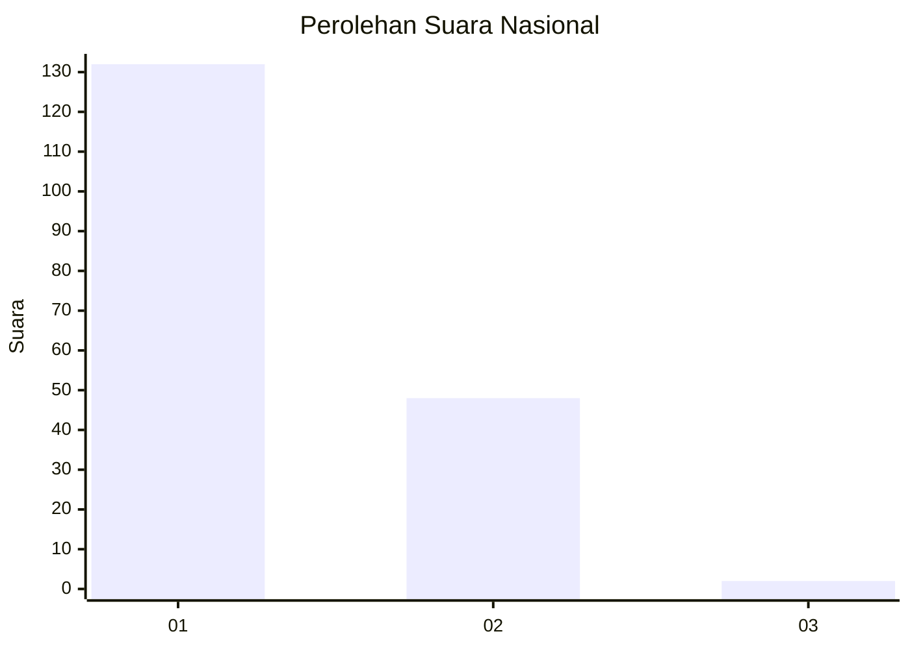
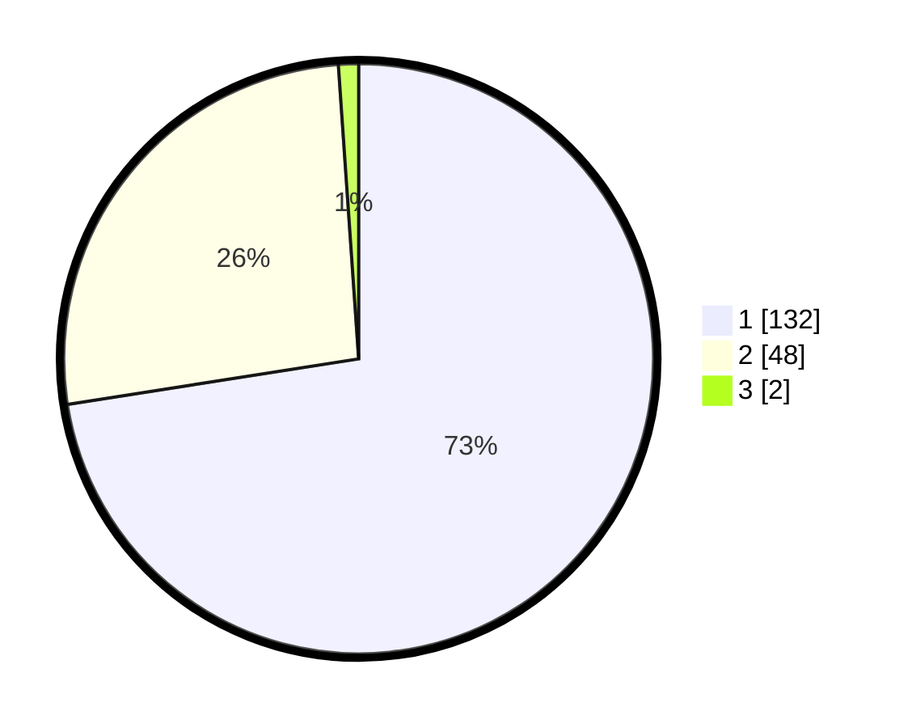

# Hasil

## Grafik

## Tabel

| No. | Nama Paslon    | Suara | Suara (raw) | Persentase |
|:--- |:-------------- | -----:| -----------:| ----------:|
| 1   | ANIES MUHAIMIN | 132   | [132][p-1]  | 72,53      |
| 2   | PRABOWO GIBRAN | 48    | [48][p-2]   | 26,37      |
| 3   | GANJAR MAHFUD  | 2     | [2][p-3]    | 1,10       |

[p-1]: https://github.com/gigit-pemilu/pemilu-2024/blob/main/pilpres/hitung-suara/sub/13-sumatera-barat/sub/05-padang-pariaman/sub/01-lubuk-alung/sub/2006-sungai-abang-lubuk-alung/sub/001-tps/sub/paslon-1.txt
[p-2]: https://github.com/gigit-pemilu/pemilu-2024/blob/main/pilpres/hitung-suara/sub/13-sumatera-barat/sub/05-padang-pariaman/sub/01-lubuk-alung/sub/2006-sungai-abang-lubuk-alung/sub/001-tps/sub/paslon-2.txt
[p-3]: https://github.com/gigit-pemilu/pemilu-2024/blob/main/pilpres/hitung-suara/sub/13-sumatera-barat/sub/05-padang-pariaman/sub/01-lubuk-alung/sub/2006-sungai-abang-lubuk-alung/sub/001-tps/sub/paslon-3.txt

## Foto C Plano

https://sirekap-obj-formc.kpu.go.id/cd09/pemilu/ppwp/13/05/01/20/06/1305012006001-20240221-180302--42d87015-7fb2-4212-838d-7de51f8c21bd.jpg

https://sirekap-obj-formc.kpu.go.id/cd09/pemilu/ppwp/13/05/01/20/06/1305012006001-20240215-023312--bfaed330-f661-4b7e-b327-cc2413039b32.jpg

https://sirekap-obj-formc.kpu.go.id/cd09/pemilu/ppwp/13/05/01/20/06/1305012006001-20240215-023329--ba66bb9f-e2a4-4c0b-8c27-267dc57c9ac4.jpg

## Metadata

| Key        | Value               |
| ---------- | ------------------- |
| Time Stamp | 2024-02-21 19:00:00 |

