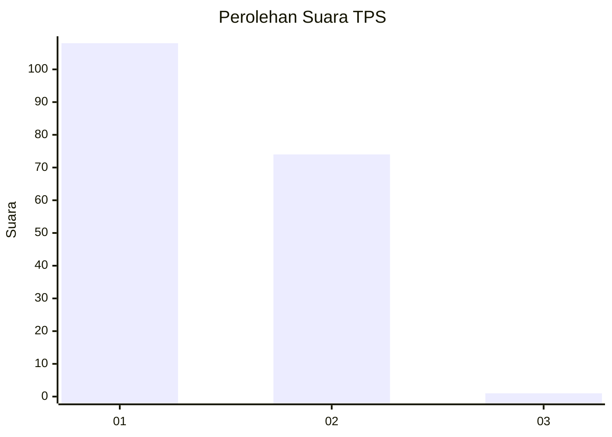
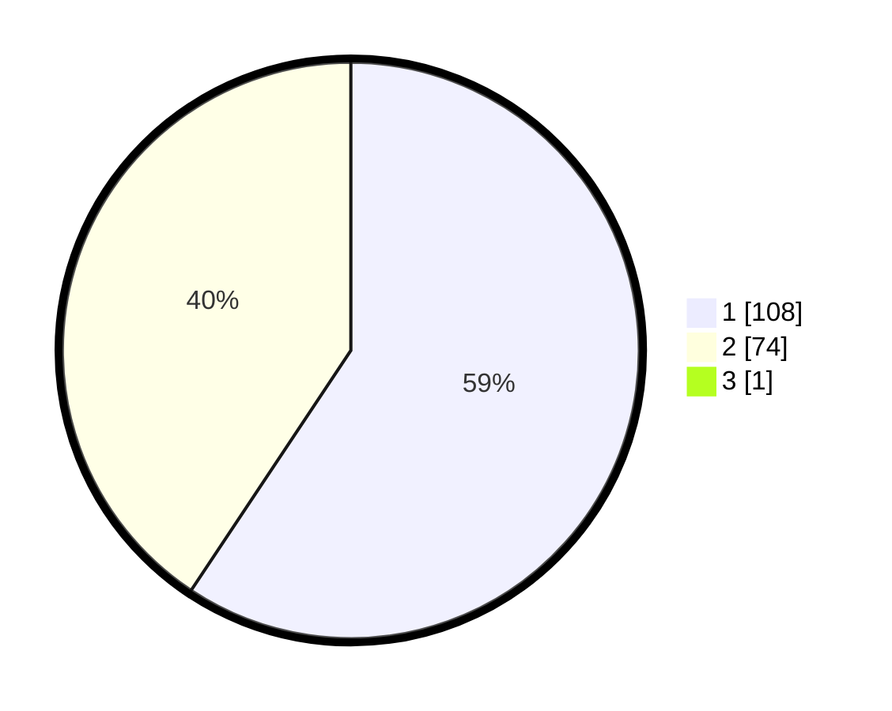

# Hasil

## Grafik

## Tabel

| No. | Nama Paslon    | Suara | Suara (raw) | Persentase |
|:--- |:-------------- | -----:| -----------:| ----------:|
| 1   | ANIES MUHAIMIN | 108   | [108][p-1]  | 59,02      |
| 2   | PRABOWO GIBRAN | 74    | [74][p-2]   | 40,44      |
| 3   | GANJAR MAHFUD  | 1     | [1][p-3]    | 0,55       |

[p-1]: https://github.com/gigit-pemilu/pemilu-2024-13-sumatera-barat/blob/main/pilpres/hitung-suara/sub/13-sumatera-barat/sub/05-padang-pariaman/sub/01-lubuk-alung/sub/2006-sungai-abang-lubuk-alung/sub/004-tps/sub/paslon-1.txt
[p-2]: https://github.com/gigit-pemilu/pemilu-2024-13-sumatera-barat/blob/main/pilpres/hitung-suara/sub/13-sumatera-barat/sub/05-padang-pariaman/sub/01-lubuk-alung/sub/2006-sungai-abang-lubuk-alung/sub/004-tps/sub/paslon-2.txt
[p-3]: https://github.com/gigit-pemilu/pemilu-2024-13-sumatera-barat/blob/main/pilpres/hitung-suara/sub/13-sumatera-barat/sub/05-padang-pariaman/sub/01-lubuk-alung/sub/2006-sungai-abang-lubuk-alung/sub/004-tps/sub/paslon-3.txt

## Foto C Plano

https://sirekap-obj-formc.kpu.go.id/a00a/pemilu/ppwp/13/05/01/20/06/1305012006004-20240221-172829--42839f41-0620-4e56-b468-6bd79e8fff10.jpg

https://sirekap-obj-formc.kpu.go.id/a00a/pemilu/ppwp/13/05/01/20/06/1305012006004-20240221-170845--18ec9510-6a6a-4832-82d4-34771c1fddd1.jpg

https://sirekap-obj-formc.kpu.go.id/a00a/pemilu/ppwp/13/05/01/20/06/1305012006004-20240221-171439--87dcc1e1-9eac-4c51-b4b4-cd1c120f9f97.jpg

## Metadata

| Key        | Value               |
| ---------- | ------------------- |
| Time Stamp | 2024-02-25 22:00:00 |

