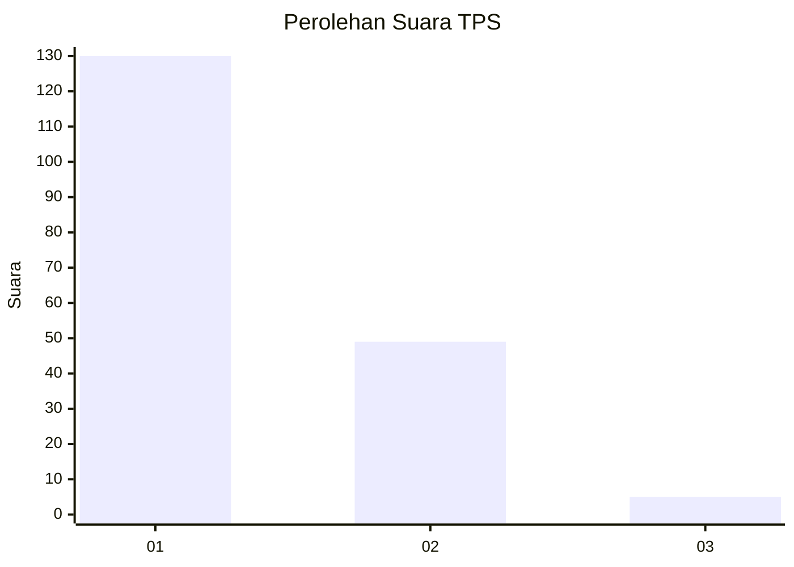
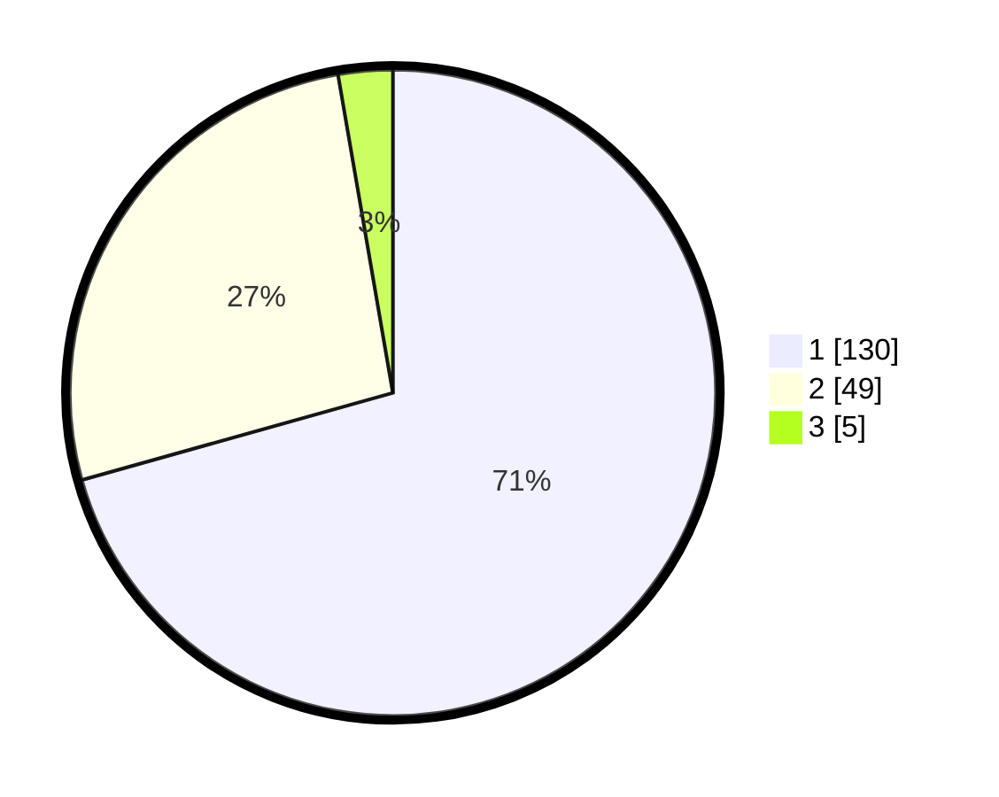

# Hasil

## Grafik

## Tabel

| No. | Nama Paslon    | Suara | Suara (raw) | Persentase |
|:--- |:-------------- | -----:| -----------:| ----------:|
| 1   | ANIES MUHAIMIN | 130   | [130][p-1]  | 70,65      |
| 2   | PRABOWO GIBRAN | 49    | [49][p-2]   | 26,63      |
| 3   | GANJAR MAHFUD  | 5     | [5][p-3]    | 2,72       |

[p-1]: https://github.com/gigit-pemilu/pemilu-2024-13-sumatera-barat/blob/main/pilpres/hitung-suara/sub/13-sumatera-barat/sub/05-padang-pariaman/sub/02-batang-anai/sub/2001-katapiang/sub/005-tps/sub/paslon-1.txt
[p-2]: https://github.com/gigit-pemilu/pemilu-2024-13-sumatera-barat/blob/main/pilpres/hitung-suara/sub/13-sumatera-barat/sub/05-padang-pariaman/sub/02-batang-anai/sub/2001-katapiang/sub/005-tps/sub/paslon-2.txt
[p-3]: https://github.com/gigit-pemilu/pemilu-2024-13-sumatera-barat/blob/main/pilpres/hitung-suara/sub/13-sumatera-barat/sub/05-padang-pariaman/sub/02-batang-anai/sub/2001-katapiang/sub/005-tps/sub/paslon-3.txt

## Foto C Plano

https://sirekap-obj-formc.kpu.go.id/347a/pemilu/ppwp/13/05/02/20/01/1305022001005-20240222-110228--41c80e61-78f6-40bd-84cc-13f2275cd02f.jpg

https://sirekap-obj-formc.kpu.go.id/347a/pemilu/ppwp/13/05/02/20/01/1305022001005-20240222-105951--33b665e5-316c-41e4-a544-a3326544e1a5.jpg

https://sirekap-obj-formc.kpu.go.id/347a/pemilu/ppwp/13/05/02/20/01/1305022001005-20240222-105834--92e90a3d-d187-4813-9c99-391a469b2598.jpg

## Metadata

| Key        | Value               |
| ---------- | ------------------- |
| Time Stamp | 2024-02-25 11:00:00 |

