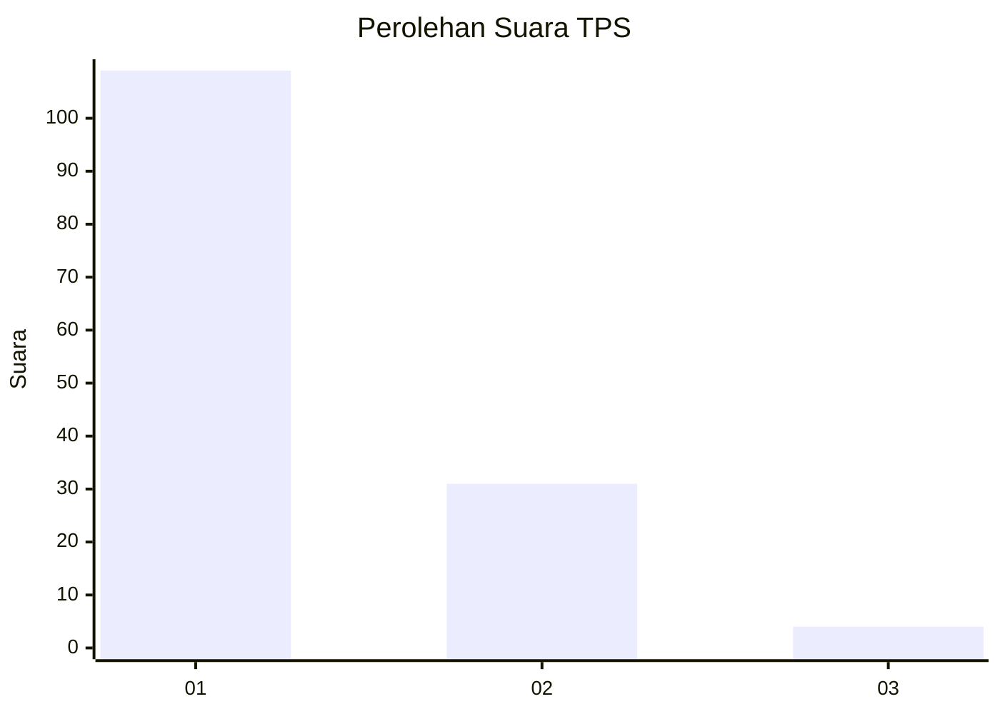
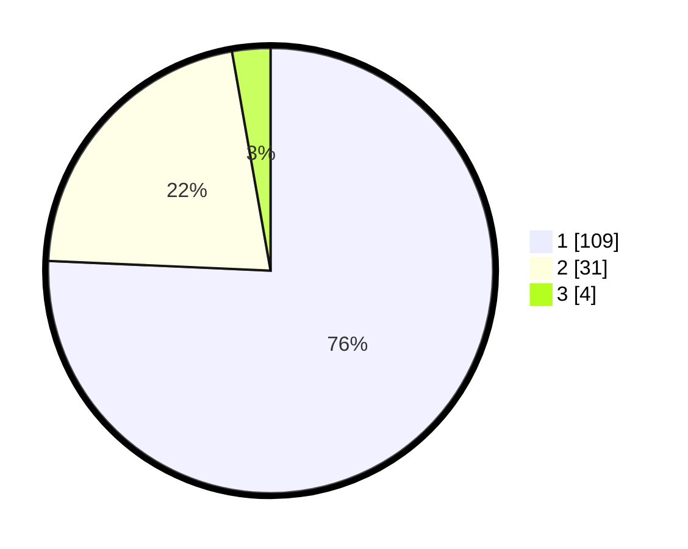

# Hasil

## Grafik

## Tabel

| No. | Nama Paslon    | Suara | Suara (raw) | Persentase |
|:--- |:-------------- | -----:| -----------:| ----------:|
| 1   | ANIES MUHAIMIN | 109   | [109][p-1]  | 75,69      |
| 2   | PRABOWO GIBRAN | 31    | [31][p-2]   | 21,53      |
| 3   | GANJAR MAHFUD  | 4     | [4][p-3]    | 2,78       |

[p-1]: https://github.com/gigit-pemilu/pemilu-2024-13-sumatera-barat/blob/main/pilpres/hitung-suara/sub/13-sumatera-barat/sub/05-padang-pariaman/sub/02-batang-anai/sub/2001-katapiang/sub/021-tps/sub/paslon-1.txt
[p-2]: https://github.com/gigit-pemilu/pemilu-2024-13-sumatera-barat/blob/main/pilpres/hitung-suara/sub/13-sumatera-barat/sub/05-padang-pariaman/sub/02-batang-anai/sub/2001-katapiang/sub/021-tps/sub/paslon-2.txt
[p-3]: https://github.com/gigit-pemilu/pemilu-2024-13-sumatera-barat/blob/main/pilpres/hitung-suara/sub/13-sumatera-barat/sub/05-padang-pariaman/sub/02-batang-anai/sub/2001-katapiang/sub/021-tps/sub/paslon-3.txt

## Foto C Plano

https://sirekap-obj-formc.kpu.go.id/bdd2/pemilu/ppwp/13/05/02/20/01/1305022001021-20240224-015052--b28f93a5-f924-45f1-a7b6-58425453e643.jpg

https://sirekap-obj-formc.kpu.go.id/bdd2/pemilu/ppwp/13/05/02/20/01/1305022001021-20240224-015741--6fbae2dc-3c3d-40cb-a0ca-2b19e8d17954.jpg

https://sirekap-obj-formc.kpu.go.id/bdd2/pemilu/ppwp/13/05/02/20/01/1305022001021-20240224-015236--1e498e54-f077-4d0e-a185-3ca8fe4354cd.jpg

## Metadata

| Key        | Value               |
| ---------- | ------------------- |
| Time Stamp | 2024-02-25 13:00:00 |

