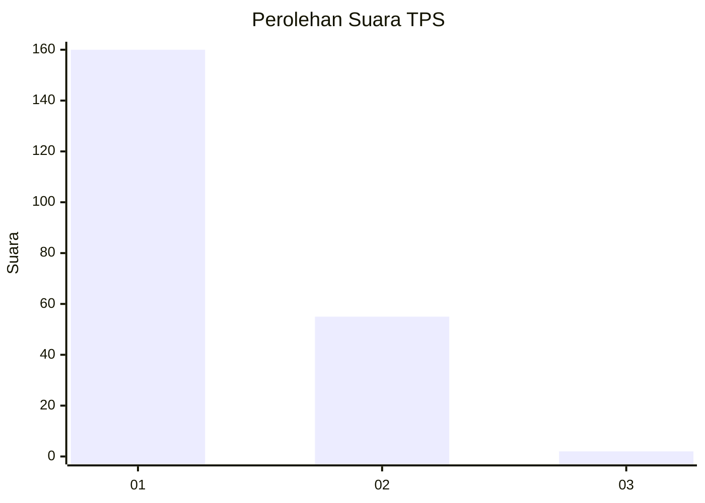
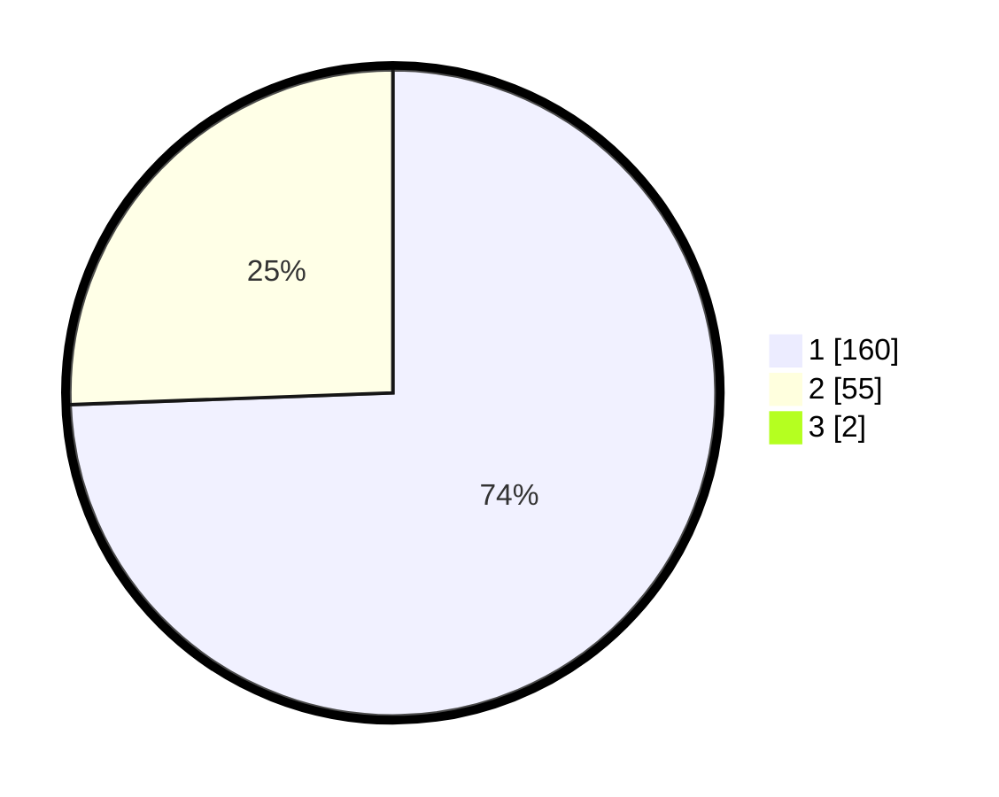

# Hasil

## Grafik

## Tabel

| No. | Nama Paslon    | Suara | Suara (raw) | Persentase |
|:--- |:-------------- | -----:| -----------:| ----------:|
| 1   | ANIES MUHAIMIN | 160   | [160][p-1]  | 73,73      |
| 2   | PRABOWO GIBRAN | 55    | [55][p-2]   | 25,35      |
| 3   | GANJAR MAHFUD  | 2     | [2][p-3]    | 0,92       |

[p-1]: https://github.com/gigit-pemilu/pemilu-2024-13-sumatera-barat/blob/main/pilpres/hitung-suara/sub/13-sumatera-barat/sub/05-padang-pariaman/sub/02-batang-anai/sub/2001-katapiang/sub/023-tps/sub/paslon-1.txt
[p-2]: https://github.com/gigit-pemilu/pemilu-2024-13-sumatera-barat/blob/main/pilpres/hitung-suara/sub/13-sumatera-barat/sub/05-padang-pariaman/sub/02-batang-anai/sub/2001-katapiang/sub/023-tps/sub/paslon-2.txt
[p-3]: https://github.com/gigit-pemilu/pemilu-2024-13-sumatera-barat/blob/main/pilpres/hitung-suara/sub/13-sumatera-barat/sub/05-padang-pariaman/sub/02-batang-anai/sub/2001-katapiang/sub/023-tps/sub/paslon-3.txt

## Foto C Plano

https://sirekap-obj-formc.kpu.go.id/8b20/pemilu/ppwp/13/05/02/20/01/1305022001023-20240224-003145--e120e6a5-ef0e-4644-8fd2-e8456b2ebc7f.jpg

https://sirekap-obj-formc.kpu.go.id/8b20/pemilu/ppwp/13/05/02/20/01/1305022001023-20240224-012541--e7744885-2199-43d0-bbbf-74bd6e71b915.jpg

https://sirekap-obj-formc.kpu.go.id/8b20/pemilu/ppwp/13/05/02/20/01/1305022001023-20240224-003950--eb6c5dc6-17da-456d-9594-9f4f66331634.jpg

## Metadata

| Key        | Value               |
| ---------- | ------------------- |
| Time Stamp | 2024-02-24 22:31:28 |

