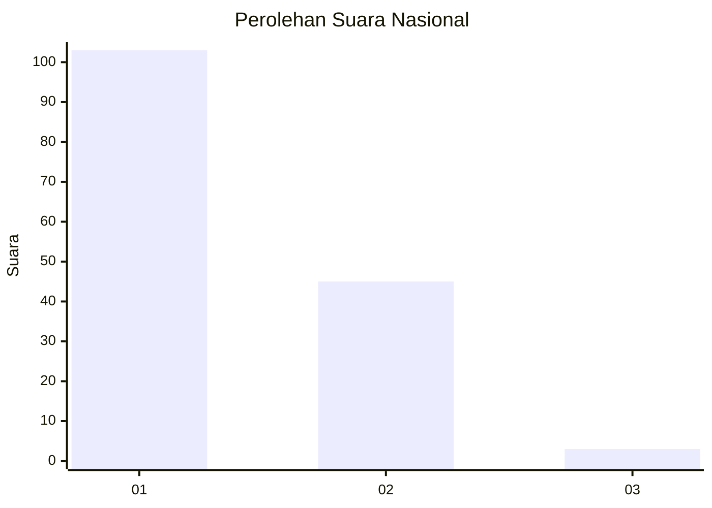
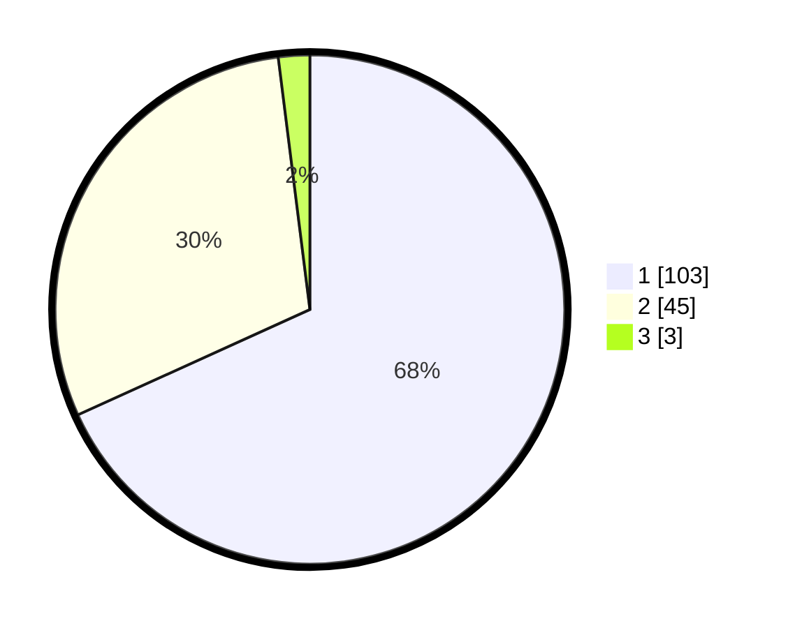

# Hasil

## Grafik

## Tabel

| No. | Nama Paslon    | Suara | Suara (raw) | Persentase |
|:--- |:-------------- | -----:| -----------:| ----------:|
| 1   | ANIES MUHAIMIN | 103   | [103][p-1]  | 68,21      |
| 2   | PRABOWO GIBRAN | 45    | [45][p-2]   | 29,80      |
| 3   | GANJAR MAHFUD  | 3     | [3][p-3]    | 1,99       |

[p-1]: https://github.com/gigit-pemilu/pemilu-2024/blob/main/pilpres/hitung-suara/sub/13-sumatera-barat/sub/05-padang-pariaman/sub/04-2-x-11-enam-lingkuang/sub/2002-sicincin/sub/001-tps/sub/paslon-1.txt
[p-2]: https://github.com/gigit-pemilu/pemilu-2024/blob/main/pilpres/hitung-suara/sub/13-sumatera-barat/sub/05-padang-pariaman/sub/04-2-x-11-enam-lingkuang/sub/2002-sicincin/sub/001-tps/sub/paslon-2.txt
[p-3]: https://github.com/gigit-pemilu/pemilu-2024/blob/main/pilpres/hitung-suara/sub/13-sumatera-barat/sub/05-padang-pariaman/sub/04-2-x-11-enam-lingkuang/sub/2002-sicincin/sub/001-tps/sub/paslon-3.txt

## Foto C Plano

https://sirekap-obj-formc.kpu.go.id/0663/pemilu/ppwp/13/05/04/20/02/1305042002001-20240214-222138--882648c7-9387-4c8c-b5c2-9d9ac3b6bb7d.jpg

https://sirekap-obj-formc.kpu.go.id/0663/pemilu/ppwp/13/05/04/20/02/1305042002001-20240214-222619--3857d22e-9276-4ca8-a146-291530bd1370.jpg

https://sirekap-obj-formc.kpu.go.id/0663/pemilu/ppwp/13/05/04/20/02/1305042002001-20240214-222400--bb73c75b-a5ab-44ed-9445-762ebfe3852d.jpg

## Metadata

| Key        | Value               |
| ---------- | ------------------- |
| Time Stamp | 2024-02-24 22:31:28 |

