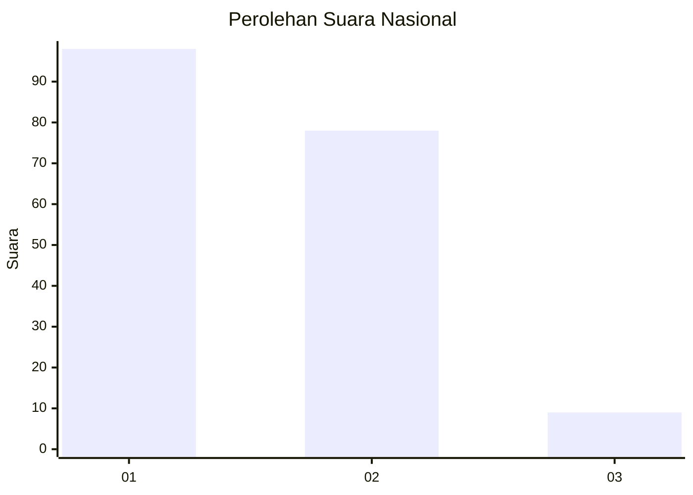
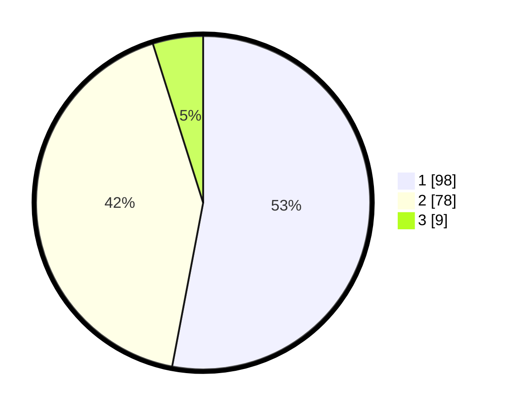

# Hasil

## Grafik

## Tabel

| No. | Nama Paslon    | Suara | Suara (raw) | Persentase |
|:--- |:-------------- | -----:| -----------:| ----------:|
| 1   | ANIES MUHAIMIN | 98    | [98][p-1]   | 52,97      |
| 2   | PRABOWO GIBRAN | 78    | [78][p-2]   | 42,16      |
| 3   | GANJAR MAHFUD  | 9     | [9][p-3]    | 4,86       |

[p-1]: https://github.com/gigit-pemilu/pemilu-2024/blob/main/pilpres/hitung-suara/sub/13-sumatera-barat/sub/05-padang-pariaman/sub/04-2-x-11-enam-lingkuang/sub/2002-sicincin/sub/004-tps/sub/paslon-1.txt
[p-2]: https://github.com/gigit-pemilu/pemilu-2024/blob/main/pilpres/hitung-suara/sub/13-sumatera-barat/sub/05-padang-pariaman/sub/04-2-x-11-enam-lingkuang/sub/2002-sicincin/sub/004-tps/sub/paslon-2.txt
[p-3]: https://github.com/gigit-pemilu/pemilu-2024/blob/main/pilpres/hitung-suara/sub/13-sumatera-barat/sub/05-padang-pariaman/sub/04-2-x-11-enam-lingkuang/sub/2002-sicincin/sub/004-tps/sub/paslon-3.txt

## Foto C Plano

https://sirekap-obj-formc.kpu.go.id/c006/pemilu/ppwp/13/05/04/20/02/1305042002004-20240215-050403--a9d28b2b-2ccb-4ba9-82ba-2a0eb4e6db81.jpg

https://sirekap-obj-formc.kpu.go.id/c006/pemilu/ppwp/13/05/04/20/02/1305042002004-20240215-052436--fe5d81c5-9633-4f01-b015-a195e0ac014b.jpg

https://sirekap-obj-formc.kpu.go.id/c006/pemilu/ppwp/13/05/04/20/02/1305042002004-20240215-050825--e5b5cbfe-006c-4e1b-8694-25170c9a7eca.jpg

## Metadata

| Key        | Value               |
| ---------- | ------------------- |
| Time Stamp | 2024-02-15 21:30:27 |

