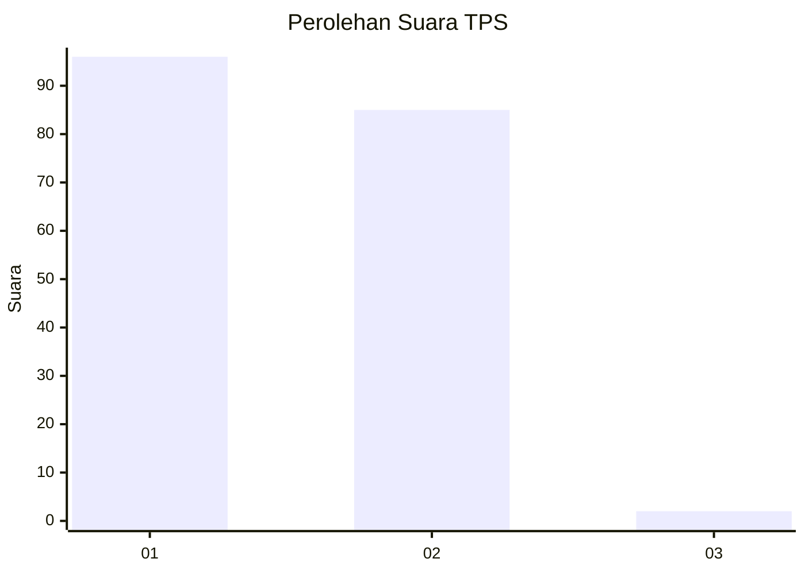
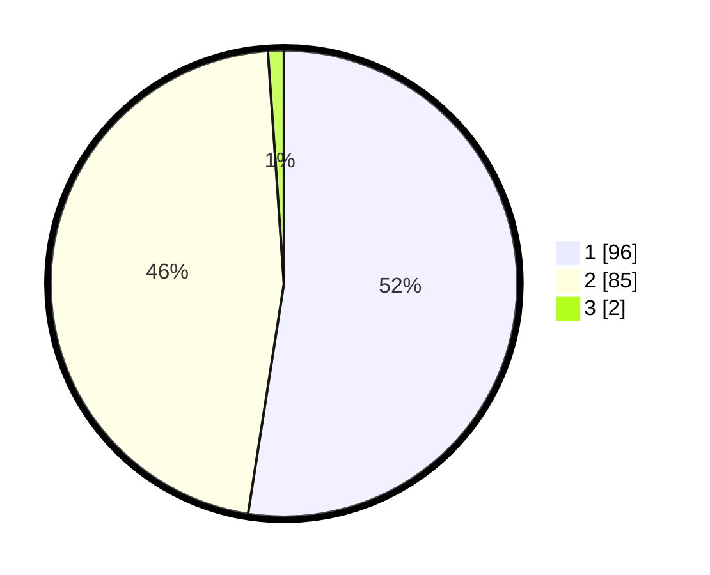

# Hasil

## Grafik

## Tabel

| No. | Nama Paslon    | Suara | Suara (raw) | Persentase |
|:--- |:-------------- | -----:| -----------:| ----------:|
| 1   | ANIES MUHAIMIN | 96    | [96][p-1]   | 52,46      |
| 2   | PRABOWO GIBRAN | 85    | [85][p-2]   | 46,45      |
| 3   | GANJAR MAHFUD  | 2     | [2][p-3]    | 1,09       |

[p-1]: https://github.com/gigit-pemilu/pemilu-2024-13-sumatera-barat/blob/main/pilpres/hitung-suara/sub/13-sumatera-barat/sub/05-padang-pariaman/sub/04-2-x-11-enam-lingkuang/sub/2002-sicincin/sub/006-tps/sub/paslon-1.txt
[p-2]: https://github.com/gigit-pemilu/pemilu-2024-13-sumatera-barat/blob/main/pilpres/hitung-suara/sub/13-sumatera-barat/sub/05-padang-pariaman/sub/04-2-x-11-enam-lingkuang/sub/2002-sicincin/sub/006-tps/sub/paslon-2.txt
[p-3]: https://github.com/gigit-pemilu/pemilu-2024-13-sumatera-barat/blob/main/pilpres/hitung-suara/sub/13-sumatera-barat/sub/05-padang-pariaman/sub/04-2-x-11-enam-lingkuang/sub/2002-sicincin/sub/006-tps/sub/paslon-3.txt

## Foto C Plano

https://sirekap-obj-formc.kpu.go.id/68af/pemilu/ppwp/13/05/04/20/02/1305042002006-20240215-044701--0f5f096f-12bd-4748-8ced-f83a9cae65ae.jpg

https://sirekap-obj-formc.kpu.go.id/68af/pemilu/ppwp/13/05/04/20/02/1305042002006-20240215-020802--ca220c9b-bf97-4af7-9810-e0ab303636f1.jpg

https://sirekap-obj-formc.kpu.go.id/68af/pemilu/ppwp/13/05/04/20/02/1305042002006-20240215-020858--9dfe9d97-d7ad-446a-ad47-f4db702777f3.jpg

## Metadata

| Key        | Value               |
| ---------- | ------------------- |
| Time Stamp | 2024-02-25 23:00:00 |

