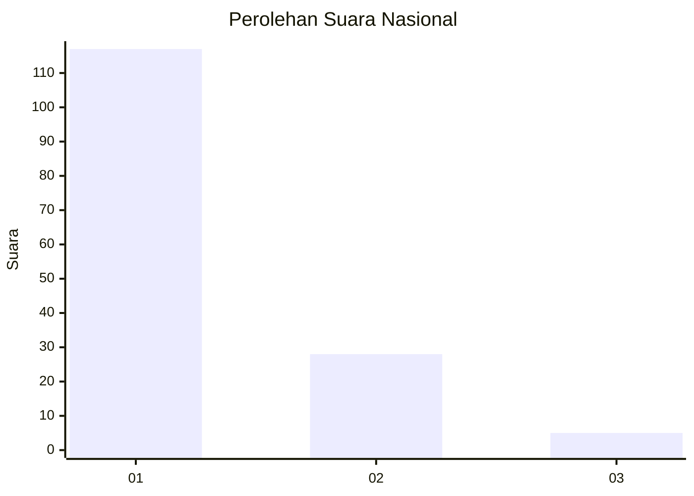
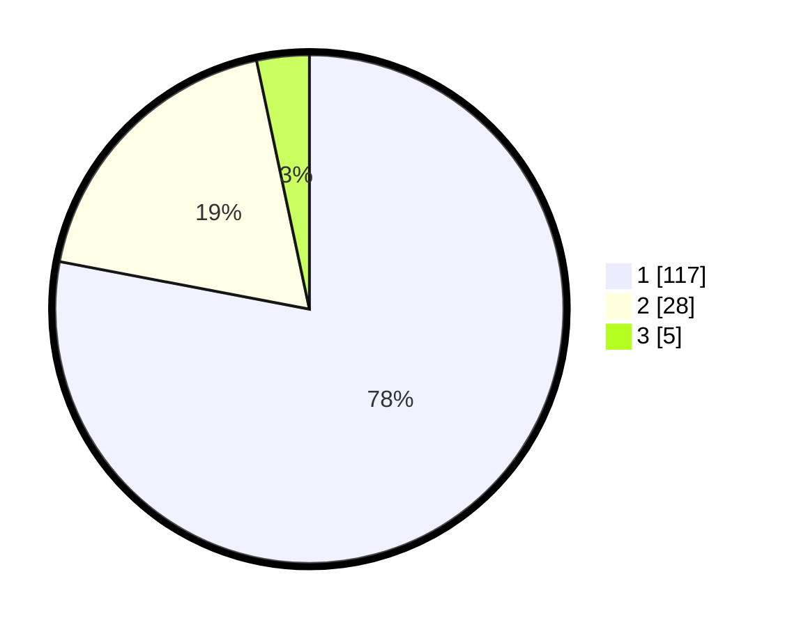

# Hasil

## Grafik

## Tabel

| No. | Nama Paslon    | Suara | Suara (raw) | Persentase |
|:--- |:-------------- | -----:| -----------:| ----------:|
| 1   | ANIES MUHAIMIN | 117   | [117][p-1]  | 78,00      |
| 2   | PRABOWO GIBRAN | 28    | [28][p-2]   | 18,67      |
| 3   | GANJAR MAHFUD  | 5     | [5][p-3]    | 3,33       |

[p-1]: https://github.com/gigit-pemilu/pemilu-2024/blob/main/pilpres/hitung-suara/sub/13-sumatera-barat/sub/05-padang-pariaman/sub/05-vii-koto-sungai-sarik/sub/2011-balah-aie-utara/sub/004-tps/sub/paslon-1.txt
[p-2]: https://github.com/gigit-pemilu/pemilu-2024/blob/main/pilpres/hitung-suara/sub/13-sumatera-barat/sub/05-padang-pariaman/sub/05-vii-koto-sungai-sarik/sub/2011-balah-aie-utara/sub/004-tps/sub/paslon-2.txt
[p-3]: https://github.com/gigit-pemilu/pemilu-2024/blob/main/pilpres/hitung-suara/sub/13-sumatera-barat/sub/05-padang-pariaman/sub/05-vii-koto-sungai-sarik/sub/2011-balah-aie-utara/sub/004-tps/sub/paslon-3.txt

## Foto C Plano

https://sirekap-obj-formc.kpu.go.id/d4bc/pemilu/ppwp/13/05/05/20/11/1305052011004-20240214-233334--28137de4-db6c-49ac-9108-87cf01f13936.jpg

https://sirekap-obj-formc.kpu.go.id/d4bc/pemilu/ppwp/13/05/05/20/11/1305052011004-20240221-111729--415ac684-26b6-4260-8deb-960c1e4ab0fd.jpg

https://sirekap-obj-formc.kpu.go.id/d4bc/pemilu/ppwp/13/05/05/20/11/1305052011004-20240214-235309--491010ca-951d-405c-afb0-e74b39721a32.jpg

## Metadata

| Key        | Value               |
| ---------- | ------------------- |
| Time Stamp | 2024-02-24 22:31:28 |

