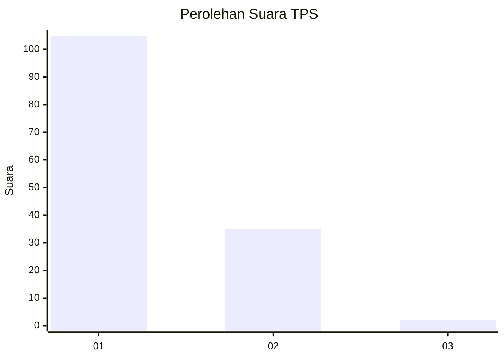
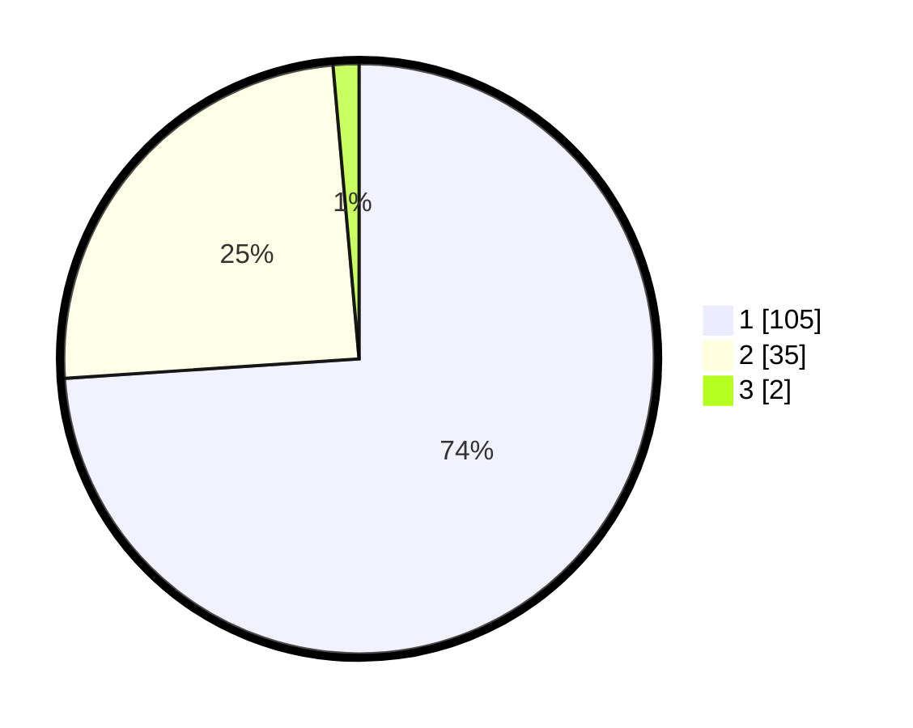

# Hasil

## Grafik

## Tabel

| No. | Nama Paslon    | Suara | Suara (raw) | Persentase |
|:--- |:-------------- | -----:| -----------:| ----------:|
| 1   | ANIES MUHAIMIN | 105   | [105][p-1]  | 73,94      |
| 2   | PRABOWO GIBRAN | 35    | [35][p-2]   | 24,65      |
| 3   | GANJAR MAHFUD  | 2     | [2][p-3]    | 1,41       |

[p-1]: https://github.com/gigit-pemilu/pemilu-2024-13-sumatera-barat/blob/main/pilpres/hitung-suara/sub/13-sumatera-barat/sub/05-padang-pariaman/sub/05-vii-koto-sungai-sarik/sub/2011-balah-aie-utara/sub/006-tps/sub/paslon-1.txt
[p-2]: https://github.com/gigit-pemilu/pemilu-2024-13-sumatera-barat/blob/main/pilpres/hitung-suara/sub/13-sumatera-barat/sub/05-padang-pariaman/sub/05-vii-koto-sungai-sarik/sub/2011-balah-aie-utara/sub/006-tps/sub/paslon-2.txt
[p-3]: https://github.com/gigit-pemilu/pemilu-2024-13-sumatera-barat/blob/main/pilpres/hitung-suara/sub/13-sumatera-barat/sub/05-padang-pariaman/sub/05-vii-koto-sungai-sarik/sub/2011-balah-aie-utara/sub/006-tps/sub/paslon-3.txt

## Foto C Plano

https://sirekap-obj-formc.kpu.go.id/9b96/pemilu/ppwp/13/05/05/20/11/1305052011006-20240222-222623--7c89e674-54e9-4ce7-a7cc-8d76bf68e16e.jpg

https://sirekap-obj-formc.kpu.go.id/9b96/pemilu/ppwp/13/05/05/20/11/1305052011006-20240221-151925--66c4f15f-06e6-4e8a-9e36-b3664a340270.jpg

https://sirekap-obj-formc.kpu.go.id/9b96/pemilu/ppwp/13/05/05/20/11/1305052011006-20240221-152055--d94ca48f-914f-4c02-97a3-1fd8612990f5.jpg

## Metadata

| Key        | Value               |
| ---------- | ------------------- |
| Time Stamp | 2024-02-22 23:00:00 |

