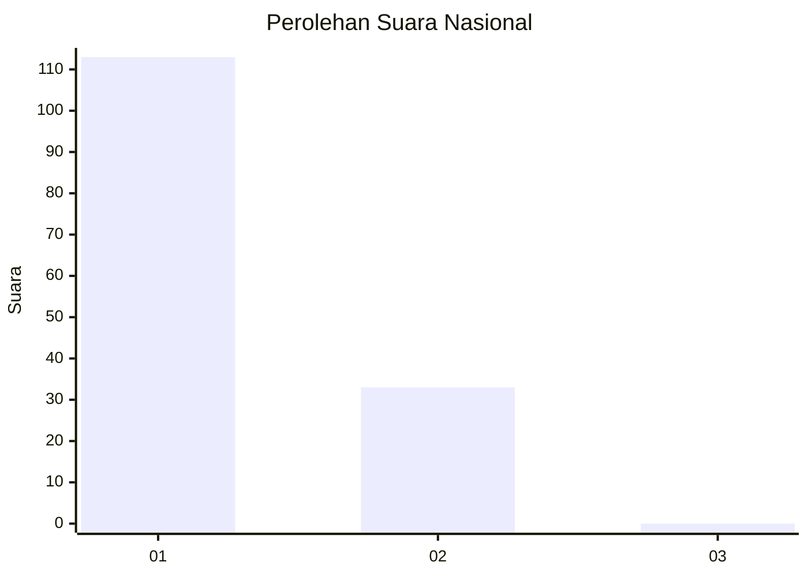
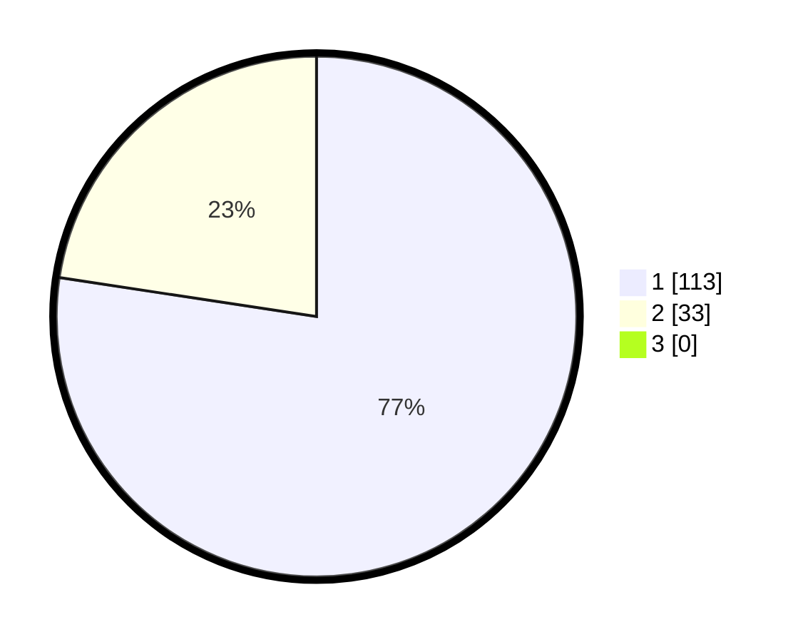

# Hasil

## Grafik

## Tabel

| No. | Nama Paslon    | Suara | Suara (raw) | Persentase |
|:--- |:-------------- | -----:| -----------:| ----------:|
| 1   | ANIES MUHAIMIN | 113   | [113][p-1]  | 77,40      |
| 2   | PRABOWO GIBRAN | 33    | [33][p-2]   | 22,60      |
| 3   | GANJAR MAHFUD  | 0     | [0][p-3]    | 0,00       |

[p-1]: https://github.com/gigit-pemilu/pemilu-2024/blob/main/pilpres/hitung-suara/sub/13-sumatera-barat/sub/05-padang-pariaman/sub/06-v-koto-kampung-dalam/sub/2001-campago/sub/005-tps/sub/paslon-1.txt
[p-2]: https://github.com/gigit-pemilu/pemilu-2024/blob/main/pilpres/hitung-suara/sub/13-sumatera-barat/sub/05-padang-pariaman/sub/06-v-koto-kampung-dalam/sub/2001-campago/sub/005-tps/sub/paslon-2.txt
[p-3]: https://github.com/gigit-pemilu/pemilu-2024/blob/main/pilpres/hitung-suara/sub/13-sumatera-barat/sub/05-padang-pariaman/sub/06-v-koto-kampung-dalam/sub/2001-campago/sub/005-tps/sub/paslon-3.txt

## Foto C Plano

https://sirekap-obj-formc.kpu.go.id/a1ad/pemilu/ppwp/13/05/06/20/01/1305062001005-20240215-090528--af8c2217-eb40-4ebb-aa85-2306f8d2d772.jpg

https://sirekap-obj-formc.kpu.go.id/a1ad/pemilu/ppwp/13/05/06/20/01/1305062001005-20240215-090605--011f622a-a02e-4a0e-b7a9-8b8623cda88c.jpg

## Metadata

| Key        | Value               |
| ---------- | ------------------- |
| Time Stamp | 2024-02-25 16:00:00 |

