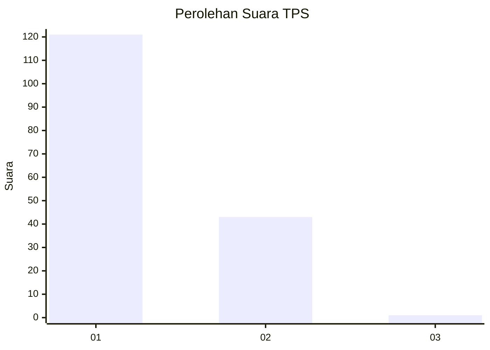
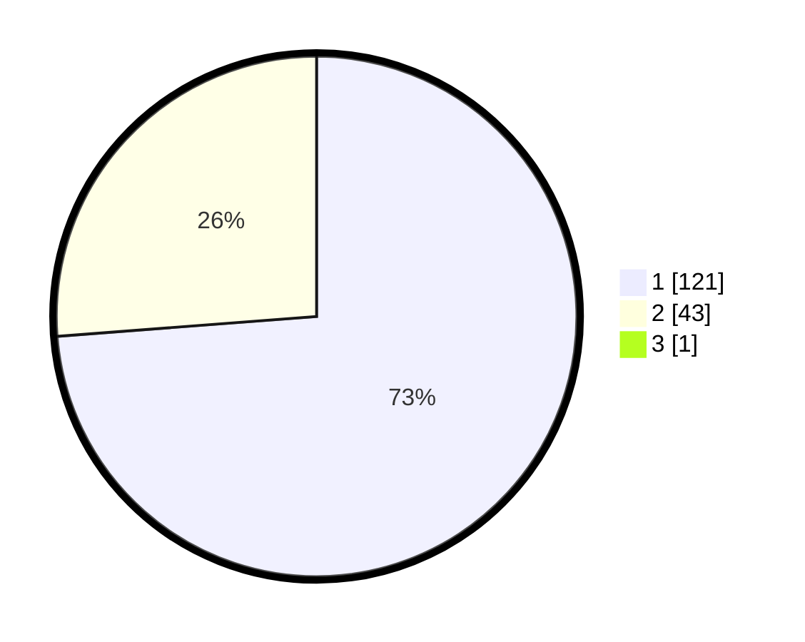

# Hasil

## Grafik

## Tabel

| No. | Nama Paslon    | Suara | Suara (raw) | Persentase |
|:--- |:-------------- | -----:| -----------:| ----------:|
| 1   | ANIES MUHAIMIN | 121   | [121][p-1]  | 73,33      |
| 2   | PRABOWO GIBRAN | 43    | [43][p-2]   | 26,06      |
| 3   | GANJAR MAHFUD  | 1     | [1][p-3]    | 0,61       |

[p-1]: https://github.com/gigit-pemilu/pemilu-2024-13-sumatera-barat/blob/main/pilpres/hitung-suara/sub/13-sumatera-barat/sub/05-padang-pariaman/sub/06-v-koto-kampung-dalam/sub/2002-sikucua/sub/003-tps/sub/paslon-1.txt
[p-2]: https://github.com/gigit-pemilu/pemilu-2024-13-sumatera-barat/blob/main/pilpres/hitung-suara/sub/13-sumatera-barat/sub/05-padang-pariaman/sub/06-v-koto-kampung-dalam/sub/2002-sikucua/sub/003-tps/sub/paslon-2.txt
[p-3]: https://github.com/gigit-pemilu/pemilu-2024-13-sumatera-barat/blob/main/pilpres/hitung-suara/sub/13-sumatera-barat/sub/05-padang-pariaman/sub/06-v-koto-kampung-dalam/sub/2002-sikucua/sub/003-tps/sub/paslon-3.txt

## Foto C Plano

https://sirekap-obj-formc.kpu.go.id/62ce/pemilu/ppwp/13/05/06/20/02/1305062002003-20240220-222149--074a915e-fdce-40f1-a867-4b03ccb0c399.jpg

https://sirekap-obj-formc.kpu.go.id/62ce/pemilu/ppwp/13/05/06/20/02/1305062002003-20240220-222416--4c7469d6-b496-4639-bc6d-9a41854bccbf.jpg

https://sirekap-obj-formc.kpu.go.id/62ce/pemilu/ppwp/13/05/06/20/02/1305062002003-20240220-174447--e7542c01-163b-49bd-9b98-fce5bf73cf45.jpg

## Metadata

| Key        | Value               |
| ---------- | ------------------- |
| Time Stamp | 2024-02-24 22:31:28 |

