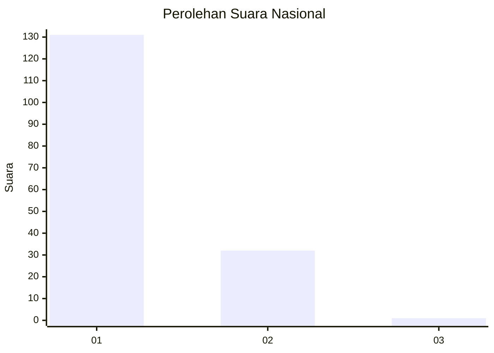
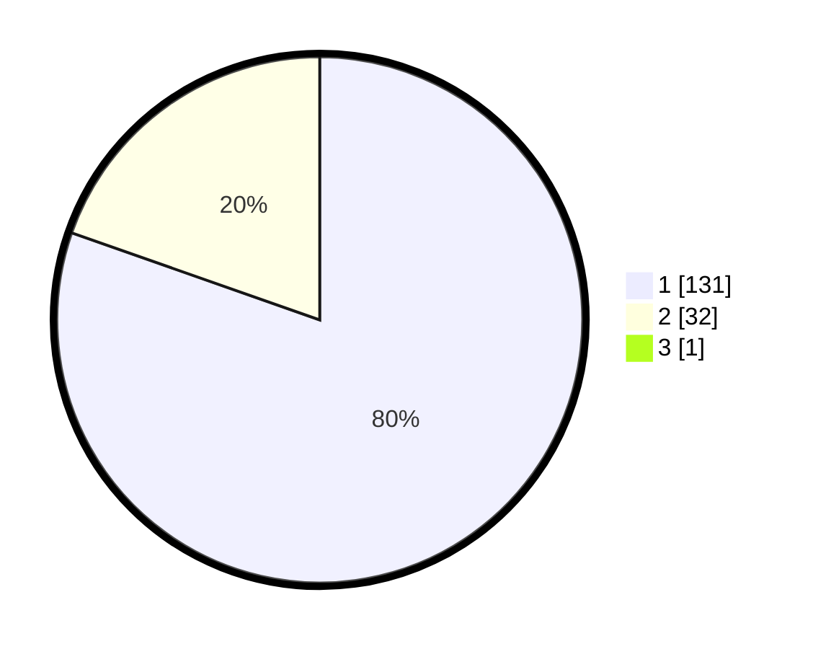

# Hasil

## Grafik

## Tabel

| No. | Nama Paslon    | Suara | Suara (raw) | Persentase |
|:--- |:-------------- | -----:| -----------:| ----------:|
| 1   | ANIES MUHAIMIN | 131   | [131][p-1]  | 79,88      |
| 2   | PRABOWO GIBRAN | 32    | [32][p-2]   | 19,51      |
| 3   | GANJAR MAHFUD  | 1     | [1][p-3]    | 0,61       |

[p-1]: https://github.com/gigit-pemilu/pemilu-2024/blob/main/pilpres/hitung-suara/sub/13-sumatera-barat/sub/05-padang-pariaman/sub/07-sungai-garingging/sub/2001-kuranji-hulu/sub/014-tps/sub/paslon-1.txt
[p-2]: https://github.com/gigit-pemilu/pemilu-2024/blob/main/pilpres/hitung-suara/sub/13-sumatera-barat/sub/05-padang-pariaman/sub/07-sungai-garingging/sub/2001-kuranji-hulu/sub/014-tps/sub/paslon-2.txt
[p-3]: https://github.com/gigit-pemilu/pemilu-2024/blob/main/pilpres/hitung-suara/sub/13-sumatera-barat/sub/05-padang-pariaman/sub/07-sungai-garingging/sub/2001-kuranji-hulu/sub/014-tps/sub/paslon-3.txt

## Foto C Plano

https://sirekap-obj-formc.kpu.go.id/fa23/pemilu/ppwp/13/05/07/20/01/1305072001014-20240218-114159--534be632-d9d8-46ab-9025-df728f7301d3.jpg

https://sirekap-obj-formc.kpu.go.id/fa23/pemilu/ppwp/13/05/07/20/01/1305072001014-20240218-114314--5b7f9455-efcb-46b7-b48f-ff19c1204a20.jpg

https://sirekap-obj-formc.kpu.go.id/fa23/pemilu/ppwp/13/05/07/20/01/1305072001014-20240218-114343--ff10c3d0-abd4-4bb0-b074-6278d159d646.jpg

## Metadata

| Key        | Value               |
| ---------- | ------------------- |
| Time Stamp | 2024-02-25 16:00:00 |

