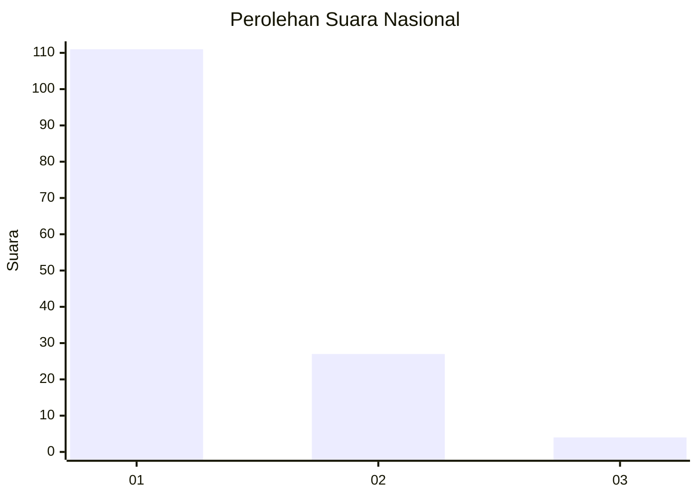
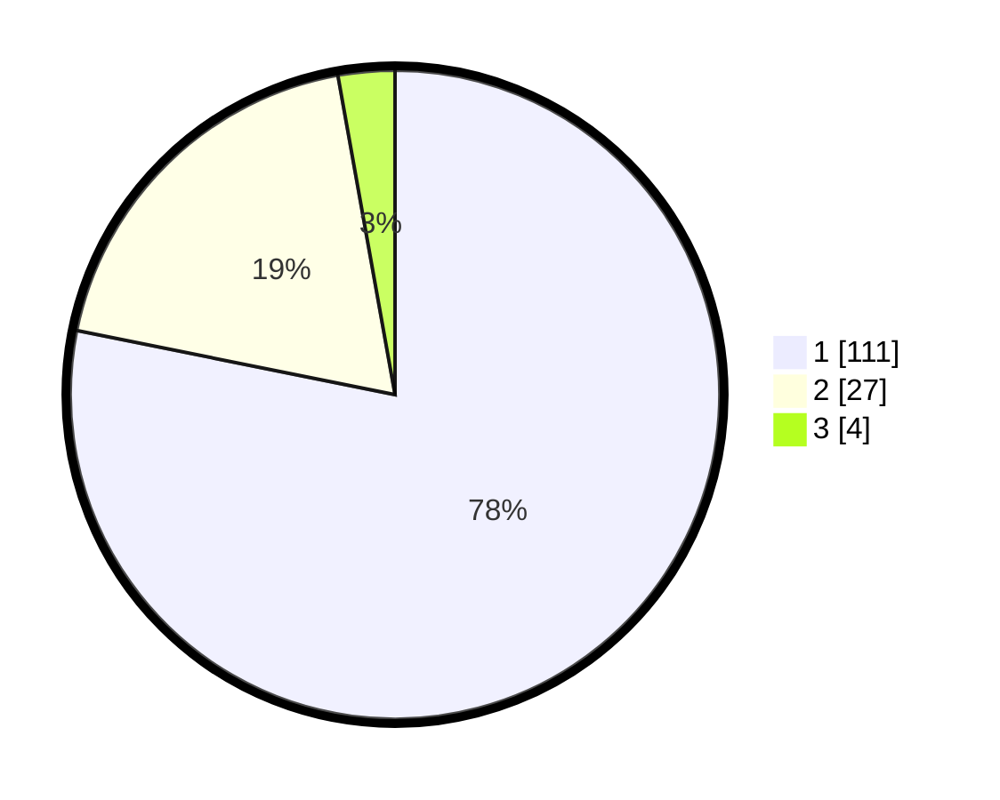

# Hasil

## Grafik

## Tabel

| No. | Nama Paslon    | Suara | Suara (raw) | Persentase |
|:--- |:-------------- | -----:| -----------:| ----------:|
| 1   | ANIES MUHAIMIN | 111   | [111][p-1]  | 78,17      |
| 2   | PRABOWO GIBRAN | 27    | [27][p-2]   | 19,01      |
| 3   | GANJAR MAHFUD  | 4     | [4][p-3]    | 2,82       |

[p-1]: https://github.com/gigit-pemilu/pemilu-2024/blob/main/pilpres/hitung-suara/sub/13-sumatera-barat/sub/05-padang-pariaman/sub/07-sungai-garingging/sub/2001-kuranji-hulu/sub/019-tps/sub/paslon-1.txt
[p-2]: https://github.com/gigit-pemilu/pemilu-2024/blob/main/pilpres/hitung-suara/sub/13-sumatera-barat/sub/05-padang-pariaman/sub/07-sungai-garingging/sub/2001-kuranji-hulu/sub/019-tps/sub/paslon-2.txt
[p-3]: https://github.com/gigit-pemilu/pemilu-2024/blob/main/pilpres/hitung-suara/sub/13-sumatera-barat/sub/05-padang-pariaman/sub/07-sungai-garingging/sub/2001-kuranji-hulu/sub/019-tps/sub/paslon-3.txt

## Foto C Plano

https://sirekap-obj-formc.kpu.go.id/2c4e/pemilu/ppwp/13/05/07/20/01/1305072001019-20240218-150938--12695848-e0fa-4895-a823-302b3c358142.jpg

https://sirekap-obj-formc.kpu.go.id/2c4e/pemilu/ppwp/13/05/07/20/01/1305072001019-20240218-151008--c44b7415-cfbd-49fc-9be8-aef69044c7f4.jpg

https://sirekap-obj-formc.kpu.go.id/2c4e/pemilu/ppwp/13/05/07/20/01/1305072001019-20240218-151035--16551dfb-3f30-478e-9a31-4f21cbbf9c2c.jpg

## Metadata

| Key        | Value               |
| ---------- | ------------------- |
| Time Stamp | 2024-02-25 21:00:00 |

