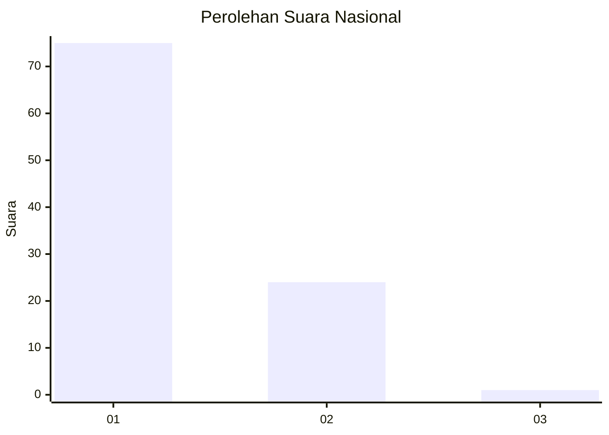
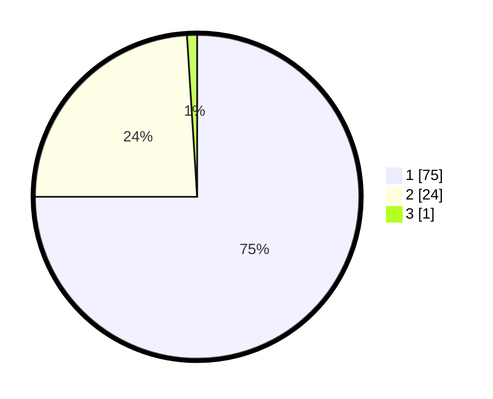

# Hasil

## Grafik

## Tabel

| No. | Nama Paslon    | Suara | Suara (raw) | Persentase |
|:--- |:-------------- | -----:| -----------:| ----------:|
| 1   | ANIES MUHAIMIN | 75    | [75][p-1]   | 75,00      |
| 2   | PRABOWO GIBRAN | 24    | [24][p-2]   | 24,00      |
| 3   | GANJAR MAHFUD  | 1     | [1][p-3]    | 1,00       |

[p-1]: https://github.com/gigit-pemilu/pemilu-2024/blob/main/pilpres/hitung-suara/sub/13-sumatera-barat/sub/05-padang-pariaman/sub/07-sungai-garingging/sub/2001-kuranji-hulu/sub/020-tps/sub/paslon-1.txt
[p-2]: https://github.com/gigit-pemilu/pemilu-2024/blob/main/pilpres/hitung-suara/sub/13-sumatera-barat/sub/05-padang-pariaman/sub/07-sungai-garingging/sub/2001-kuranji-hulu/sub/020-tps/sub/paslon-2.txt
[p-3]: https://github.com/gigit-pemilu/pemilu-2024/blob/main/pilpres/hitung-suara/sub/13-sumatera-barat/sub/05-padang-pariaman/sub/07-sungai-garingging/sub/2001-kuranji-hulu/sub/020-tps/sub/paslon-3.txt

## Foto C Plano

https://sirekap-obj-formc.kpu.go.id/0495/pemilu/ppwp/13/05/07/20/01/1305072001020-20240218-160237--9c4bd49b-fba2-48fd-bc5d-b30f11408f75.jpg

https://sirekap-obj-formc.kpu.go.id/0495/pemilu/ppwp/13/05/07/20/01/1305072001020-20240218-160205--5dc80dd8-9445-4ccd-acd9-b69db572ac52.jpg

https://sirekap-obj-formc.kpu.go.id/0495/pemilu/ppwp/13/05/07/20/01/1305072001020-20240218-160230--5a119fdf-4b3a-49d6-b4cf-db6c2dc116ef.jpg

## Metadata

| Key        | Value               |
| ---------- | ------------------- |
| Time Stamp | 2024-02-25 16:00:00 |

