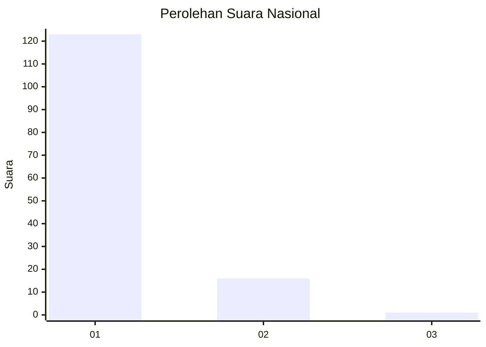
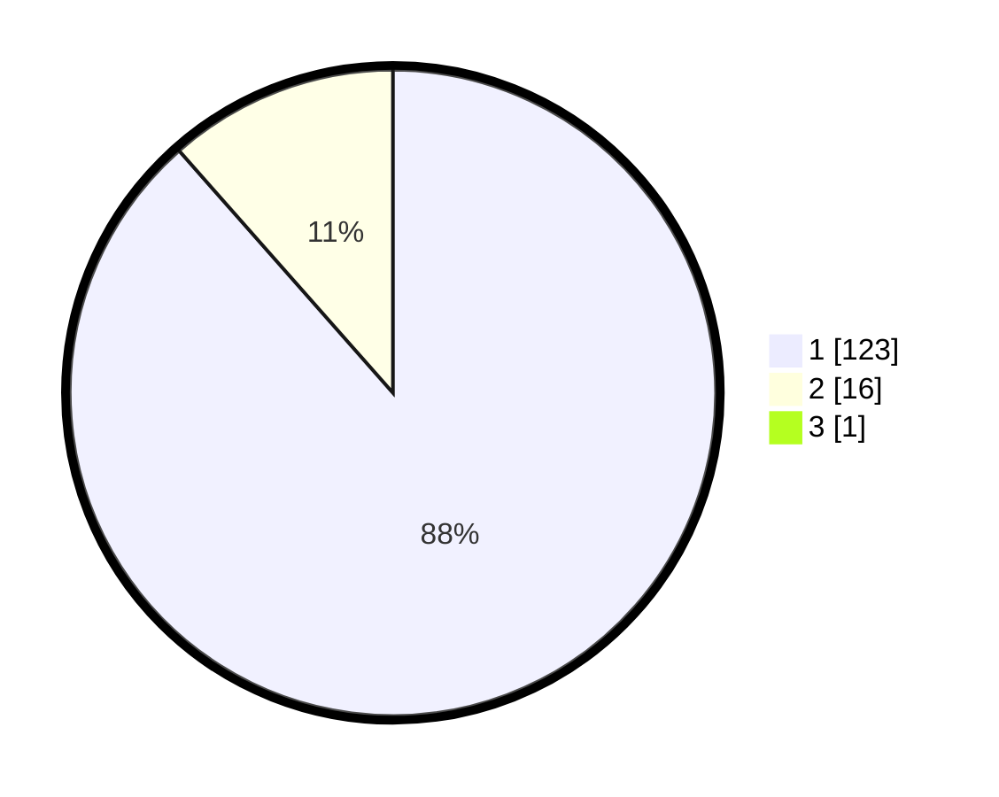

# Hasil

## Grafik

## Tabel

| No. | Nama Paslon    | Suara | Suara (raw) | Persentase |
|:--- |:-------------- | -----:| -----------:| ----------:|
| 1   | ANIES MUHAIMIN | 123   | [123][p-1]  | 87,86      |
| 2   | PRABOWO GIBRAN | 16    | [16][p-2]   | 11,43      |
| 3   | GANJAR MAHFUD  | 1     | [1][p-3]    | 0,71       |

[p-1]: https://github.com/gigit-pemilu/pemilu-2024/blob/main/pilpres/hitung-suara/sub/13-sumatera-barat/sub/05-padang-pariaman/sub/07-sungai-garingging/sub/2001-kuranji-hulu/sub/021-tps/sub/paslon-1.txt
[p-2]: https://github.com/gigit-pemilu/pemilu-2024/blob/main/pilpres/hitung-suara/sub/13-sumatera-barat/sub/05-padang-pariaman/sub/07-sungai-garingging/sub/2001-kuranji-hulu/sub/021-tps/sub/paslon-2.txt
[p-3]: https://github.com/gigit-pemilu/pemilu-2024/blob/main/pilpres/hitung-suara/sub/13-sumatera-barat/sub/05-padang-pariaman/sub/07-sungai-garingging/sub/2001-kuranji-hulu/sub/021-tps/sub/paslon-3.txt

## Foto C Plano

https://sirekap-obj-formc.kpu.go.id/042f/pemilu/ppwp/13/05/07/20/01/1305072001021-20240218-170536--fc932258-0477-4f49-af75-78a87fd810f8.jpg

https://sirekap-obj-formc.kpu.go.id/042f/pemilu/ppwp/13/05/07/20/01/1305072001021-20240218-170044--1cde5949-852c-419a-b0bf-9fa4c7ad5a41.jpg

https://sirekap-obj-formc.kpu.go.id/042f/pemilu/ppwp/13/05/07/20/01/1305072001021-20240218-170114--a5ef97c4-6fd1-43b0-8cc8-4da500df35df.jpg

## Metadata

| Key        | Value               |
| ---------- | ------------------- |
| Time Stamp | 2024-02-24 22:31:28 |

