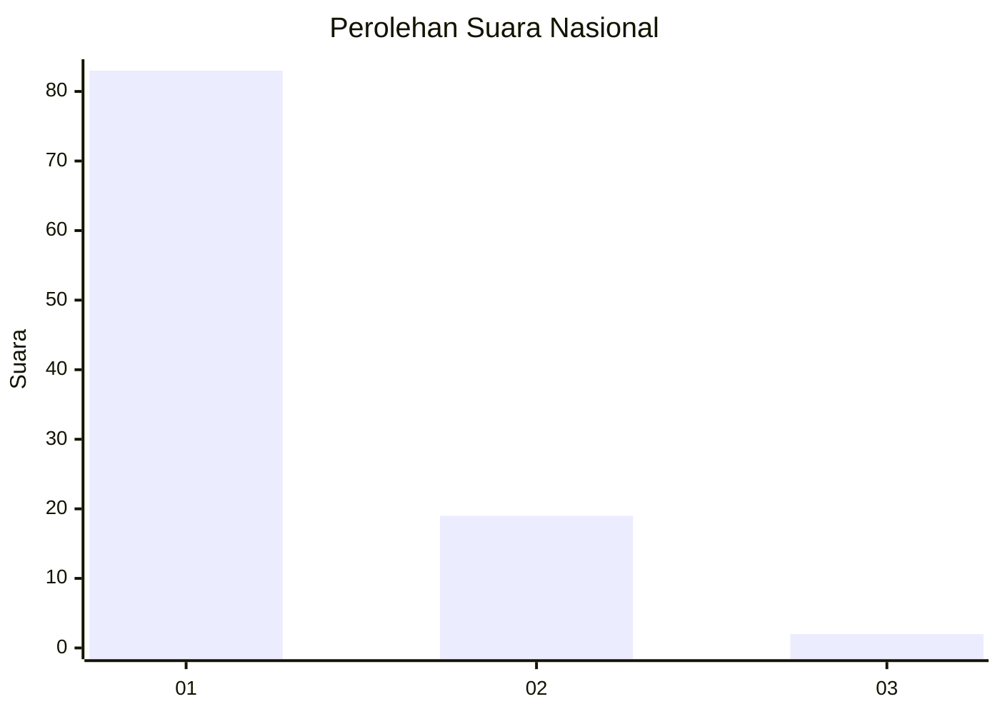
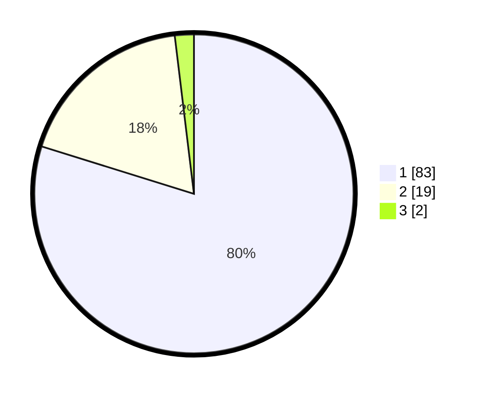

# Hasil

## Grafik

## Tabel

| No. | Nama Paslon    | Suara | Suara (raw) | Persentase |
|:--- |:-------------- | -----:| -----------:| ----------:|
| 1   | ANIES MUHAIMIN | 83    | [83][p-1]   | 79,81      |
| 2   | PRABOWO GIBRAN | 19    | [19][p-2]   | 18,27      |
| 3   | GANJAR MAHFUD  | 2     | [2][p-3]    | 1,92       |

[p-1]: https://github.com/gigit-pemilu/pemilu-2024/blob/main/pilpres/hitung-suara/sub/13-sumatera-barat/sub/05-padang-pariaman/sub/07-sungai-garingging/sub/2001-kuranji-hulu/sub/026-tps/sub/paslon-1.txt
[p-2]: https://github.com/gigit-pemilu/pemilu-2024/blob/main/pilpres/hitung-suara/sub/13-sumatera-barat/sub/05-padang-pariaman/sub/07-sungai-garingging/sub/2001-kuranji-hulu/sub/026-tps/sub/paslon-2.txt
[p-3]: https://github.com/gigit-pemilu/pemilu-2024/blob/main/pilpres/hitung-suara/sub/13-sumatera-barat/sub/05-padang-pariaman/sub/07-sungai-garingging/sub/2001-kuranji-hulu/sub/026-tps/sub/paslon-3.txt

## Foto C Plano

https://sirekap-obj-formc.kpu.go.id/43b0/pemilu/ppwp/13/05/07/20/01/1305072001026-20240218-205311--d7dca115-6bec-409c-a87f-dc789b2d3b45.jpg

https://sirekap-obj-formc.kpu.go.id/43b0/pemilu/ppwp/13/05/07/20/01/1305072001026-20240218-205343--f4a6ba97-b9a4-45b5-8b83-f3766a59baa6.jpg

https://sirekap-obj-formc.kpu.go.id/43b0/pemilu/ppwp/13/05/07/20/01/1305072001026-20240218-205404--12cd8e4c-926b-4934-8793-04a4d1eecdc4.jpg

## Metadata

| Key        | Value               |
| ---------- | ------------------- |
| Time Stamp | 2024-02-26 14:00:00 |

