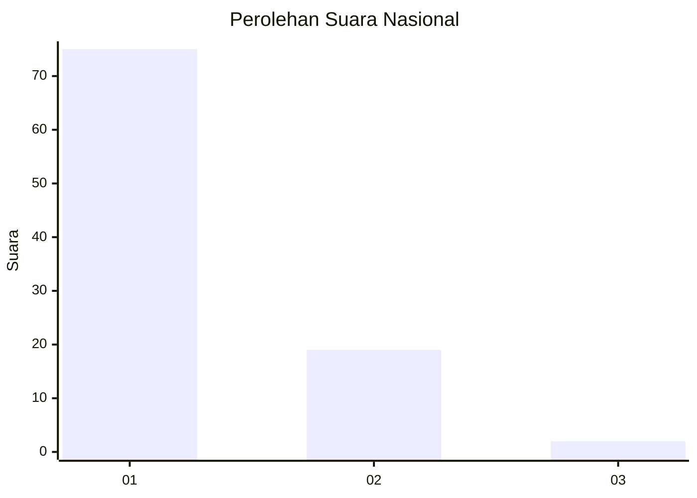
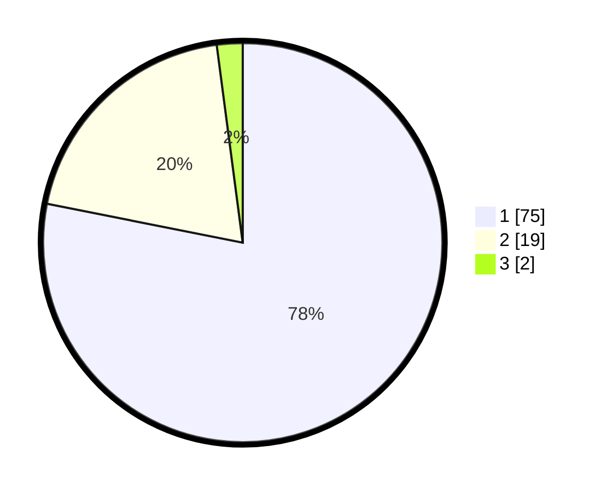

# Hasil

## Grafik

## Tabel

| No. | Nama Paslon    | Suara | Suara (raw) | Persentase |
|:--- |:-------------- | -----:| -----------:| ----------:|
| 1   | ANIES MUHAIMIN | 75    | [75][p-1]   | 78,13      |
| 2   | PRABOWO GIBRAN | 19    | [19][p-2]   | 19,79      |
| 3   | GANJAR MAHFUD  | 2     | [2][p-3]    | 2,08       |

[p-1]: https://github.com/gigit-pemilu/pemilu-2024/blob/main/pilpres/hitung-suara/sub/13-sumatera-barat/sub/05-padang-pariaman/sub/07-sungai-garingging/sub/2001-kuranji-hulu/sub/028-tps/sub/paslon-1.txt
[p-2]: https://github.com/gigit-pemilu/pemilu-2024/blob/main/pilpres/hitung-suara/sub/13-sumatera-barat/sub/05-padang-pariaman/sub/07-sungai-garingging/sub/2001-kuranji-hulu/sub/028-tps/sub/paslon-2.txt
[p-3]: https://github.com/gigit-pemilu/pemilu-2024/blob/main/pilpres/hitung-suara/sub/13-sumatera-barat/sub/05-padang-pariaman/sub/07-sungai-garingging/sub/2001-kuranji-hulu/sub/028-tps/sub/paslon-3.txt

## Foto C Plano

https://sirekap-obj-formc.kpu.go.id/6be5/pemilu/ppwp/13/05/07/20/01/1305072001028-20240218-215028--91015a9e-0dbb-4ff6-9f8c-756f3a3a52fc.jpg

https://sirekap-obj-formc.kpu.go.id/6be5/pemilu/ppwp/13/05/07/20/01/1305072001028-20240218-215104--690fac11-1dbf-4487-8049-d7dd61191c75.jpg

https://sirekap-obj-formc.kpu.go.id/6be5/pemilu/ppwp/13/05/07/20/01/1305072001028-20240218-215148--f2d74d50-827c-4531-938a-b0aba28ebfe5.jpg

## Metadata

| Key        | Value               |
| ---------- | ------------------- |
| Time Stamp | 2024-02-25 11:00:00 |

