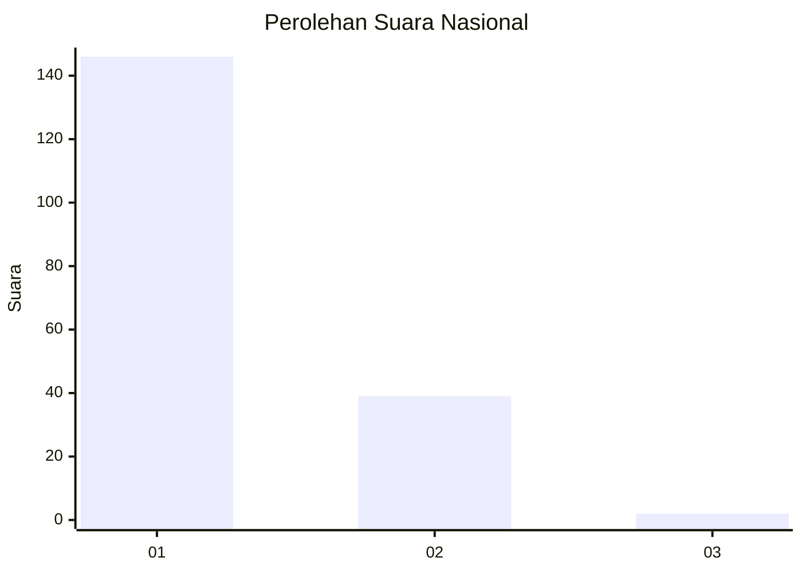
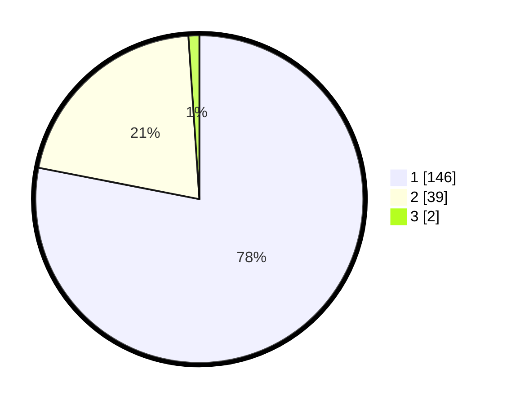

# Hasil

## Grafik

## Tabel

| No. | Nama Paslon    | Suara | Suara (raw) | Persentase |
|:--- |:-------------- | -----:| -----------:| ----------:|
| 1   | ANIES MUHAIMIN | 146   | [146][p-1]  | 78,07      |
| 2   | PRABOWO GIBRAN | 39    | [39][p-2]   | 20,86      |
| 3   | GANJAR MAHFUD  | 2     | [2][p-3]    | 1,07       |

[p-1]: https://github.com/gigit-pemilu/pemilu-2024/blob/main/pilpres/hitung-suara/sub/13-sumatera-barat/sub/05-padang-pariaman/sub/07-sungai-garingging/sub/2003-batu-gadang-kuranji-hulu/sub/002-tps/sub/paslon-1.txt
[p-2]: https://github.com/gigit-pemilu/pemilu-2024/blob/main/pilpres/hitung-suara/sub/13-sumatera-barat/sub/05-padang-pariaman/sub/07-sungai-garingging/sub/2003-batu-gadang-kuranji-hulu/sub/002-tps/sub/paslon-2.txt
[p-3]: https://github.com/gigit-pemilu/pemilu-2024/blob/main/pilpres/hitung-suara/sub/13-sumatera-barat/sub/05-padang-pariaman/sub/07-sungai-garingging/sub/2003-batu-gadang-kuranji-hulu/sub/002-tps/sub/paslon-3.txt

## Foto C Plano

https://sirekap-obj-formc.kpu.go.id/9b10/pemilu/ppwp/13/05/07/20/03/1305072003002-20240220-233843--28f2f887-12d6-49e2-900e-9f095ac8bbd3.jpg

https://sirekap-obj-formc.kpu.go.id/9b10/pemilu/ppwp/13/05/07/20/03/1305072003002-20240220-233921--185362b5-9bb9-4896-8b71-e21665c0bd3f.jpg

https://sirekap-obj-formc.kpu.go.id/9b10/pemilu/ppwp/13/05/07/20/03/1305072003002-20240220-234005--db0438b7-8549-44cc-b8bc-b23534365735.jpg

## Metadata

| Key        | Value               |
| ---------- | ------------------- |
| Time Stamp | 2024-02-24 22:31:28 |

