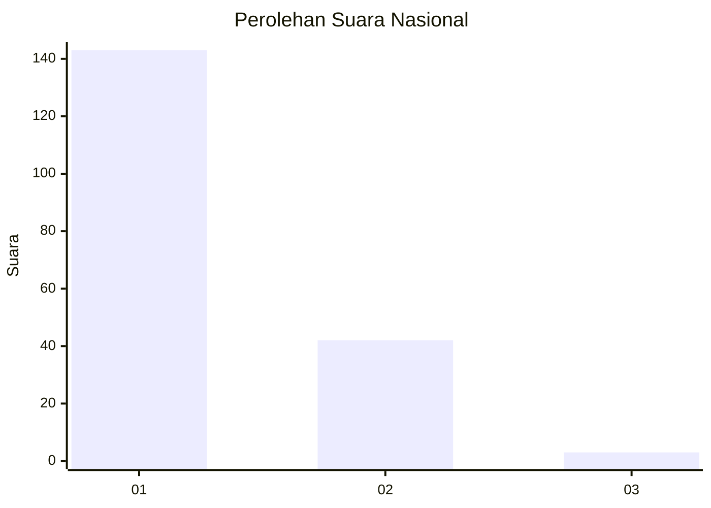
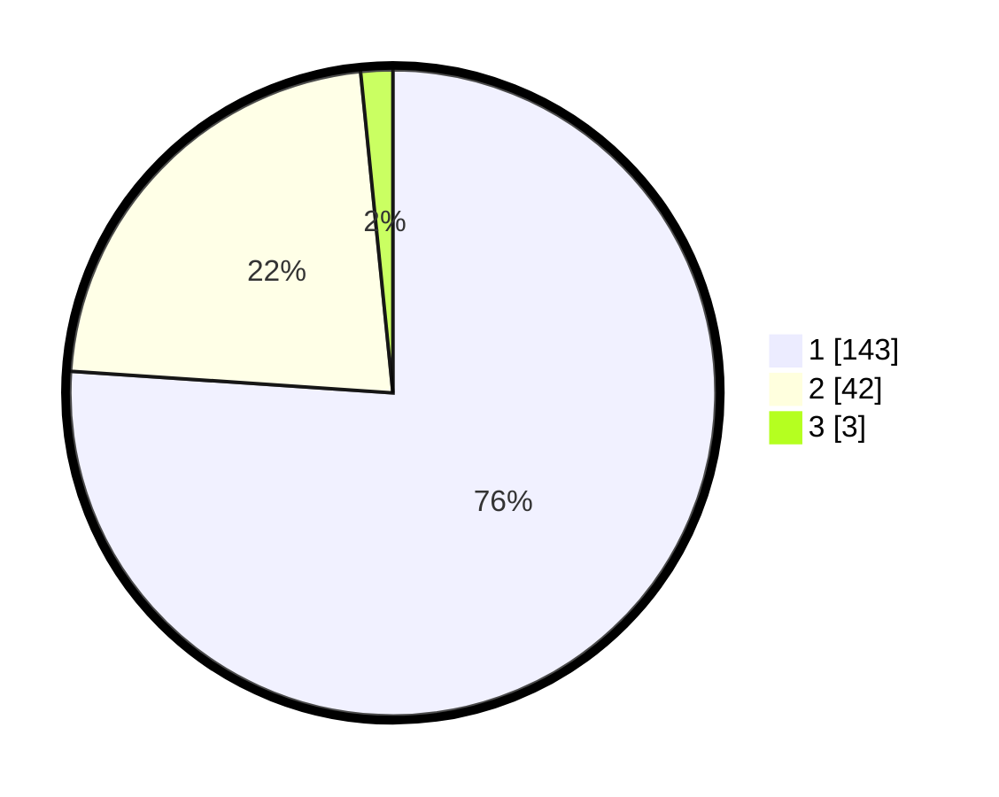

# Hasil

## Grafik

## Tabel

| No. | Nama Paslon    | Suara | Suara (raw) | Persentase |
|:--- |:-------------- | -----:| -----------:| ----------:|
| 1   | ANIES MUHAIMIN | 143   | [143][p-1]  | 76,06      |
| 2   | PRABOWO GIBRAN | 42    | [42][p-2]   | 22,34      |
| 3   | GANJAR MAHFUD  | 3     | [3][p-3]    | 1,60       |

[p-1]: https://github.com/gigit-pemilu/pemilu-2024/blob/main/pilpres/hitung-suara/sub/13-sumatera-barat/sub/05-padang-pariaman/sub/07-sungai-garingging/sub/2003-batu-gadang-kuranji-hulu/sub/004-tps/sub/paslon-1.txt
[p-2]: https://github.com/gigit-pemilu/pemilu-2024/blob/main/pilpres/hitung-suara/sub/13-sumatera-barat/sub/05-padang-pariaman/sub/07-sungai-garingging/sub/2003-batu-gadang-kuranji-hulu/sub/004-tps/sub/paslon-2.txt
[p-3]: https://github.com/gigit-pemilu/pemilu-2024/blob/main/pilpres/hitung-suara/sub/13-sumatera-barat/sub/05-padang-pariaman/sub/07-sungai-garingging/sub/2003-batu-gadang-kuranji-hulu/sub/004-tps/sub/paslon-3.txt

## Foto C Plano

https://sirekap-obj-formc.kpu.go.id/c092/pemilu/ppwp/13/05/07/20/03/1305072003004-20240220-204134--092341f5-f510-47ba-801b-aa6c4784177b.jpg

https://sirekap-obj-formc.kpu.go.id/c092/pemilu/ppwp/13/05/07/20/03/1305072003004-20240220-204220--34718b18-8f50-41f6-a160-73b7eed66e43.jpg

https://sirekap-obj-formc.kpu.go.id/c092/pemilu/ppwp/13/05/07/20/03/1305072003004-20240220-204300--c06ea23d-9bd2-4695-a626-ef201be40abe.jpg

## Metadata

| Key        | Value               |
| ---------- | ------------------- |
| Time Stamp | 2024-02-25 15:00:00 |

