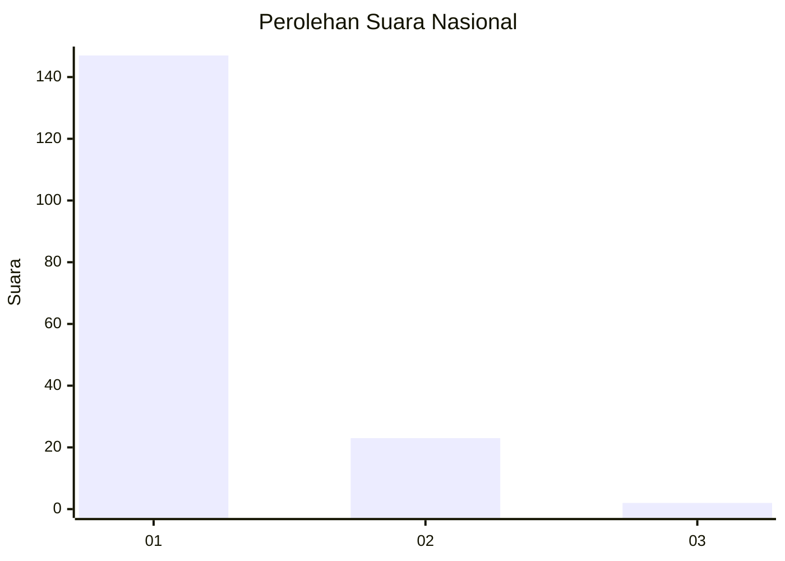
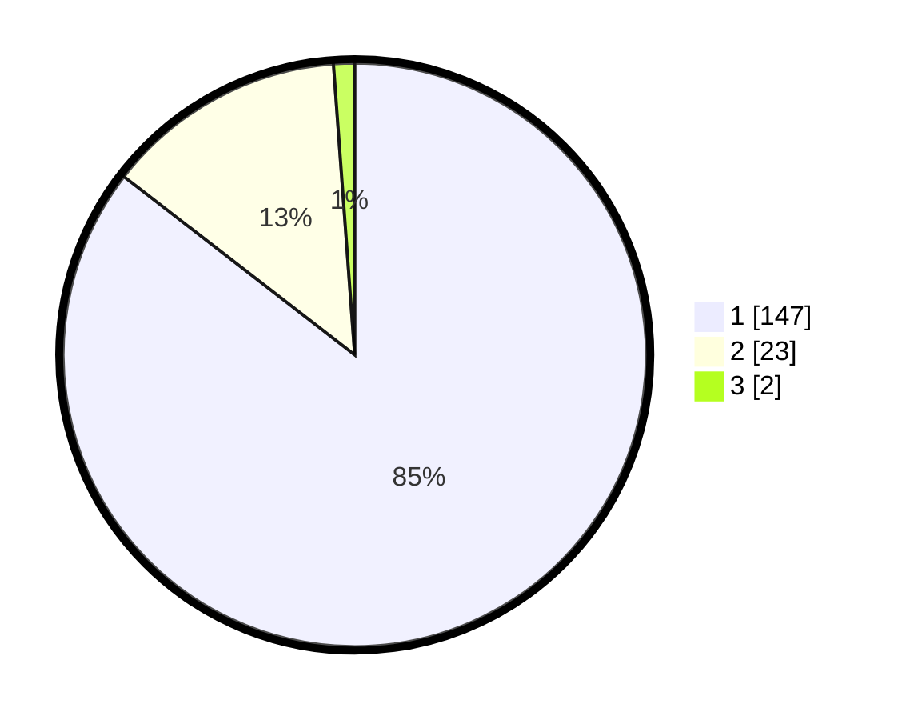

# Hasil

## Grafik

## Tabel

| No. | Nama Paslon    | Suara | Suara (raw) | Persentase |
|:--- |:-------------- | -----:| -----------:| ----------:|
| 1   | ANIES MUHAIMIN | 147   | [147][p-1]  | 85,47      |
| 2   | PRABOWO GIBRAN | 23    | [23][p-2]   | 13,37      |
| 3   | GANJAR MAHFUD  | 2     | [2][p-3]    | 1,16       |

[p-1]: https://github.com/gigit-pemilu/pemilu-2024/blob/main/pilpres/hitung-suara/sub/13-sumatera-barat/sub/05-padang-pariaman/sub/07-sungai-garingging/sub/2004-sungai-sirah-kuranji-hulu/sub/016-tps/sub/paslon-1.txt
[p-2]: https://github.com/gigit-pemilu/pemilu-2024/blob/main/pilpres/hitung-suara/sub/13-sumatera-barat/sub/05-padang-pariaman/sub/07-sungai-garingging/sub/2004-sungai-sirah-kuranji-hulu/sub/016-tps/sub/paslon-2.txt
[p-3]: https://github.com/gigit-pemilu/pemilu-2024/blob/main/pilpres/hitung-suara/sub/13-sumatera-barat/sub/05-padang-pariaman/sub/07-sungai-garingging/sub/2004-sungai-sirah-kuranji-hulu/sub/016-tps/sub/paslon-3.txt

## Foto C Plano

https://sirekap-obj-formc.kpu.go.id/fab1/pemilu/ppwp/13/05/07/20/04/1305072004016-20240214-224933--52c6b715-1c13-4c88-ab4e-fc93e406a9dc.jpg

https://sirekap-obj-formc.kpu.go.id/fab1/pemilu/ppwp/13/05/07/20/04/1305072004016-20240214-225228--ca62f1a6-a7bc-4189-ae1b-3aa9e88d2b28.jpg

https://sirekap-obj-formc.kpu.go.id/fab1/pemilu/ppwp/13/05/07/20/04/1305072004016-20240214-225746--9c1ca8e2-1cc2-4924-875d-e5c196c2169f.jpg

## Metadata

| Key        | Value               |
| ---------- | ------------------- |
| Time Stamp | 2024-02-15 19:30:26 |

