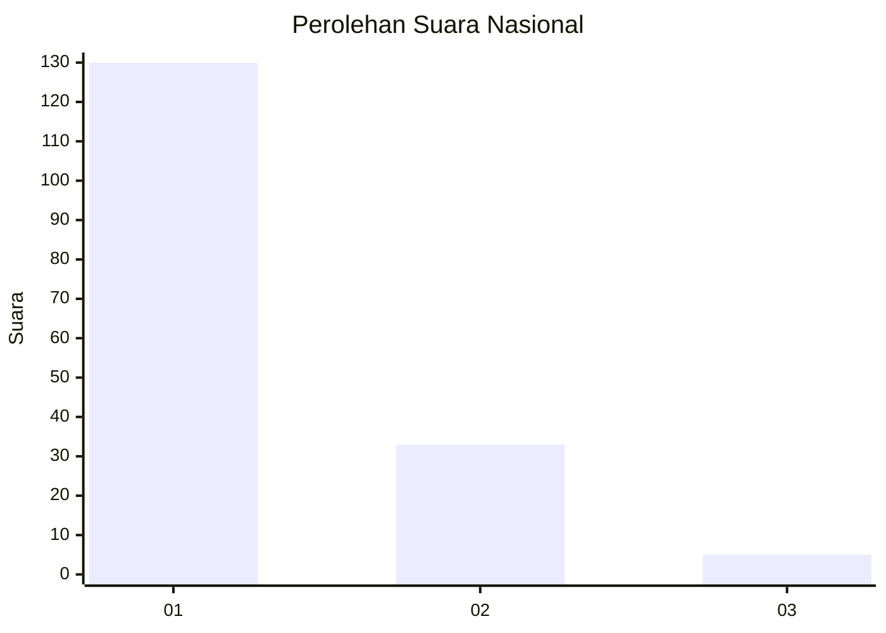
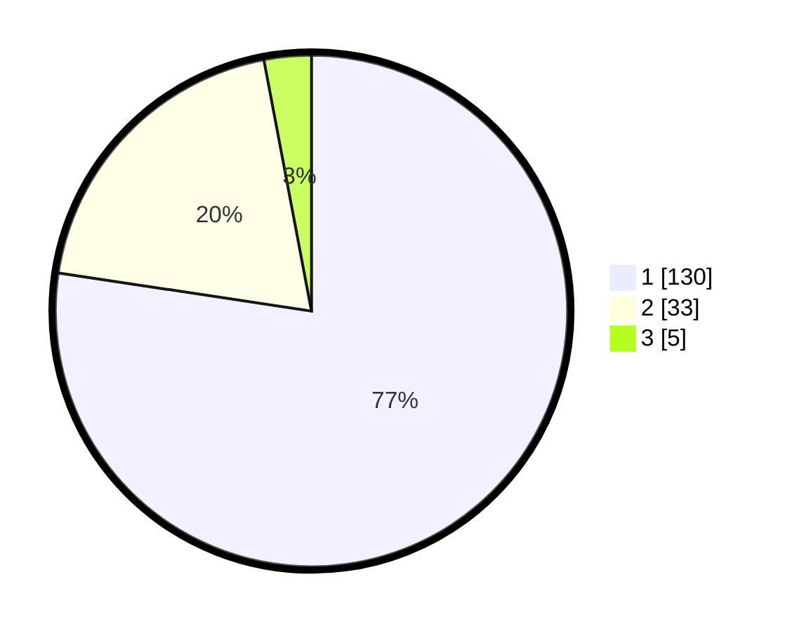

# Hasil

## Grafik

## Tabel

| No. | Nama Paslon    | Suara | Suara (raw) | Persentase |
|:--- |:-------------- | -----:| -----------:| ----------:|
| 1   | ANIES MUHAIMIN | 130   | [130][p-1]  | 77,38      |
| 2   | PRABOWO GIBRAN | 33    | [33][p-2]   | 19,64      |
| 3   | GANJAR MAHFUD  | 5     | [5][p-3]    | 2,98       |

[p-1]: https://github.com/gigit-pemilu/pemilu-2024/blob/main/pilpres/hitung-suara/sub/13-sumatera-barat/sub/05-padang-pariaman/sub/08-sungai-limau/sub/2001-kuranji-hilir/sub/004-tps/sub/paslon-1.txt
[p-2]: https://github.com/gigit-pemilu/pemilu-2024/blob/main/pilpres/hitung-suara/sub/13-sumatera-barat/sub/05-padang-pariaman/sub/08-sungai-limau/sub/2001-kuranji-hilir/sub/004-tps/sub/paslon-2.txt
[p-3]: https://github.com/gigit-pemilu/pemilu-2024/blob/main/pilpres/hitung-suara/sub/13-sumatera-barat/sub/05-padang-pariaman/sub/08-sungai-limau/sub/2001-kuranji-hilir/sub/004-tps/sub/paslon-3.txt

## Foto C Plano

https://sirekap-obj-formc.kpu.go.id/8e25/pemilu/ppwp/13/05/08/20/01/1305082001004-20240227-022526--cc3c0b3e-e7a2-484c-a752-733b241a0fe7.jpg

https://sirekap-obj-formc.kpu.go.id/8e25/pemilu/ppwp/13/05/08/20/01/1305082001004-20240227-022418--724562fa-4bfa-4d84-80b7-573f046b8dd2.jpg

https://sirekap-obj-formc.kpu.go.id/8e25/pemilu/ppwp/13/05/08/20/01/1305082001004-20240227-022800--176baf98-8b69-4b59-8c24-9ce9c415f7f9.jpg

## Metadata

| Key        | Value               |
| ---------- | ------------------- |
| Time Stamp | 2024-02-27 22:00:00 |

## DATA PEMILIH TETAP

Jumlah pemilih dalam DPT: **292**.
 * L: **644**.
 * P: **648**.

## DATA PENGGUNA HAK PILIH

Jumlah pengguna hak pilih dalam DPT: **865**.
 * L: **62**.
 * P: **890**.

Jumlah pengguna hak pilih dalam DPTb: **83**.
 * L: **2**.
 * P: **881**.

Jumlah pengguna hak pilih dalam DPK: **6**.
 * L: **4**.
 * P: **882**.

Jumlah pengguna hak pilih: **874**.
 * L: **873**.
 * P: **208**.

## JUMLAH SUARA SAH DAN TIDAK SAH

JUMLAH SELURUH SUARA SAH: **168**.

JUMLAH SUARA TIDAK SAH: **6**.

JUMLAH SELURUH SUARA SAH DAN SUARA TIDAK SAH: **174**.

