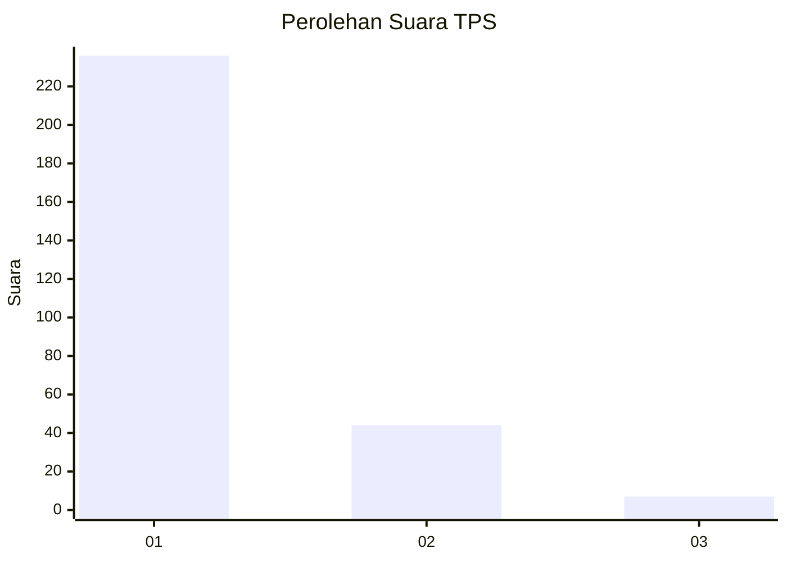
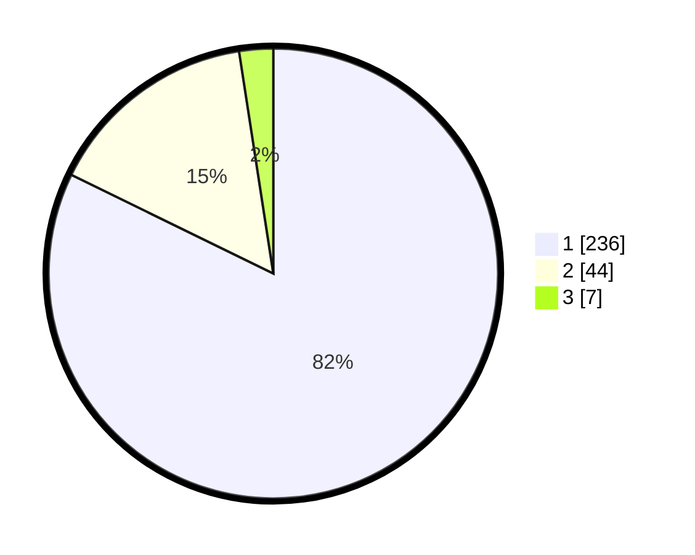

# Hasil

## Grafik

## Tabel

| No. | Nama Paslon    | Suara | Suara (raw) | Persentase |
|:--- |:-------------- | -----:| -----------:| ----------:|
| 1   | ANIES MUHAIMIN | 236   | [236][p-1]  | 82,23      |
| 2   | PRABOWO GIBRAN | 44    | [44][p-2]   | 15,33      |
| 3   | GANJAR MAHFUD  | 7     | [7][p-3]    | 2,44       |

[p-1]: https://github.com/gigit-pemilu/pemilu-2024-13-sumatera-barat/blob/main/pilpres/hitung-suara/sub/13-sumatera-barat/sub/05-padang-pariaman/sub/08-sungai-limau/sub/2001-kuranji-hilir/sub/006-tps/sub/paslon-1.txt
[p-2]: https://github.com/gigit-pemilu/pemilu-2024-13-sumatera-barat/blob/main/pilpres/hitung-suara/sub/13-sumatera-barat/sub/05-padang-pariaman/sub/08-sungai-limau/sub/2001-kuranji-hilir/sub/006-tps/sub/paslon-2.txt
[p-3]: https://github.com/gigit-pemilu/pemilu-2024-13-sumatera-barat/blob/main/pilpres/hitung-suara/sub/13-sumatera-barat/sub/05-padang-pariaman/sub/08-sungai-limau/sub/2001-kuranji-hilir/sub/006-tps/sub/paslon-3.txt

## Foto C Plano

https://sirekap-obj-formc.kpu.go.id/8d84/pemilu/ppwp/13/05/08/20/01/1305082001006-20240226-001536--13f7ff3d-18e7-4e42-bdc4-4843527fe673.jpg

https://sirekap-obj-formc.kpu.go.id/8d84/pemilu/ppwp/13/05/08/20/01/1305082001006-20240226-001607--52a98733-de47-4cb7-998e-e38beb3f9842.jpg

https://sirekap-obj-formc.kpu.go.id/8d84/pemilu/ppwp/13/05/08/20/01/1305082001006-20240226-001651--e86a2999-9e46-4d58-b9ae-c595c85c522e.jpg

## Metadata

| Key        | Value               |
| ---------- | ------------------- |
| Time Stamp | 2024-02-26 01:00:00 |

## DATA PEMILIH TETAP

Jumlah pemilih dalam DPT: **252**.
 * L: **129**.
 * P: **123**.

## DATA PENGGUNA HAK PILIH

Jumlah pengguna hak pilih dalam DPT: **156**.
 * L: **70**.
 * P: **80**.

Jumlah pengguna hak pilih dalam DPTb: **89**.
 * L: **802**.
 * P: **802**.

Jumlah pengguna hak pilih dalam DPK: **66**.
 * L: **1**.
 * P: **81**.

Jumlah pengguna hak pilih: **162**.
 * L: **49**.
 * P: **85**.

## JUMLAH SUARA SAH DAN TIDAK SAH

JUMLAH SELURUH SUARA SAH: **159**.

JUMLAH SUARA TIDAK SAH: **3**.

JUMLAH SELURUH SUARA SAH DAN SUARA TIDAK SAH: **162**.

