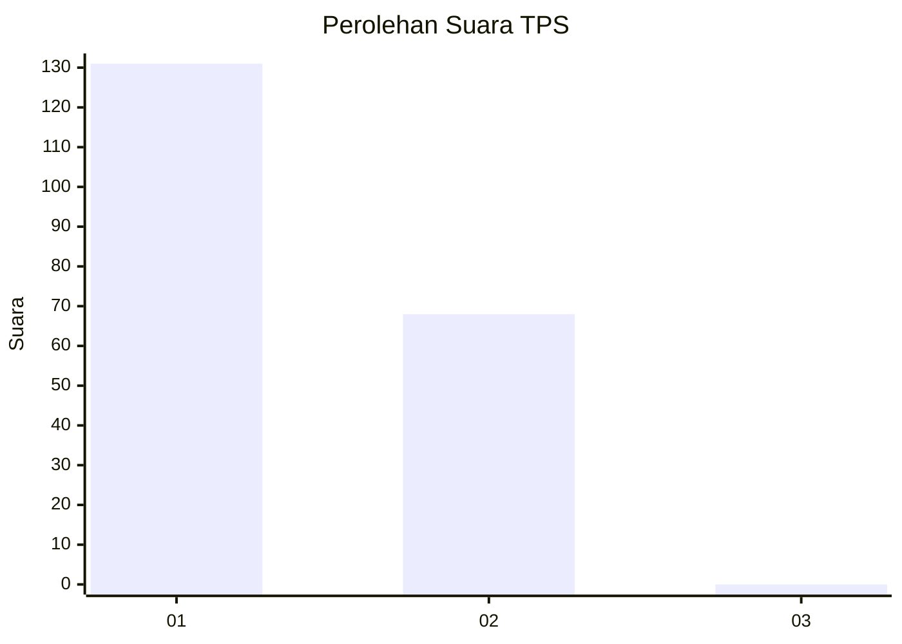
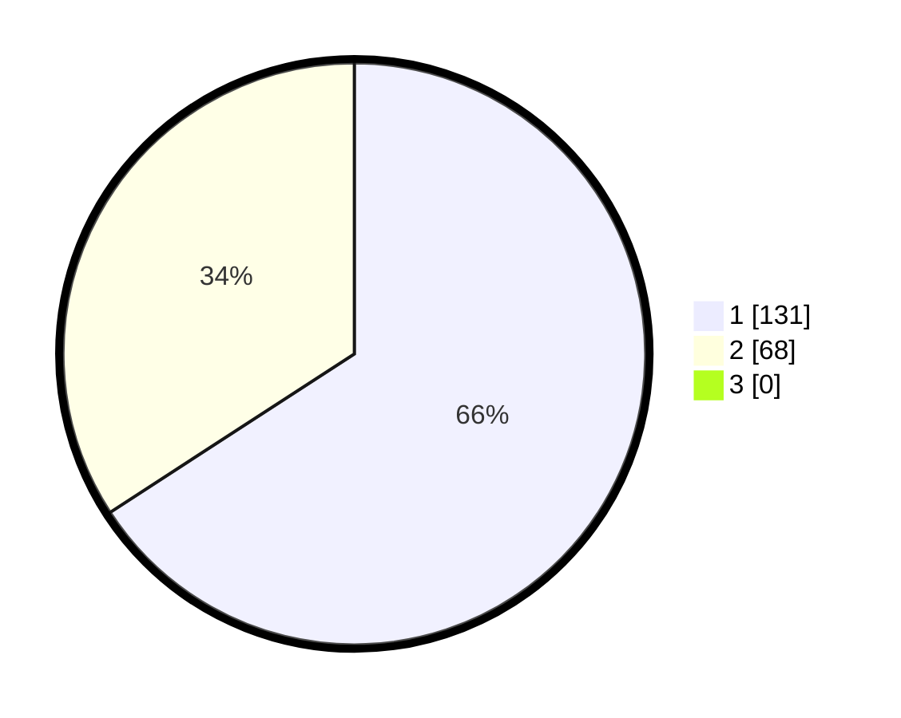

# Hasil

## Grafik

## Tabel

| No. | Nama Paslon    | Suara | Suara (raw) | Persentase |
|:--- |:-------------- | -----:| -----------:| ----------:|
| 1   | ANIES MUHAIMIN | 131   | [131][p-1]  | 65,83      |
| 2   | PRABOWO GIBRAN | 68    | [68][p-2]   | 34,17      |
| 3   | GANJAR MAHFUD  | 0     | [0][p-3]    | 0,00       |

[p-1]: https://github.com/gigit-pemilu/pemilu-2024-13-sumatera-barat/blob/main/pilpres/hitung-suara/sub/13-sumatera-barat/sub/05-padang-pariaman/sub/08-sungai-limau/sub/2001-kuranji-hilir/sub/008-tps/sub/paslon-1.txt
[p-2]: https://github.com/gigit-pemilu/pemilu-2024-13-sumatera-barat/blob/main/pilpres/hitung-suara/sub/13-sumatera-barat/sub/05-padang-pariaman/sub/08-sungai-limau/sub/2001-kuranji-hilir/sub/008-tps/sub/paslon-2.txt
[p-3]: https://github.com/gigit-pemilu/pemilu-2024-13-sumatera-barat/blob/main/pilpres/hitung-suara/sub/13-sumatera-barat/sub/05-padang-pariaman/sub/08-sungai-limau/sub/2001-kuranji-hilir/sub/008-tps/sub/paslon-3.txt

## Foto C Plano

https://sirekap-obj-formc.kpu.go.id/68e4/pemilu/ppwp/13/05/08/20/01/1305082001008-20240227-021357--10cb3459-c943-4468-b4b5-2e773d5aa531.jpg

https://sirekap-obj-formc.kpu.go.id/68e4/pemilu/ppwp/13/05/08/20/01/1305082001008-20240227-021502--cd988023-3ea0-4625-9417-d094db811f9b.jpg

https://sirekap-obj-formc.kpu.go.id/68e4/pemilu/ppwp/13/05/08/20/01/1305082001008-20240227-021938--959439cc-16e4-4f90-a71c-7160be600ec5.jpg

## Metadata

| Key        | Value               |
| ---------- | ------------------- |
| Time Stamp | 2024-02-27 22:00:00 |

## DATA PEMILIH TETAP

Jumlah pemilih dalam DPT: **283**.
 * L: **433**.
 * P: **536**.

## DATA PENGGUNA HAK PILIH

Jumlah pengguna hak pilih dalam DPT: **493**.
 * L: **33**.
 * P: **352**.

Jumlah pengguna hak pilih dalam DPTb: **82**.
 * L: **8**.
 * P: **2**.

Jumlah pengguna hak pilih dalam DPK: **84**.
 * L: **3**.
 * P: **82**.

Jumlah pengguna hak pilih: **294**.
 * L: **96**.
 * P: **385**.

## JUMLAH SUARA SAH DAN TIDAK SAH

JUMLAH SELURUH SUARA SAH: **199**.

JUMLAH SUARA TIDAK SAH: **2**.

JUMLAH SELURUH SUARA SAH DAN SUARA TIDAK SAH: **201**.

