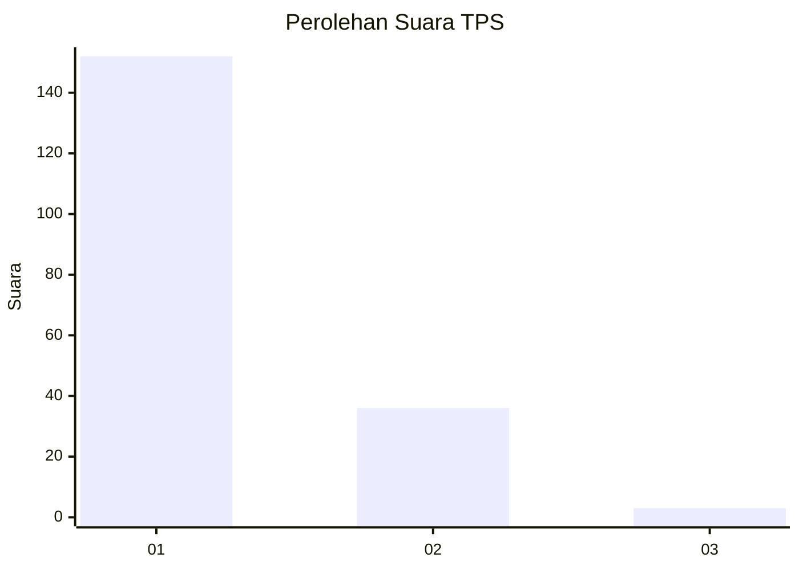
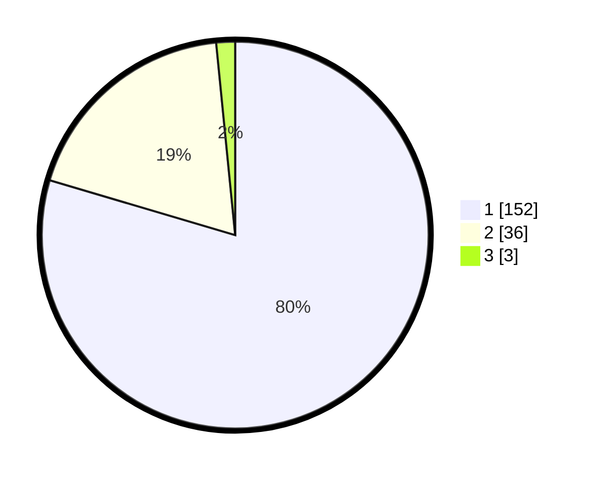

# Hasil

## Grafik

## Tabel

| No. | Nama Paslon    | Suara | Suara (raw) | Persentase |
|:--- |:-------------- | -----:| -----------:| ----------:|
| 1   | ANIES MUHAIMIN | 152   | [152][p-1]  | 79,58      |
| 2   | PRABOWO GIBRAN | 36    | [36][p-2]   | 18,85      |
| 3   | GANJAR MAHFUD  | 3     | [3][p-3]    | 1,57       |

[p-1]: https://github.com/gigit-pemilu/pemilu-2024-13-sumatera-barat/blob/main/pilpres/hitung-suara/sub/13-sumatera-barat/sub/05-padang-pariaman/sub/08-sungai-limau/sub/2001-kuranji-hilir/sub/013-tps/sub/paslon-1.txt
[p-2]: https://github.com/gigit-pemilu/pemilu-2024-13-sumatera-barat/blob/main/pilpres/hitung-suara/sub/13-sumatera-barat/sub/05-padang-pariaman/sub/08-sungai-limau/sub/2001-kuranji-hilir/sub/013-tps/sub/paslon-2.txt
[p-3]: https://github.com/gigit-pemilu/pemilu-2024-13-sumatera-barat/blob/main/pilpres/hitung-suara/sub/13-sumatera-barat/sub/05-padang-pariaman/sub/08-sungai-limau/sub/2001-kuranji-hilir/sub/013-tps/sub/paslon-3.txt

## Foto C Plano

https://sirekap-obj-formc.kpu.go.id/9e22/pemilu/ppwp/13/05/08/20/01/1305082001013-20240226-172039--d4b46e97-2dca-4431-9aea-224f68e68fb7.jpg

https://sirekap-obj-formc.kpu.go.id/9e22/pemilu/ppwp/13/05/08/20/01/1305082001013-20240226-173152--461c81fa-bd3b-4fcd-b56c-bfe292cb4991.jpg

https://sirekap-obj-formc.kpu.go.id/9e22/pemilu/ppwp/13/05/08/20/01/1305082001013-20240226-172211--fe6f630d-89d8-42b0-8b07-e477ef48d5cc.jpg

## Metadata

| Key        | Value               |
| ---------- | ------------------- |
| Time Stamp | 2024-02-26 22:00:00 |

## DATA PEMILIH TETAP

Jumlah pemilih dalam DPT: **287**.
 * L: **140**.
 * P: **147**.

## DATA PENGGUNA HAK PILIH

Jumlah pengguna hak pilih dalam DPT: **183**.
 * L: **880**.
 * P: **103**.

Jumlah pengguna hak pilih dalam DPTb: **882**.
 * L: **881**.
 * P: **881**.

Jumlah pengguna hak pilih dalam DPK: **887**.
 * L: **884**.
 * P: **883**.

Jumlah pengguna hak pilih: **192**.
 * L: **885**.
 * P: **107**.

## JUMLAH SUARA SAH DAN TIDAK SAH

JUMLAH SELURUH SUARA SAH: **191**.

JUMLAH SUARA TIDAK SAH: **1**.

JUMLAH SELURUH SUARA SAH DAN SUARA TIDAK SAH: **192**.

