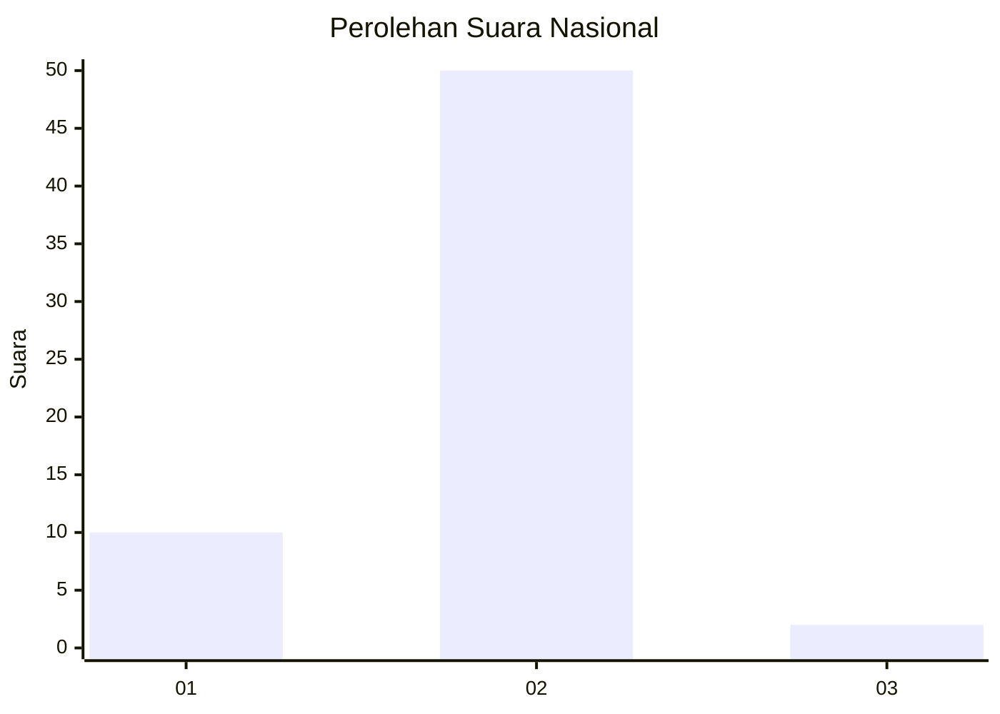
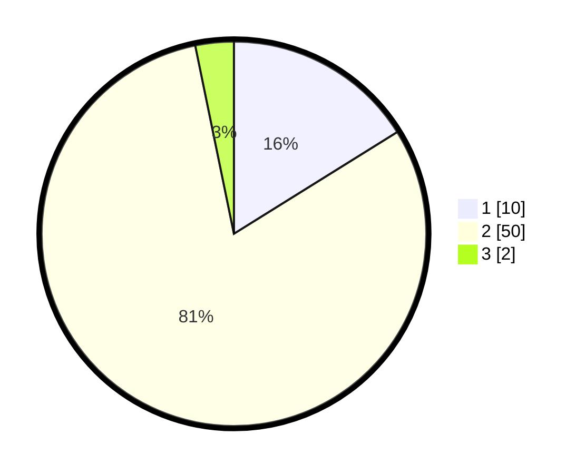

# Hasil

## Grafik

## Tabel

| No. | Nama Paslon    | Suara | Suara (raw) | Persentase |
|:--- |:-------------- | -----:| -----------:| ----------:|
| 1   | ANIES MUHAIMIN | 10    | [10][p-1]   | 16,13      |
| 2   | PRABOWO GIBRAN | 50    | [50][p-2]   | 80,65      |
| 3   | GANJAR MAHFUD  | 2     | [2][p-3]    | 3,23       |

[p-1]: https://github.com/gigit-pemilu/pemilu-2024/blob/main/pilpres/hitung-suara/sub/13-sumatera-barat/sub/05-padang-pariaman/sub/08-sungai-limau/sub/2001-kuranji-hilir/sub/017-tps/sub/paslon-1.txt
[p-2]: https://github.com/gigit-pemilu/pemilu-2024/blob/main/pilpres/hitung-suara/sub/13-sumatera-barat/sub/05-padang-pariaman/sub/08-sungai-limau/sub/2001-kuranji-hilir/sub/017-tps/sub/paslon-2.txt
[p-3]: https://github.com/gigit-pemilu/pemilu-2024/blob/main/pilpres/hitung-suara/sub/13-sumatera-barat/sub/05-padang-pariaman/sub/08-sungai-limau/sub/2001-kuranji-hilir/sub/017-tps/sub/paslon-3.txt

## Foto C Plano

https://sirekap-obj-formc.kpu.go.id/833c/pemilu/ppwp/13/05/08/20/01/1305082001017-20240226-192212--59c4079e-b2e0-455a-bea7-c1b5d8595e6f.jpg

https://sirekap-obj-formc.kpu.go.id/833c/pemilu/ppwp/13/05/08/20/01/1305082001017-20240226-192233--8053a99c-0079-4bee-b464-d824122e8740.jpg

https://sirekap-obj-formc.kpu.go.id/833c/pemilu/ppwp/13/05/08/20/01/1305082001017-20240226-192301--27fe37a1-089d-488b-8026-3650dce12b78.jpg

## Metadata

| Key        | Value               |
| ---------- | ------------------- |
| Time Stamp | 2024-02-26 22:00:00 |

## DATA PEMILIH TETAP

Jumlah pemilih dalam DPT: **190**.
 * L: **827**.
 * P: **103**.

## DATA PENGGUNA HAK PILIH

Jumlah pengguna hak pilih dalam DPT: **172**.
 * L: **872**.
 * P: **900**.

Jumlah pengguna hak pilih dalam DPTb: **816**.
 * L: **806**.
 * P: **885**.

Jumlah pengguna hak pilih dalam DPK: **800**.
 * L: **88**.
 * P: **808**.

Jumlah pengguna hak pilih: **183**.
 * L: **878**.
 * P: **145**.

## JUMLAH SUARA SAH DAN TIDAK SAH

JUMLAH SELURUH SUARA SAH: **182**.

JUMLAH SUARA TIDAK SAH: **3**.

JUMLAH SELURUH SUARA SAH DAN SUARA TIDAK SAH: **183**.

